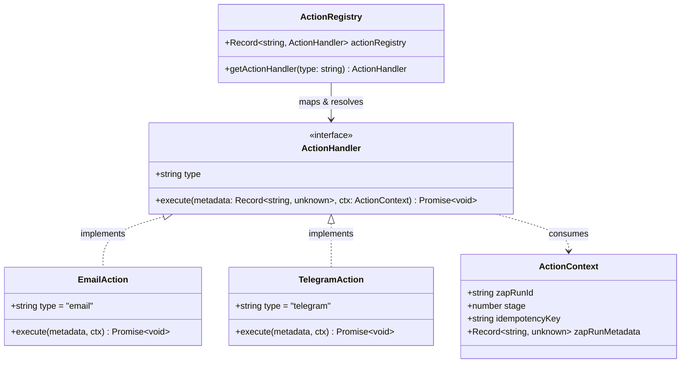

# Action Registry & Extensibility

This document describes the Action Registry architecture in the worker subsystem, detailing how action types are defined, registered, dynamically resolved, and executed.

---

## 🏛️ Action Registry Architecture

Action execution is decoupled from the worker's Kafka consumer and lease management loop via a centralized registry pattern.



---

## 📋 Core Type Contracts

Located in [`apps/worker/types.ts`](../apps/worker/types.ts):

### `ActionContext`

Contains execution identifiers, stage sequence data, and incoming trigger payload metadata:

```typescript
export interface ActionContext {
  zapRunId: string;
  stage: number;
  idempotencyKey: string;
  zapRunMetadata: Record<string, unknown>;
}
```

### `ActionHandler`

Every action integration must adhere to this interface:

```typescript
export interface ActionHandler {
  type: string;
  execute: (
    metadata: Record<string, unknown>,
    ctx: ActionContext,
  ) => Promise<void>;
}
```

---

## 🗂️ Action Registry & Resolution

Located in [`apps/worker/actions/index.ts`](../apps/worker/actions/index.ts):

```typescript
export const actionRegistry: Record<string, ActionHandler> = {
  [emailAction.type]: emailAction,
  [telegramAction.type]: telegramAction,
};

export function getActionHandler(type: string): ActionHandler | undefined {
  return actionRegistry[type];
}
```

When a message is received:

1. `loadStageExecution()` loads the `Action` record and retrieves `action.type.id` from PostgreSQL.
2. `getActionHandler(actionTypeId)` looks up the corresponding handler in `actionRegistry`.
3. If no handler matches the ID, the worker logs an unsupported action error and marks the stage `FAILED`.

---

## 🧩 Template Variable Interpolation (`parse.ts`)

Located in [`apps/worker/parse.ts`](../apps/worker/parse.ts):

Action configurations allow users to bind dynamic webhook payload fields to action parameters using `{{expression}}` mustache syntax.

### Syntax & Mechanics

```typescript
export function parse(template: string, values: any): string {
  if (!template || typeof template !== "string") return "";
  return template.replace(/\{\{([^}]+)\}\}/g, (_, expression) => {
    try {
      const keys = expression.split(".");
      let val = values;
      for (const key of keys) {
        if (val == null) return "";
        val = val[key];
      }
      return val == null ? "" : String(val);
    } catch {
      return "";
    }
  });
}
```

**Example**:

- Webhook payload: `{ "sender": { "name": "Alice" }, "comment": { "text": "Deploy approved" } }`
- Template: `"Notification for {{sender.name}}: {{comment.text}}"`
- Output: `"Notification for Alice: Deploy approved"`

---

## 🔌 Supported Action Implementations

### 1. Email Action (`email`)

- **File**: [`apps/worker/actions/email.ts`](../apps/worker/actions/email.ts)
- **Integration**: [Resend SDK](https://resend.com/)
- **Configuration Fields**: `to`, `from`, `subject`, `body`.
- **Idempotency**: Transmits `ctx.idempotencyKey` in `Idempotency-Key` and `X-Entity-Ref-ID` request headers.

### 2. Telegram Action (`telegram`)

- **File**: [`apps/worker/actions/telegram.ts`](../apps/worker/actions/telegram.ts)
- **Integration**: Telegram Bot API (`https://api.telegram.org/bot<token>/sendMessage`)
- **Configuration Fields**: `botToken` (or fallback `process.env.TELEGRAM_BOT_TOKEN`), `channelUserName`, `message`.
- **Chat ID Resolution**: Includes `resolveChatId()` helper to automatically query `getChat?chat_id=@<name>` when given a public channel handle.

---

## ➕ Adding a New Action Integration

To introduce a new integration (e.g., Slack, Discord, OpenAI):

1. Create `apps/worker/actions/<provider>.ts` implementing `ActionHandler`.
2. Parse necessary configuration templates with `parse(metadata.field, ctx.zapRunMetadata)`.
3. Import and add the new handler to `actionRegistry` in [`apps/worker/actions/index.ts`](../apps/worker/actions/index.ts).
4. Register the new `AvailableAction` record in the PostgreSQL database.
