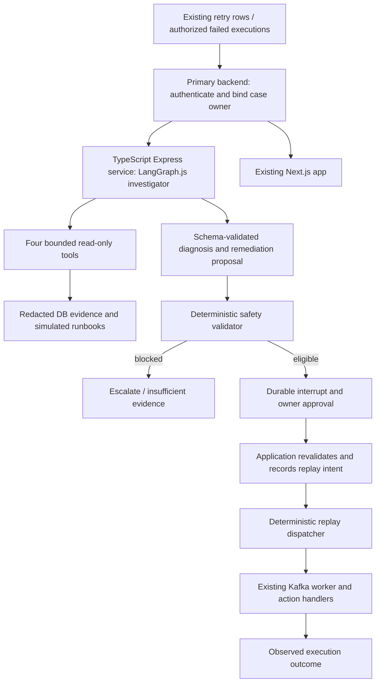

# Autonomous DLQ Triage Agent — master implementation plan

> **Status: Phase 1 implemented in TypeScript; Phases 2–15 remain proposed.** Prepared 2026-09-18 against source at `22da39e`; Phase 1 was migrated to the existing Bun/TypeScript stack on 2026-09-21. Implement only the phase explicitly requested next, using the repository teaching workflow and `executing-plans`; finish its tests and review before advancing.

**Goal:** investigate failed workflow stages, gather bounded evidence, propose grounded remediation, enforce deterministic safety and human approval, and hand eligible replay to application code.

**Architecture:** one TypeScript LangGraph.js investigator in a separate Express service, behind the existing primary backend’s authenticated endpoints. Tools are read-only. Durable agent state is separate from approval/execution authority; the existing worker remains the executor of external actions.

**Stack:** Bun, TypeScript, Express, Zod and LangGraph.js for the AI service; PostgreSQL for durable agent state when required. Existing Prisma, KafkaJS and Next.js remain in place. Add one model adapter initially; RAG and Langfuse remain in their planned phases. The agent is an ordinary `apps/*` workspace with dependencies in the shared Bun lockfile.

**Requirements and navigation:** this document owns sequencing, boundaries and teaching goals. [Failure taxonomy](AI/failure-taxonomy.md) owns scenarios/evidence. [ADRs 009–018](decisions.md#adr-009-read-only-single-agent-triage-boundary) own new proposed decisions. Reuse [architecture](architecture.md), [execution flow](execution-flow.md), [worker](worker.md), [Kafka](kafka.md), [actions](actions.md), [idempotency](idempotency.md), [repository structure](repository-structure.md), [current state](current-state.md), and [verification commands](tooling_Verification.md); do not duplicate their service setup instructions.

## 1. Current AI-relevant architecture

The existing path is webhook transaction -> `ZapRun` + `ZapRunOutbox` -> processor -> `zap-events` -> ordered worker action -> next stage or dead-letter sinks. This is a linear sequence, not a general branching DAG. The AI triage graph is a separate control workflow; it does not change the user's Zap graph.

| Actual code                                                                                                                                                              | Reusable behavior                                                                                   | AI implication                                                                                                                      |
| ------------------------------------------------------------------------------------------------------------------------------------------------------------------------ | --------------------------------------------------------------------------------------------------- | ----------------------------------------------------------------------------------------------------------------------------------- |
| [Webhook](../apps/webhook/index.ts), [processor](../apps/processor/index.ts)                                                                                             | Transactional ingestion and ACK-before-delete publishing of stage zero                              | Preserve; initial outbox cannot replay arbitrary stages because it stores no stage and processor hardcodes zero                     |
| [Worker](../apps/worker/index.ts), `claimExecution`, `executeClaimedAction`, `publishNextStage`                                                                          | Atomic create/reclaim of execution lease; three attempts; ordered stage publication; manual offsets | Keep as executor; FAILED is terminal, so republishing alone does not replay                                                         |
| [Retry](../apps/worker/retry.ts), [deadletter](../apps/worker/deadletter.ts)                                                                                             | Full-jitter retry; sequential independent attempts to write Kafka DLQ and SQL retry row             | Useful evidence sources, but neither guaranteed complete nor a replay scheduler                                                     |
| [Schema](../packages/db/prisma/schema.prisma)                                                                                                                            | Retry rows, execution state, trigger payload, current action definitions and owner relation         | Read explicit joins; retry/execution models have no FK relation to run and can be orphaned                                          |
| [Registry](../apps/worker/actions/index.ts), [email](../apps/worker/actions/email.ts), [Telegram](../apps/worker/actions/telegram.ts), [parser](../apps/worker/parse.ts) | Real integrations, stable per-run/stage idempotency key, template parsing                           | Investigate concrete email/Telegram cases; dry-run inputs without calling handlers                                                  |
| [API](../apps/primary_backend/route/zap.ts), [middleware](../apps/primary_backend/middleware.ts)                                                                         | JWT user identity, owner-filtered Zap/run queries and retry counts                                  | Reuse identity/ownership patterns; add case-level authorization on every read, approval and stream                                  |
| [History UI](../apps/frontend/src/app/history/page.tsx), [Zap detail](../apps/frontend/src/app/zap/[id]/page.tsx), [hooks](../apps/frontend/src/hooks/useZaps.ts)        | Existing shell, authenticated fetch, run list and inspect pages                                     | Extend these; `Autoreplay` is currently an `MvpAction` placeholder                                                                  |
| [Worker tests](../apps/worker/idempotency.test.ts)                                                                                                                       | Lightweight assert-based checks; retry/deadletter scripts import real helpers                       | Lease test copies orchestration into a Map simulation; it does not establish real DB concurrency or external exactly-once execution |

Phase 1 now provides a local fixture-only LangGraph.js preview API and CLI under `apps/ai_agent/`. No live model adapter, backend/DLQ connection, Langfuse, checkpoint store, RAG corpus, evaluation harness, approval ledger or deterministic replay service is implemented.

### Code/documentation discrepancies that affect this design

1. README claims action integrations/retries are missing; source implements them. Its listed edit/delete Zap routes are not in `route/zap.ts`, which has create/list/runs/detail only. Do not plan an agent tool against a nonexistent edit endpoint.
2. Existing docs/ADR 003 overstate exactly-once external side effects. Database leases cannot atomically include provider delivery; Telegram has no implemented provider deduplication. There is no lease renewal/fencing, provider timeout, or persistent provider receipt. A late worker can outlive its lease.
3. `sendEmail` ignores Resend's structured `{ data, error }` result; the installed SDK returns errors rather than necessarily throwing. Thus a failure can become SUCCESS and bypass DLQ. [Resend's Node example](https://resend.com/docs/send-with-nodejs) also checks the error explicitly. The current HTTP idempotency header is supported by the installed SDK; do not incorrectly call the header wiring broken.
4. `deadLetter` swallows failure of either or both sinks; reaching the later commit does not imply durable dead-letter capture. `attempt: 3` is a configured limit, not persisted per-attempt proof. The catch also handles failures writing SUCCESS, so a DLQ does not prove the provider failed.
5. Unsupported handlers become FAILED without DLQ. Invalid JSON throws before classification; empty value/missing action returns before the explicit commit, contrary to the worker diagram. Later committed offsets can advance past earlier records. These need separate coverage/quarantine handling, not fabricated DLQ rows.
6. The history API treats a drained outbox as success. That only means initial publication, not action completion. AI safety and its future UI must read execution rows instead.
7. Worker loads current action configuration, with no historical snapshot/version; `sortingOrder` is not unique. The worker does not validate all predecessor SUCCESS rows before executing a received stage. Proposed replay must enforce this explicitly.
8. `nextRunAt` is unused for scheduling. `ZapRun` has no creation time; use actual available timestamps and label uncertainty. There is no usable arbitrary log-search source.
9. `current-state.md` describes future AI actions/general DAGs, a different objective from this triage layer. Its missing shared tsconfig claim is stale in this checkout: `packages/typescript-config/react-library.json` exists. Do not assume old tooling failures are current.

These findings define gates for connecting AI to live replay. They do not justify rebuilding ingestion, Kafka, auth or workflow execution. Older docs remain historical descriptions; corrections important to safety are recorded in the existing decision document and this source audit.

## 2. Architectural review

| Proposed idea                              | Verdict and repository-specific adjustment                                                                                                                                                                                                                                                                                                                                                                              |
| ------------------------------------------ | ----------------------------------------------------------------------------------------------------------------------------------------------------------------------------------------------------------------------------------------------------------------------------------------------------------------------------------------------------------------------------------------------------------------------- |
| 1. Simple single-agent LangGraph           | Recommended. Use a small `StateGraph` with typed state and a bounded evidence loop. Multiple deterministic nodes are not multiple agents. Plain async functions would be enough for diagnosis alone, but persistence/interrupts make LangGraph useful here. No autonomous supervisor.                                                                                                                                   |
| 2. Scenario-derived tools                  | Strongly agree. Four read-only tools cover this taxonomy. Application routing/policy/approval/replay are not tools. Never expose SQL, shell, arbitrary HTTP, DB updates, Kafka publish or action execution.                                                                                                                                                                                                             |
| 3. Simulated runbooks as RAG               | Appropriate with explicit simulation labels. Six short local Markdown documents and deterministic lexical retrieval first; benchmark against simply supplying relevant runbooks. Retrieval does not establish incident facts.                                                                                                                                                                                           |
| 4. LangGraph streaming                     | Useful after stable state/proposal contracts. Project sanitized LangGraph.js updates through the agent service and an authenticated primary-backend SSE stream; graph streaming itself supplies neither browser auth nor reconnect history. Skip raw token/chain-of-thought streaming. [LangGraph.js streaming](https://docs.langchain.com/oss/javascript/langgraph/streaming) supports state updates for this purpose. |
| 5. Interrupt/resume for approval           | Appropriate only with durable checkpoints, owner-bound thread IDs, versioned immutable proposals, and idempotent approval consumption. Restarted interrupt nodes rerun preceding code; keep that code free of effects. [LangGraph.js interrupt reference](https://docs.langchain.com/oss/javascript/langgraph/interrupts).                                                                                              |
| 6. Replay outside LLM                      | Mandatory, but missing today. Add a guarded application command and durable replay intent integrated with the existing worker. Republish-to-Kafka is insufficient because FAILED stages are skipped.                                                                                                                                                                                                                    |
| 7. Langfuse                                | Useful at the first live-model milestone. Keep it optional for service availability and separate from approval/audit truth. Validate one TypeScript integration in the AI service, not multiple overlapping tracing stacks. [Official integration](https://langfuse.com/integrations/frameworks/langchain).                                                                                                             |
| 8. Traces connected to evaluations         | Agree. Link investigation, evidence version, prompt/model version, runbook revision, dataset item and replay outcome. Curate/redact traces before adding them to a dataset; a trace is not ground truth.                                                                                                                                                                                                                |
| 9. Code evaluators plus semantic judge     | Agree; start deterministic fixtures in Phase 1, not Phase 11. Judges score grounding/usefulness only; code enforces permissions, schema, ordering and replay policy. Langfuse supports both offline datasets and online evaluations ([overview](https://langfuse.com/docs/evaluation/overview)).                                                                                                                        |
| 10. Supervisor only if complexity warrants | Agree, but number of nodes alone is not justification. First use functions/subgraphs; require an evaluation-backed benefit from independent expertise before adding agents.                                                                                                                                                                                                                                             |
| 11. Optional MCP                           | Agree. Local typed functions fit a single monorepo. MCP is an interoperability adapter later, not a prerequisite for tools, RAG or safe execution.                                                                                                                                                                                                                                                                      |

**Architecture revision:** the user selected TypeScript/Bun for the AI subsystem after the separate Python stack proved distracting. The agent remains a separate service and trust boundary, but it now participates in the existing monorepo/toolchain. This reduces learning and operational overhead without changing the safety architecture. It does not justify a supervisor, MCP server or hosted platform.

## 3. Boundaries, state and initial contracts

### Initial footprint and trust boundary

The agent lives in `apps/ai_agent/` as a normal Bun workspace with its own `package.json`, `tsconfig.json`, `src/` and `tests/`. Keep graph logic importable independently of Express; expose a local fixture API and CLI using the same graph. Later, primary-backend `route/triage.ts` is the authenticated gateway. Do not add AI action types to the worker registry.

Initial read-only case discovery in the TypeScript backend uses owner-filtered `ZapRunRetry` rows, not a second Kafka consumer. This covers only the surviving SQL sink. A later deterministic reconciler discovers FAILED executions without rows and optionally imports Kafka-only failures under a separate consumer group; it never performs LLM calls inside the workflow consumer. Unknown ownership is quarantined outside tenant APIs.

Server code binds `userId`, `caseId`, `zapRunId`, `stage` and internal thread ID after a join through the owner. A model-supplied ID is never authorization. Do not hand the model a Prisma client, provider credential, executable code, free-form URL or Kafka producer. The agent process has separate credentials and no workflow-table write role or workflow-topic producer capability.

### Agent-service contract

- The browser keeps its existing JWT-to-primary-backend flow. The primary backend verifies ownership, creates the case/investigation binding and calls private agent endpoints. The agent service does not become a second user-auth system.
- Use authenticated service-to-service requests over TLS outside local development. The primary backend issues short-lived signed context scoped to owner, case, investigation, allowed evidence operations and audience. Both services validate issuer/audience/expiry; the agent cannot select a different owner and evidence endpoints independently recheck current ownership. Do not trust caller-provided identity headers or expose internal endpoints merely because they have private-looking URLs.
- Agent tools call bounded primary-backend evidence/validation APIs with that scope; the backend queries existing Prisma models and returns redacted versioned DTOs. Start with HTTP, not new Kafka topics. A trusted runner may renew scope only through a server-side binding check; model arguments cannot request renewal or broaden access.
- Zod validates every service, tool and model boundary. Specify contract version, UUID/string IDs, nonnegative integer stages, UTC timestamps, error codes and size limits. The backend computes canonical workflow fingerprints; the agent carries them unchanged. Use shared JSON contract fixtures including invalid values.
- Distinguish domain outcomes (`insufficient_evidence`, `blocked`) from transport/auth/timeouts. Bound HTTP/model deadlines, propagate correlation/idempotency IDs and retry reads only within budget. Never blindly retry a state-changing request after a timeout without checking its durable idempotency key.
- A proposal is submitted idempotently to the primary backend and stored immutably before approval. Application code owns policy validation, human approval and replay authorization. The agent receives the resulting decision reference through an idempotent resume endpoint and verifies it rather than trusting `approved: true` in a request.
- There is no transaction spanning agent checkpoints and application approval tables. Persist the decision first, then deliver the resume notification; reconcile pending notifications by decision ID after crashes or lost responses. A replay command is created and consumed solely by deterministic application code, independently of whether the graph resumed.
- LangGraph checkpoint tables and application tables retain explicit ownership even though both services use TypeScript. Prisma remains owner of workflow/proposal/approval/replay tables. Checkpoint setup runs as a controlled migration, not concurrently in every agent startup. Kafka integrations remain deferred; any later AI DLQ consumer is intake-only with its own group and never replaces the existing worker.

The Express server wrapper owns model-client shutdown, and strict Zod schemas reject unknown or oversized request/evidence/model values. These are service-boundary concerns rather than reasons to add a framework-specific abstraction.

### Four tool contracts

All tools validate arguments, apply server-bound case/owner scope, limit result size, enforce a short timeout, redact before model/checkpoint/trace/UI exposure, and return an evidence ID, observed time, source, version/hash, and completeness flags. Unknowns are explicit. Tools cannot widen scope through model arguments.

| Tool / proposed file under `apps/ai_agent/src/tools/` | Input                                                         | Output and scope                                                                                                                                                            |
| ----------------------------------------------------- | ------------------------------------------------------------- | --------------------------------------------------------------------------------------------------------------------------------------------------------------------------- |
| `getFailureContext` / `failure-context.ts`            | No model-selected identity; bound case                        | Selected retry fields, source kind, current action type, redacted template structure and payload field summary; distinguish current config from historical evidence         |
| `getExecutionEvidence` / `execution-evidence.ts`      | Bound case; bounded history limit (default 10, maximum 50)    | Current stage/predecessor states, lease, authorized related failure rows, ordering validity, later replay ledger; no global tenant history                                  |
| `validateActionInputs` / `validate-action-inputs.ts`  | Bound case, no arbitrary code/template injection              | Deterministic parser dry run, missing paths/required fields, field type errors, supported action type, redacted fingerprint; no provider network calls or handler `execute` |
| `searchRunbooks` / `search-runbooks.ts`               | Query capped at 500 chars; optional provider/failure category | At most three versioned excerpts with document/section IDs, source labels and retrieval scores; bounded total excerpt bytes                                                 |

Keep authoritative action-input validation next to the worker parser and expose it through a bounded backend evidence endpoint. The agent tool calls this endpoint rather than duplicating parser behavior. Shared JSON fixtures test the contract. Trusted validation can examine secrets but returns only presence/source/version indicators. No provider calls to test credentials or delivery; future receipt adapters require a demonstrated taxonomy need.

### Typed state and output

`apps/ai_agent/src/contracts.ts` uses strict Zod schemas for requests, evidence and output, rejecting unknown fields, oversized values and invalid types. Use an explicit serializable LangGraph.js state schema with intentional reducers; validate external/model values before merging them. Version JSON/OpenAPI contracts and test both services rather than assuming shared language types validate remote data.

- **CaseRef:** server-bound case ID, source (`retry_row`, later `reconciled_execution` or `kafka_quarantine`), run/stage, owner and source reference. Model-visible projection excludes auth data.
- **Evidence:** ID, type, source reference, observed timestamp, content hash, redacted facts, unavailable fields, and simulation flag. Evidence snapshots are immutable per investigation revision.
- **InvestigationState:** case reference, evidence map, safe progress, bounded tool/step counters, diagnosis, proposal and deterministic policy result. Start with at most 8 tool calls, 12 graph steps, one output-repair attempt and a 60-second active-run deadline; human waiting does not consume that deadline. Enforce the framework recursion bound as an additional cap.
- **Diagnosis:** taxonomy ID or `unknown`, summary, evidence references, alternate explanations, missing evidence, confidence label (`low`, `medium`, `high`). Confidence is descriptive, never replay authorization.
- **RemediationProposal:** immutable proposal ID/version, kind (`wait_then_replay`, `request_manual_fix`, `escalate`, `no_action`), reasons, evidence refs, preconditions and optional not-before time. No SQL, script, credentials, arbitrary patch, free-form replay payload or topic.
- **PolicyResult:** `blocked`, `requires_approval`, or `no_action`, with machine-readable reasons and evaluated execution/configuration/evidence fingerprints. Only application code creates it; the model cannot write `approved`/`safe`.
- **ProgressEvent:** investigation ID, monotonic sequence, timestamp, safe event type and bounded summary. Public status is not raw graph state or hidden reasoning.

Lifecycle: `queued -> investigating -> proposed -> blocked | awaiting_approval -> approved | rejected | expired -> replay_queued -> replaying -> resolved | replay_failed | outcome_unknown`. A cancellation/agent-error terminal state never means an action succeeded. Dispatch ACK is only queued; verified stage/whole-run completion determines resolution. Proposal edits require a new version and approval.

### Persistence, API and run ownership (introduced in Phase 8)

The agent service owns investigation jobs, safe progress events and LangGraph PostgreSQL checkpoints in an `ai_agent` schema with a restricted role and service-owned migrations. Primary-backend Prisma owns case-owner bindings, immutable submitted proposals, `TriageApproval` and later `ReplayRequest` in the application schema. The same PostgreSQL instance can host both. No table has two migration owners; neither service directly updates the other’s tables. Avoid duplicating unrestricted payloads across stores.

- Investigation stores source identity, owner/run/stage, status, graph/prompt version, redacted evidence snapshot and hash, proposal/version, checkpoint thread ID, active-run lease and expiry. Permit only one active investigation per canonical source identity; repeated start with the same idempotency token returns it.
- Approval stores actor, proposal/evidence/configuration hashes, decision, timestamp, expiry, and a unique consumable authorization reference. Initial policy: run owner can approve their own eligible case; an operator role/cross-tenant approval is not implied by JWT auth.
- Events are bounded, append-only user-safe progress/audit records. Approval/replay transitions require durable business audit even if Langfuse is down. Failed trace export is non-blocking; failed approval audit is fail-closed.
- A short-lived DB lease serializes graph execution per investigation across requests/processes. A deterministic runner claims queued rows and resumes after restart; one-process polling is sufficient initially. Waiting for human approval releases the runner lease and all Kafka/provider resources. Browser disconnect does not cancel a persisted investigation.
- Proposed routes under `/api/v1/triage`: `GET /cases`, `POST /cases/:caseId/investigations`, `GET /investigations/:id`, `POST /investigations/:id/decision`, and `GET /investigations/:id/events`. Validate ownership on every request and derive internal graph thread IDs server-side. POST start/decision accept idempotency keys. Decision accepts only proposal version and approve/reject, not arbitrary `Command` state or model instructions.

Only introduce persistence after fixture contracts work. The Phase 1 request-bound preview has no checkpointer; any later in-memory checkpointer is limited to local teaching exercises, while durable approvals must survive restart. LangGraph supplies checkpoint mechanisms, not the application's auth and approval policy ([LangGraph.js persistence reference](https://docs.langchain.com/oss/javascript/langgraph/persistence)).

## 4. Failure taxonomy and the minimum RAG corpus

The [taxonomy](AI/failure-taxonomy.md) covers F01 rate limits, F02 outages/transport, F03 credentials/permissions, F04 destination/template input, F05 unsupported action, F06 malformed/missing stage/run, F07 uncertain delivery/lease, F08 stale/duplicate cases, F09 incomplete DLQ/progression and F10 hidden email errors. F05/F06/F10 and some F07/F09 incidents are coverage gaps, not normal DLQ inputs today.

Create these **six simulated documents in Phase 5**, not during this planning task:

| Planned document under `docs/AI/runbooks/` | Scope and required distinctions                                                                                             |
| ------------------------------------------ | --------------------------------------------------------------------------------------------------------------------------- |
| `transient-provider-failure.md`            | F01/F02: provider vs transport, cooldown, pre-send vs ambiguous failure, no unsupported claim of recovery                   |
| `credentials-and-destinations.md`          | F03/F04: missing config vs worker environment unknown, bot membership, operator repair, no secrets or send-to-test          |
| `template-and-registry-validation.md`      | F04/F05/F06: parser missing-path behavior, expected action IDs, stage ordering, unsupported-handler detection gap           |
| `uncertain-delivery.md`                    | F07: leases vs external delivery, Telegram ambiguity, email same-request/key and bounded deduplication window               |
| `replay-and-stale-cases.md`                | F08: terminal FAILED behavior, SUCCESS refusal, fingerprints, expiry, approval and replay-request deduplication             |
| `evidence-gaps.md`                         | F09/F10: split/lost sinks, hidden SDK errors, progression vs action failure, explicit abstention and engineering escalation |

Every document contains ID/version, `simulated: true`, owner/review date, applicable taxonomy/provider/code version, symptoms, evidence needed, read-only investigation procedure, allowed remediation, forbidden actions, replay/approval conditions, verification/rollback or escalation, and links to existing source/docs. Separate fabricated examples from real implementation facts. Do not copy the architecture docs, ingest the entire repo, `.env`, README credentials, user payloads or Graphify graph.

Index allowed Markdown files at startup/build by headings, keeping each short section intact with ID, heading, provider/category metadata and content hash. Use deterministic token/keyword overlap plus metadata filters with stable tie-breaking and a small top-k. No vector DB, embeddings, reranker, GraphRAG or ingestion service initially. Return no match rather than inventing a citation. The agent cites retrieved sections as procedural guidance alongside separate incident evidence; neither retrieved prose nor payload/error text can change tool permissions or policy. Code safety wins if a runbook conflicts.

Evaluate retrieval against labelled relevant sections and a no-retrieval baseline. Introduce embeddings only if held-out paraphrases fail retrieval materially and improvement justifies dependency/cost; reuse PostgreSQL if it suffices. Versioned stale runbooks must be excluded or explicitly flagged, not silently trusted.

## 5. Deterministic replay design and release gate

**Initial scope is same-input, single-stage replay only.** No LLM mutations, bulk replay, changed recipient/body, historical payload edits, credential repair, reset of SUCCESS, or creation of a new run to evade deduplication. Manual repair recommendations can be useful even when replay remains blocked.

Before replay, code must verify all of: owner authorization; approved unexpired proposal; unchanged evidence/action/payload fingerprint and deployed handler version; valid existing run and contiguous unique stage sequence; every predecessor SUCCESS; no incompatible successor state; target FAILED and no live execution; no existing active replay request; provider delivery safety; not-before deadline; bounded replay count. Revalidate after human wait, when creating the request, and immediately before worker execution. Deny unknowns. Resend currently retains keys for 24 hours; do not assume the existing stable key guarantees safety indefinitely or with changed content ([Resend idempotency](https://resend.com/docs/dashboard/emails/idempotency-keys)).

### Smallest reliable extension to the foundation

1. TypeScript backend `services/replay.ts` transactionally validates and consumes one approval, and creates one immutable `ReplayRequest` containing run/stage, request ID, approved fingerprint, execution generation, actor, deadline and audit linkage. Unique constraints/CAS prevent competing active requests. It does **not** clear FAILED or call Kafka in the approval transaction.
2. Use the request row itself as the durable replay outbox (pending dispatch, lease and ACK time), rather than misusing the stage-zero ingestion outbox. A deterministic `replay-dispatcher.ts` publishes `{ zapRunId, stage, replayRequestId }` to existing `zap-events`, then marks publication. A crash after ACK can duplicate the same request ID; correctness must survive it. Keep request pending on publish failure and back off.
3. Extend the worker envelope validation compatibly: ordinary `{ zapRunId, stage }` stays supported; only envelopes with a valid stored replay request may enter the guarded replay path. An arbitrary Kafka replayRequestId is not authority without matching DB state. Deploy the compatible worker before enabling dispatcher publishing.
4. Worker atomically claims an approved request and its expected FAILED execution generation, verifies fingerprint/order/safety, and only then transitions to PENDING with a fenced lease. Ordinary stale events cannot reopen FAILED. Capture exact action inputs selected for this attempt; do not load mutable config again after validation.
5. Preserve `(zapRunId, stage)` and the existing provider key for same-request retry; preserve SUCCESS predecessors. Add generation/claim ownership so stale workers cannot finalize a newer execution. Enforce bounded provider timeouts; DB fencing cannot by itself undo an already accepted external request. Unsupported provider guarantees remain blocked.
6. Record outcome and request generation together. If uncertain after a crash, preserve `outcome_unknown` and require reconciliation; do not automatically retry ambiguous Telegram delivery. Repeated delivery of a completed replay request is a no-op. Successful stage progression continues through the existing worker, with validated ordering and crash-window tests.
7. On replay failure, retain original failure/approval evidence and record the new failure with request/generation linkage. Start a new case revision; never consume old approval again. No infinite autonomous retry loop.

Do not implement this whole mechanism in Phase 1. Phase 3 establishes evidence prerequisites; Phase 8 establishes durable safety/approval; Phase 9 integrates replay in small reviewed substeps: ledger/dry-run, publisher, worker guarded claim, then crash/concurrency verification. Test real transaction conflicts and duplicate delivery before live side effects. Extending the existing worker at these boundaries preserves the foundation instead of replacing it.

## 6. Phases, dependencies and teaching workflow

**Learning baseline:** use the repository’s existing TypeScript/Bun conventions so the learner can focus on AI-system behavior rather than a second stack. Skip basic TypeScript and Express lessons. Teach the current increment's graph boundaries, dependency injection, asynchronous resource lifecycle, failure handling, contract validation, persistence and recovery through concrete code and tests. Agent paths below are relative to `apps/ai_agent/` unless explicitly rooted.

These are independently reviewable increments, **not dependency-free tasks**. Each leaves a usable artifact and may stop without implementing later phases. At every phase: teach the concepts below using the local `/teach` guidance, ask the learner to predict one failure path, implement incrementally, run the listed checks, and have them explain the observed result. Keep learning objectives here; create separate lessons only when requested. Do not generate a second generic curriculum or duplicate architecture docs.

Order changes: taxonomy analysis is already completed before finalizing tools; Phase 1 uses its fixtures. Evidence gaps precede live tools/replay. Structured output begins with the agent, not after streaming. Observability moves before HITL/replay. Evaluation fixtures start immediately and grow throughout; Phase 11 formalizes the experiment workflow. Durable approval precedes side effects, basic UI precedes the full command center, and supervisors follow production evidence.

### Phase 1 — Small fixture-driven LangGraph.js agent (implemented)

- **Dependencies:** this reviewed plan and taxonomy; no live backend/DLQ access required.
- **Learn / before coding:** implement LangGraph.js state transitions, strict Zod boundaries and injected model/tool clients; manage server/model lifecycle, deadlines and API error mapping. Explain why model output cannot authorize a send; skip introductory TypeScript tutorials.
- **Goal / interface:** local-only Express `POST /investigations/preview` and CLI accept an allowlisted synthetic fixture ID, not arbitrary paths or live case IDs. One fixture `getFailureContext` tool supplies redacted facts; the graph returns a validated diagnosis/proposal or `insufficient_evidence`. Use a fake model in tests and one optional live-model smoke run. No database, Kafka, RAG, approval, frontend or replay. This request-bound preview is explicitly non-durable; Phase 8 adds durable jobs.
- **Files:** `package.json`, `tsconfig.json`, `src/contracts.ts`, `graph.ts`, `http.ts`, `fixture-model.ts`, `demo.ts`, `index.ts`, `src/tools/failure-context.ts`, `tests/graph.test.ts`, `tests/http.test.ts`, and two synthetic fixtures. The root `bun.lock` owns dependencies.
- **Tests:** known 429 fixture, ambiguous timeout abstention, strict invalid output, tool rejection, repeated calls/step limit, model timeout, HTTP validation/unknown fixture and client shutdown; no write/send capability. Run `bun test apps/ai_agent/tests` and `bun run --cwd apps/ai_agent check-types`; live-model smoke is optional and outside deterministic CI.
- **Done:** explainable tool call -> evidence -> grounded structured proposal, bounded failure path, reproducible tests; application behavior unchanged.
- **Interview concepts:** agent vs workflow, capability boundaries, nondeterminism, structured output vs safety, why a graph is warranted.

### Phase 2 — Executable taxonomy and initial evaluation fixtures

- **Dependencies:** Phase 1 contract; scenario definitions already in [taxonomy](AI/failure-taxonomy.md).
- **Learn / before coding:** symptoms vs causes, ground truth vs hypotheses, evidence sufficiency, failure coverage vs DLQ coverage.
- **Goal / interface:** machine-readable cases carry scenario ID, source kind, evidence, expected diagnosis set, missing evidence and expected policy outcome. Build 20 scenario variants and six safety cases; begin a deterministic rubric and label gaps honestly.
- **Likely files:** `tests/fixtures/`, `evaluation/cases.jsonl`, `src/evaluation/checks.ts`, `tests/checks.test.ts`; update taxonomy only for discovered facts.
- **Tests:** every F01–F10 case has required fields and expected evidence/policy; no real secrets/PII; fixture parser validates; unsupported/non-DLQ cases cannot masquerade as normal retry rows.
- **Done:** versioned fixtures drive implementation and an initial held-out set is excluded from prompts/runbooks.
- **Interview concepts:** dataset design, coverage, class imbalance, leakage, safe abstention.

### Phase 3 — Evidence readiness and targeted foundation safeguards

- **Dependencies:** Phase 2. This is targeted prerequisite work, not rebuilding the backend.
- **Learn / before coding:** SDK error contracts, atomicity boundaries, retry attempts vs failure records, provider acceptance vs worker status.
- **Goal / interface:** normalize safe provider errors/results; detect Resend error values; capture action/request fingerprints, first-attempt time, per-attempt outcome certainty and safe receipt IDs; add failure identity linking sinks for new failures. For exhausted failures, transactionally persist FAILED state plus the failure record before treating the event as durably parked; Kafka DLQ publication remains independently retryable from that stored identity. On DB failure, do not claim capture or deliberately acknowledge completion; recovery must reconcile unresolved executions, including records skipped while a lease was active. Preserve legacy unknowns rather than inventing backfill facts. This narrowly changes the loss-tolerant behavior documented in ADR 004 and requires updating its status/description when implemented.
- **Likely files:** worker `actions/email.ts`, `actions/telegram.ts`, `types.ts`, `index.ts`, `deadletter.ts` and focused tests; additive Prisma schema/migration; existing worker/Kafka/current-state docs. New fields are optional for old envelopes; no destructive migration.
- **Tests:** SDK returned error, resolver-vs-send failure, SUCCESS-write failure after provider acceptance, unsupported handler, malformed envelope, either/both sink failure; structured redaction; old messages still accepted. Run actual helpers/orchestration, not just copied lease logic.
- **Done:** observed facts and unknowns are explicit; synthetic/legacy evidence remains labelled; no claim of reliable live triage if both sinks can disappear. Read-only demonstration may continue with documented partial coverage while this gate is unfinished, but live replay cannot.
- **Interview concepts:** dual writes, idempotency vs exactly-once, observability gaps, backward compatibility, durable quarantine.

### Phase 4 — Four bounded investigation tools

- **Dependencies:** Phase 2 contracts; Phase 3 for complete live evidence. Partial read-only mode must label missing fields.
- **Learn / before coding:** least privilege, owner-bound context, redaction, dry runs and schema validation at trust boundaries.
- **Goal / interface:** implement the first three agent tools through an injected authenticated primary-backend evidence client; keep `searchRunbooks` for Phase 5. Add owner-filtered case listing and a private Express investigation boundary. Test the service contract above before using live evidence.
- **Likely files:** agent `src/tools/failure-context.ts`, `execution-evidence.ts`, `validate-action-inputs.ts`, `src/clients/backend.ts`, `tests/tools.test.ts`, `tests/contracts.test.ts`; primary backend `route/triage.ts`, pure validation adapter and `index.ts`; reuse `middleware.ts` and worker `parse.ts`.
- **Tests:** two owners with overlapping-looking case IDs, orphan retry rows, result truncation, unavailable history, timeout, secrets in nested data/error text, parser parity, authenticated evidence HTTP and no provider execution/network calls. Local DB integration validates the owner joins.
- **Done:** tools satisfy F01–F10 evidence needs or explicitly return unavailable; no arbitrary SQL/log/network tool exists.
- **Interview concepts:** confused deputy, object authorization, capabilities, deterministic validation vs LLM inference.

### Phase 5 — Simulated runbooks and minimal RAG

- **Dependencies:** Phase 2 taxonomy and Phase 4 tool boundary; can author runbook text while evidence work proceeds.
- **Learn / before coding:** retrieval vs generation, provenance, precision/recall, procedural guidance vs incident facts.
- **Goal / interface:** six documents and bounded `searchRunbooks` as specified in Section 4; cited immutable excerpt IDs/version hashes.
- **Likely files:** six `docs/AI/runbooks/` files, agent `src/tools/search-runbooks.ts`, `tests/search-runbooks.test.ts`.
- **Tests:** relevant section in top three, empty/no-match response, stale version, conflicting text, deterministic tie order, malicious text and metadata filtering; compare with no-retrieval baseline.
- **Done:** useful cited guidance on held-out phrasing; no embedding/vector infrastructure without measured need.
- **Interview concepts:** RAG grounding, chunking tradeoffs, retrieval evaluation, prompt injection through documents.

### Phase 6 — Integrated diagnosis and structured remediation

- **Dependencies:** Phases 4–5 and early deterministic checks.
- **Learn / before coding:** evidence synthesis, uncertainty, loop termination, recommendations vs commands.
- **Goal / interface:** bounded graph `load -> gather/validate/retrieve -> diagnose -> validate proposal -> finish`, with a limited evidence loop when necessary. Accept only schema-valid output with existing evidence references; unsupported remediation becomes escalation.
- **Likely files:** `src/graph.ts`, `contracts.ts`, `prompts.ts`, `src/evaluation/checks.ts`, `tests/graph.test.ts`; update API response contracts.
- **Tests:** full taxonomy fixtures, nonexistent citations, contradicting evidence, hallucinated tools, prompt injection, exhausted budget and malformed output. Unknown delivery cannot become a replay recommendation merely from high confidence.
- **Done:** read-only investigation demo with testable recommendations, no fabricated facts and bounded cost/latency.
- **Interview concepts:** tool-use trajectories, grounding vs correctness, finite-state control, fail-closed output handling.

### Phase 7 — Langfuse observability

- **Dependencies:** Phase 6 (basic correlation/logging begins in Phase 1).
- **Learn / before coding:** trace/span hierarchy, correlation vs audit, redaction before export, sampling and cost accounting.
- **Goal / interface:** link graph/model/tool/retrieval spans to investigation/evidence/prompt/model/runbook versions; capture tool failures, token usage, latency and final policy category. Preserve a stable local investigation ID if export fails.
- **Likely files:** `src/observability.ts`, `tests/observability.test.ts`, graph/model wiring and `package.json`; document environment variable names without values.
- **Tests:** fake exporter verifies nesting/redaction and version tags; one real test trace in a configured project; exporter outage does not break diagnosis; no prompt/secret dump on error.
- **Done:** one inspected trace explains what evidence was used and links to a fixture/evaluation run; no mandatory Langfuse self-hosting stack or duplicate LangSmith requirement.
- **Interview concepts:** observability vs monitoring vs audit, trace propagation, privacy, measuring latency/cost.

### Phase 8 — Durable investigations, deterministic safety and HITL

- **Dependencies:** Phase 6; Phase 7 trace linkage preferred, availability not required. Phase 3 evidence required for replay eligibility.
- **Learn / before coding:** durable checkpoints, interrupt node restart, idempotent resume, CAS/version checks, time-of-check/time-of-use races.
- **Goal / interface:** implement persistence/API design from Section 3, deterministic `services/replay-policy.ts` producing `PolicyResult`, and durable interrupt/resume. All replay is approval-required initially; approval cannot override a block. Rejection/expiry/cancellation ends the pending proposal without side effects.
- **Likely files:** agent `src/checkpoint.ts`, `runner.ts`, `graph.ts`, `tests/hitl.test.ts`, `tests/recovery.test.ts`, service-owned checkpoint migrations/dependencies; primary-backend `services/replay-policy.ts`, `route/triage.ts`, focused policy tests and Prisma-owned proposal/approval migrations.
- **Tests:** restart at interrupt, wrong owner/thread, expired proposal, changed fingerprint, missing predecessor, active lease, unknown Telegram delivery, concurrent decisions, duplicate resume, failed checkpoint/audit write and crash between approval commit and agent resume notification. Reconciliation must preserve the authoritative decision without repeated effects.
- **Done:** durable approve/reject demo via API, immutable proposal and auditable actor; approved state is still only authority for the later application replay path.
- **Interview concepts:** durable execution vs database transactions, authorization vs confirmation, fencing/versioning, exactly-once approval consumption.

### Phase 9 — Deterministic replay integration

- **Dependencies:** Phases 3 and 8, passing safety fixtures; feature disabled by default until integration verification.
- **Learn / before coding:** durable intent, outbox ACK windows, replay generations, external side-effect uncertainty, prerequisite ordering.
- **Goal / interface:** Section 5 protocol, one eligible stage/request. `services/replay.ts` consumes an approved version and returns a ReplayRequest ID; dispatcher and worker enforce the rest. Graph/tool registry has no replay function.
- **Likely files:** backend `services/replay.ts`, `services/replay-dispatcher.ts`, `services/replay.test.ts`; worker `index.ts`, extracted `execution.ts` only as needed to test real logic, `replay.test.ts`, action timeout/receipt handling; Prisma schema/migration. Keep initial `ZapRunOutbox`/processor semantics unchanged.
- **Tests:** actual PostgreSQL transaction races; duplicate approvals/dispatch/events; publish fail before/after ACK; process crash before/after provider call; stale worker completion; unchanged predecessors; no reset of SUCCESS; invalid/mismatched request ID; expired key window; old event compatibility; new failure generation. External providers are stubbed with acceptance/timeout semantics in automated tests.
- **Done:** eligible fixture replay succeeds through existing worker once logically; unsafe/unknown cases remain blocked; queued vs executed vs unknown outcomes remain distinct; one manually authorized sandbox smoke only after deterministic tests pass.
- **Interview concepts:** at-least-once delivery, effectively-once application outcomes, transactional outbox, fencing, compensation limits.

### Phase 10 — Streaming and minimal operator UI

- **Dependencies:** Phase 8 persistent events and stable state contract; replay controls require Phase 9.
- **Learn / before coding:** graph updates vs network transport, SSE framing, authenticated fetch streaming, reconnect cursors, durable state vs transient notifications.
- **Goal / interface:** project LangGraph.js updates into sanitized persisted events, expose an internal agent stream and proxy it through authenticated primary-backend Express; add minimal investigation/approval view within the existing Next.js app. Use fetch-based SSE parsing to preserve current Bearer JWT auth; do not put tokens in query strings. Reconnect with last event sequence; if history expired, fetch a snapshot. Server-side jobs outlive browser streams.
- **Likely files:** primary-backend `route/triage.ts`; agent `src/events.ts`, `http.ts`, `tests/events.test.ts`; frontend `src/hooks/useTriage.ts`, `src/app/triage/[id]/page.tsx`, existing AppShell navigation.
- **Tests:** disconnect/reconnect, monotonic IDs, no duplicate decisions, unauthorized stream, expired token, slow client/backpressure, interrupt/rejection display and redacted errors; verify cancellation of stream does not restart graph.
- **Done:** visible investigation/tool milestones, evidence, proposal, wait/approve/reject and actual replay status. No raw hidden reasoning, provider keys or unvalidated model output streamed.
- **Interview concepts:** SSE vs WebSocket, delivery vs state, resumable UI, browser auth tradeoffs.

### Phase 11 — Evaluation dataset, experiments and code evaluators

- **Dependencies:** Phase 6; include Phase 9 trajectories when available. Early safety checks are already release gates.
- **Learn / before coding:** offline vs online eval, held-out ground truth, retrieval vs reasoning failures, safety metrics separate from accuracy.
- **Goal / interface:** version dataset/evaluator/model/prompt/runbook/code; local experiment runner exports scores linked to Langfuse traces. Promote only reviewed/redacted traces into fixtures, with human labels independent of model outputs.
- **Likely files:** `evaluation/cases.jsonl`, `src/evaluation/checks.ts`, `run.ts`, `tests/checks.test.ts`; Bun evaluation command; concise evaluation instructions in this plan.
- **Tests:** evaluator mutation checks (wrong owner, fabricated citation, bypass approval, stale proposal must fail); reproducible fixture replay and experiment linkage; no real side effects in evaluations.
- **Done:** first 26 cases split 18 development / 8 held-out by scenario variants, maintaining unsafe cases in both. All deterministic safety assertions pass, zero unauthorized writes/replays/leaks, all outputs valid or explicit errors/abstentions, and all cited evidence IDs exist. Track diagnosis acceptance (initial target >=80% on labelled cases), retrieval top-3 recall (>=90% on retrieval cases), abstention correctness, tool budget, cost and p95 active latency; report denominators and small-sample limitations. Never trade a safety failure for average score.
- **Interview concepts:** regression testing vs eval, leakage, dataset shift, calibration, trace-to-dataset feedback loops.

### Phase 12 — LLM-as-a-judge, only for semantic quality

- **Dependencies:** Phase 11 human-labelled examples and functioning deterministic gates.
- **Learn / before coding:** judge bias, calibration, evidence-grounded rubrics, evaluator prompt injection.
- **Goal / interface:** offline judge scores root-cause explanation, evidence support, uncertainty and remediation usefulness on a 0–2 rubric with cited rationale. Calibrate on a double-reviewed subset; blind the judge to candidate identity and compare disagreements. Judge never approves replay or changes execution state.
- **Likely files:** `src/evaluation/judge.ts`, `evaluation/judge-rubric.md`, `tests/judge.test.ts`, experiment runner wiring.
- **Tests:** unsupported confident answer vs grounded abstention; verbosity bias pair; malicious evidence; malformed judge output, outage and version changes. Retain deterministic results when judge is unavailable.
- **Done:** agreement/disagreement report and sampled human review show added semantic signal; do not make judge score a safety gate or use it as ground truth for its own dataset.
- **Interview concepts:** measurement validity, self-preference bias, inter-rater agreement, rubric design.

### Phase 13 — Next.js command center

- **Dependencies:** Phase 10 minimal UI and Phase 11 quality reporting; Phase 12 optional.
- **Learn / before coding:** operator decision support, clear provenance, stale state, partial failure and accessible controls.
- **Goal / interface:** extend list/detail/history into a DLQ queue, evidence timeline, retrieved references, proposal safety reasons, approval history and replay outcomes; link authorized traces. Derive real run status from execution evidence and distinguish dispatched/completed/unknown.
- **Likely files:** frontend `src/app/triage/page.tsx`, `src/app/triage/[id]/page.tsx`, `src/hooks/useTriage.ts`, `src/types/triage.ts`; history, Zap detail and `src/types/zap.ts`; backend `route/zap.ts`/`route/triage.ts` for honest aggregate status.
- **Tests:** owner isolation, empty/loading/partial/error states, keyboard approval flow, stale proposal conflict, reconnect and disabled blocked replay; end-to-end synthetic case -> investigation -> rejection or allowed replay outcome.
- **Done:** useful command center in existing frontend, no separate dashboard app or decorative graph replacing evidence.
- **Interview concepts:** human factors, auditability, eventual consistency in UI, preventing automation bias.

### Phase 14 — Production hardening and staged rollout

- **Dependencies:** complete core phases and replay crash tests; security/safety controls above are not postponed to here.
- **Learn / before coding:** threat models, recovery SLOs, bounded concurrency, secret handling, operational rollout and rollback.
- **Goal / interface:** feature flags for investigation/replay separately; per-owner rate limits and spend/concurrency budgets; durable scheduling and reconciliation; retention/access policy for evidence/checkpoints/traces; restricted DB privileges, configured origins, provider timeouts, alerts and restart recovery. Reconcile Kafka-only failures if required with stable failure IDs and a distinct consumer group. No model in the workflow consumer loop.
- **Likely files:** AI runner/config and backend routes, worker safety seams, Prisma indexes/migrations, deployment/compose config only if needed; existing operations/docs with concise AI additions.
- **Tests:** load and provider/model/DB/Kafka outages, missing sink, prompt injection, oversized payload, lease races, interrupted deploy/schema compatibility, backup/restore and kill-switch exercise; verify owner mapping and webhook ownership assumptions before external rollout.
- **Done:** report-only -> shadow diagnoses -> owner-approved canary replay -> broader approved replay, each gated on safety fixtures and measured outcomes. Rollback disables new starts/dispatch, preserves audit/checkpoints and reconciles already accepted sends; it cannot unsend external actions. Alerts cover stuck approvals/requests, missing evidence, duplicate attempts, trace export loss and cost limits.
- **Interview concepts:** fault containment, backpressure, threat modelling, operational readiness, backward-compatible rollout.

### Phase 15 — Supervisor/subagents only after measured justification

- **Dependencies:** Phase 11 baseline and real operational evidence from Phase 14. Optional; absence does not prevent project completion.
- **Learn / before coding:** decomposition vs orchestration overhead, shared context, bounded delegation, multi-agent failure amplification.
- **Goal / interface:** first refactor ordinary functions/subgraphs. Add specialist agents only when held-out failure analysis shows distinct domains cannot be handled adequately within the bounded single-agent design, and a prototype improves quality at acceptable cost/latency without new safety failures.
- **Likely files:** `src/graph.ts`, narrowly scoped `src/subgraphs/` only if justified; evaluation runner and ADR 015.
- **Tests:** compare identical dataset/budgets, tool-scope isolation, conflicting diagnoses, recursion/delegation bound, interrupted specialist and retained approval boundary.
- **Done:** written benchmark justifies adoption or records deferral. Replay and approval authority stay centralized in deterministic application code.
- **Interview concepts:** coordination cost, independent specialization, shared state vs messages, evaluation-driven architecture.

### Optional — MCP adapter

- **Dependencies:** stable Phase 4/5 tools and an actual second client/integration requirement.
- **Learn / before coding:** tool protocol vs business logic, transport authentication, capability scope and schema compatibility.
- **Goal / interface:** expose the same read-only contracts without expanding authority; no replay/write tool.
- **Likely files:** a small `src/mcp/` adapter only if required, tool contract tests and ADR 016.
- **Tests:** transport auth, cross-owner denial, schema parity, bounded responses, adapter timeout and no additional privileged capabilities.
- **Done:** demonstrated consumer benefits from interoperability; otherwise remain deferred.
- **Interview concepts:** protocols vs architecture, portability vs coupling, least privilege across transports.

## 7. Verification and first-phase checklist

Follow [tooling_Verification.md](tooling_Verification.md). For implementation phases, run relevant focused checks and record results of `bun run check-types`, `bun run lint`, `bun run build`. Root Turbo tasks only run scripts packages actually declare; backend/worker currently declare only `dev`. Add appropriate focused verification scripts when introducing AI code; a green root command alone cannot prove backend coverage. Do not run live side-effect tests as a consequence of a build.

The agent participates in root Turbo verification and also has focused commands. Use `bun test apps/ai_agent/tests` and `bun run --cwd apps/ai_agent check-types` while iterating, then run root `bun run check-types`, `bun run lint` and `bun run build` when the workspace is available on PATH. Add service-contract and PostgreSQL recovery tests in their phases. A green agent suite does not verify worker behavior, and a green root build does not replace scenario tests.

Worker regression commands when those files change: `bun run apps/worker/retry.test.ts`, `bun run apps/worker/deadletter.test.ts`, `bun run apps/worker/idempotency.test.ts`. Add production-path PostgreSQL/Kafka integration coverage for replay; existing Map-based tests do not establish concurrency guarantees. No implementation tests are claimed passed by this plan.

Phase 1 migration verification is recorded in the implementation session. The host does not expose `bun` directly on PATH, so the repository-pinned Bun 1.2.20 runtime is invoked through `npx` for focused and root checks.

Phase 1 implementation record:

- [x] Teach a small graph using F01 and F07 in [`lessons/0001-bounded-langgraph-triage.html`](../lessons/0001-bounded-langgraph-triage.html).
- [ ] Learner checkpoint: explain why a timeout is not proof of non-delivery.
- [x] Pin LangGraph.js, Express and Zod in the existing Bun workspace; the injected model interface keeps tests provider-independent.
- [x] Define minimal serializable evidence/diagnosis/proposal schemas and two synthetic fixtures, including typed cooldown and approval conditions.
- [x] Write 22 focused tests for grounded 429 diagnosis, unknown-delivery abstention, invalid/oversized input and output, lifecycle, full-request timeout and tool/step limits.
- [x] Implement the bounded TypeScript graph with one fixture read tool, one model call path and Zod output checks; expose it through the local Express preview route and CLI.
- [x] Run Bun tests and strict TypeScript checks. The optional live-model smoke was intentionally skipped because no provider was selected or required.

Phase 2 is the next planned increment and is not authorized by completion of Phase 1.

- [ ] Review the result with the learner and stop. No DB integration, RAG or replay work until its phase is requested.

## 8. Risks and deliberately deferred complexity

- **Largest risk:** confusing database execution status with provider outcome. Unknown Telegram delivery and uncertain historical email success must remain blocked.
- **Evidence quality:** final error strings, missing per-attempt records, mutable configs and lossy DLQ capture constrain diagnosis. RAG cannot reconstruct lost incident evidence.
- **Privacy/injection:** payloads, error strings and retrieved prose are untrusted; redact centrally and bound tools in code. Repo README contains credential-like material, so whole-repo ingestion is inappropriate.
- **Approval races:** checkpoints are not authorization; revalidate hashes/owner/version after human delays and again at execution. Do not keep leases or Kafka messages open awaiting humans.
- **Run lifecycle:** avoid tying long-running work to an HTTP request or streaming connection. Keep runner state durable before exposing durable HITL.
- **Historical coverage:** use read-only SQL-backed triage first and clearly report coverage gaps; no claim that every production failure reaches the agent.
- **Dependency drift:** verify current LangGraph.js and model-provider APIs in each relevant phase; no speculative version-specific snippets in a long-term master plan.
- **Unnecessary now:** general DAG engine, extra services beyond the agent service, autonomous infra remediation, 20+ tools, vector DB, GraphRAG, deep research browsing, Redis/new job broker, LangGraph hosted platform, multi-agent supervisor, MCP server, bulk autonomous replay and a separate frontend.
- **Scope:** auth/ingestion/processor rebuilds and generic cleanup are excluded. Targeted correctness changes are justified only by evidence/approval/replay safety requirements above.

The first useful outcome is a tested read-only triage agent. The first useful production outcome may remain diagnosis plus manual escalation for many cases; safe autonomy is constrained by evidence, not by how confidently the model speaks.
