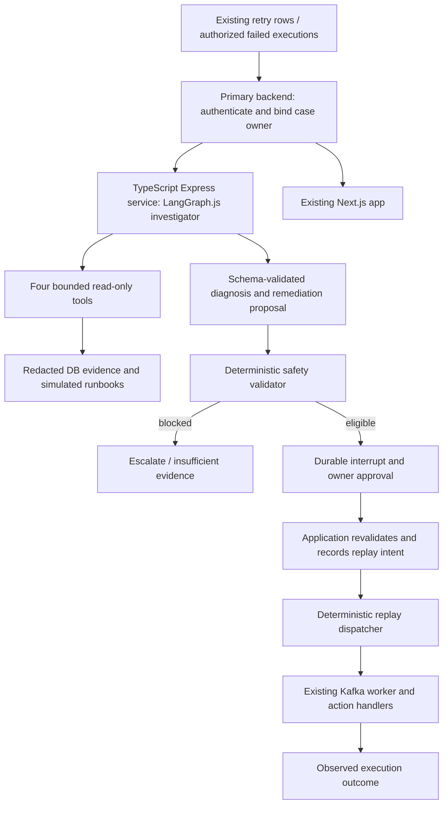

# Autonomous DLQ Triage Agent — master implementation plan

> **Status: Phases 1–4 implemented; Phase 5 is next.** Phase 4A-4C verification: 65 focused tests passed, 3 PostgreSQL integration tests passed, and type check/lint/build passed with the existing Next/Yarn-Corepack warnings. Scope revised 2026-09-24. Phase 5 simulated runbooks and later diagnosis, approval, replay, and frontend work remain deferred.

**Goal:** investigate failed workflow stages, gather bounded evidence, propose grounded remediation, enforce deterministic safety and human approval, and hand eligible replay to application code.

**Architecture:** one TypeScript LangGraph.js investigator in a separate Express service, behind the existing primary backend’s authenticated endpoints. Tools are read-only. Durable agent state is separate from approval/execution authority; the existing worker remains the executor of external actions.

**Stack:** Bun, TypeScript, Express, Zod and LangGraph.js for the AI service; PostgreSQL for durable agent state when required. Existing Prisma, KafkaJS and Next.js remain in place. Add one model adapter initially; RAG and Langfuse remain in their planned phases. The agent is an ordinary `apps/*` workspace with dependencies in the shared Bun lockfile.

**Requirements and navigation:** this document owns sequencing, release scope and implementation boundaries. [Failure taxonomy](AI/failure-taxonomy.md) owns scenarios/evidence. [ADRs 009–018](decisions.md#adr-009-read-only-single-agent-triage-boundary) own new proposed decisions. Reuse [architecture](architecture.md), [execution flow](execution-flow.md), [worker](worker.md), [Kafka](kafka.md), [actions](actions.md), [idempotency](idempotency.md), [repository structure](repository-structure.md), [current state](current-state.md), and [verification commands](tooling_Verification.md); do not duplicate their service setup instructions.

## 1. Current AI-relevant architecture

The existing path is webhook transaction -> run/outbox -> processor -> Kafka -> ordered worker actions -> durable execution/failure evidence -> separate DLQ publisher. Workflows are linear sequences, not a general branching DAG. The AI investigation graph is a separate control workflow.

| Completed phase                          | Evidence and implementation boundary                                                                                                                                                                                                                                                                                                 |
| ---------------------------------------- | ------------------------------------------------------------------------------------------------------------------------------------------------------------------------------------------------------------------------------------------------------------------------------------------------------------------------------------ |
| 1 — Fixture investigator                 | `apps/ai_agent/src/graph.ts`, contracts, injected fixture model, local preview API/CLI and tests. The fixture path remains available alongside the Phase 4 live read-only path.                                                                                                                                                      |
| 2 — Evaluation foundation                | [Implementation plan](superpowers/plans/2026-09-21-phase-2-evaluation-fixtures.md), `apps/ai_agent/evaluation/cases.jsonl`, evaluation checks and tests. Preserve the existing 26-case development/held-out dataset.                                                                                                                 |
| 3A — Provider outcomes                   | [Design](superpowers/specs/2026-09-22-phase-3a-provider-outcomes-design.md), email/Telegram handlers and tests. Structured acceptance/rejection/not-attempted/unknown evidence; Resend returned errors are handled.                                                                                                                  |
| 3B — Durable failures                    | [Design](superpowers/specs/2026-09-22-phase-3b-durable-failures-design.md), `apps/worker/execution-store.ts`, worker orchestration and additive schema. Single-shot execution, claim fencing, attempt evidence, fingerprints, atomic FAILED/failure-row persistence and ACK gating.                                                  |
| 3C — Publication/reconciliation          | [Completed checklist](superpowers/plans/2026-09-23-phase-3c-dlq-publication.md), publisher, reconciler and separate worker entrypoint. Sanitized publication by failureId, broker-ACK stamping, backoff, expired-execution quarantine and missing-failure repair without provider calls.                                             |
| 4A-4C — Bounded live investigation tools | Authenticated owner-scoped case listing and private service-scope boundary; redacted failure context; bounded execution evidence with provenance and explicit unknowns; deterministic worker-parity input validation with no provider calls. Real PostgreSQL ownership-isolation coverage and shared contract fixtures are included. |

Phase 3B supersedes Phase 3A's interim automatic provider retry behavior: the active execution path makes one provider attempt. Publication retries deliver evidence; they do not resend provider actions. Existing fencing, fingerprints, durable capture, publication and reconciliation are retained.

The Phase 3C checklist records verification as completed. Older phase plans contain historical unchecked steps; source artifacts corroborate implementation, but neither artifact presence nor this revision claims fresh deployment or migration status. Phase 4A-4C verification is recorded in this milestone; check the target environment before deployment rather than replaying old plans.

Remaining constraints: external provider acceptance is not final delivery; an accepted request followed by failed persistence can remain UNKNOWN. Historical evidence/configuration snapshots may be absent. Current action definitions are mutable. FAILED does not become replayable by raw Kafka republish. Phase 4 live tools remain read-only and bounded; RAG, integrated model diagnosis, durable HITL, frontend integration, and replay remain future work.

Some taxonomy/current-state/ADR prose still describes pre-Phase-3 behavior (including repeated provider retries or missing durable failure records). For present behavior use source and Phase 3 records; preserve legacy/unknown distinctions. Antigravity owns routine reconciliation of those documents. Do not rebuild completed safeguards from stale prose.

## 2. Release scope and workflow

**Finish line — Required:** an authenticated DLQ investigation application using bounded read-only tools and cited runbooks, explicit uncertainty, saved investigations, a usable existing-frontend UI, basic tracing, deterministic evaluations, durable LangGraph interrupt/resume, and owner-approved replay of the narrow eligible scenario in Section 5. Complete the required increments and safety gates, not every numbered extension.

Retain TypeScript/Bun, one separate Express/LangGraph.js agent service, one initial model provider, existing PostgreSQL/Kafka/Prisma, and the existing frontend. Prefer a smaller supported capability with explicit limitations. Add complexity only for its correctness, security, or approved scope; never retain a capability while deferring a safeguard on which it depends.

- **Required from the first relevant boundary:** owner isolation, service authentication, redaction, runtime contract validation, bounded requests/model/tools/cost, honest evidence and abstention. Approval/replay durability, audit, fencing, revalidation and relevant crash/concurrency tests precede live replay.
- **Optional:** resumable SSE (10C), semantic judging (12), expanded command-center presentation (13).
- **Deferred beyond completion:** broader recovery automation and scale testing (14B), supervisors (15), MCP, vector infrastructure, bulk/changed-input replay, high availability, general DAG execution, new brokers and additional services.
- **Preserved:** existing Phase 3 reliability mechanisms. A smaller release is not permission to delete them or to claim exactly-once external delivery.

**Responsibilities:** Astra revises scope/master plan; Codex implements the requested increment, verifies it and gives a concise handoff. Learning happens separately through ChatGPT/GitHub/Notion; there are no mandatory teaching sessions, learner checkpoints, lessons or interview explanations. Antigravity updates routine milestone documentation and Graphify after completion, following the repository's pushed-milestone policy. Codex reports concrete master-plan conflicts instead of silently redesigning.

This revision changes sequencing and release scope, not the read-only agent or deterministic authorization boundaries in ADRs 009–018. In particular, ADR 017's proposed streaming transport becomes optional; authenticated polling is the initial UI transport. Antigravity should align that proposed ADR during its documentation handoff. No detailed implementation plans for later phases are required now.

## 3. Boundaries, state and initial contracts

### Initial footprint and trust boundary

The agent lives in `apps/ai_agent/` as a normal Bun workspace with its own `package.json`, `tsconfig.json`, `src/` and `tests/`. Keep graph logic importable independently of Express; expose a local fixture API and CLI using the same graph. Later, primary-backend `route/triage.ts` is the authenticated gateway. Do not add AI action types to the worker registry.

Initial read-only case discovery in the TypeScript backend uses owner-filtered `ZapRunRetry` rows, not a second Kafka consumer. This covers only the surviving SQL sink. The Phase 3C reconciler already repairs FAILED executions without rows and quarantines expired executions. Importing Kafka-only failures is deferred; no LLM runs inside the workflow consumer. Unknown ownership is quarantined outside tenant APIs.

Server code binds `userId`, `caseId`, `zapRunId`, `stage` and internal thread ID after a join through the owner. A model-supplied ID is never authorization. Do not hand the model a Prisma client, provider credential, executable code, free-form URL or Kafka producer. The agent process has separate credentials and no workflow-table write role or workflow-topic producer capability.

### Agent-service contract

- The browser keeps its existing JWT-to-primary-backend flow. The primary backend verifies ownership, creates the case/investigation binding and calls private agent endpoints. The agent service does not become a second user-auth system.
- Use authenticated service-to-service requests over TLS outside local development. The primary backend issues short-lived signed context scoped to owner, case, investigation, allowed evidence operations and audience. Both services validate issuer/audience/expiry; the agent cannot select a different owner and evidence endpoints independently recheck current ownership. Do not trust caller-provided identity headers or expose internal endpoints merely because they have private-looking URLs.
- Agent tools call bounded primary-backend evidence/validation APIs with that scope; the backend queries existing Prisma models and returns redacted versioned DTOs. Start with HTTP, not new Kafka topics. A trusted runner may renew scope only through a server-side binding check; model arguments cannot request renewal or broaden access.
- Zod validates every service, tool and model boundary. Specify contract version, UUID/string IDs, nonnegative integer stages, UTC timestamps, error codes and size limits. The backend computes canonical workflow fingerprints; the agent carries them unchanged. Use shared JSON contract fixtures including invalid values.
- Distinguish domain outcomes (`insufficient_evidence`, `blocked`) from transport/auth/timeouts. Bound HTTP/model deadlines, propagate correlation/idempotency IDs and retry reads only within budget. Never blindly retry a state-changing request after a timeout without checking its durable idempotency key.
- A proposal is submitted idempotently to the primary backend and stored immutably before approval. Application code owns policy validation, human approval and replay authorization. The agent receives the resulting decision reference through an idempotent resume endpoint and verifies it rather than trusting `approved: true` in a request.
- There is no transaction spanning agent checkpoints and application approval tables. Persist the decision first, then deliver the resume notification; reconcile pending notifications by decision ID after crashes or lost responses. A replay command is created and consumed solely by deterministic application code, independently of whether the graph resumed.
- LangGraph checkpoint tables and application tables retain explicit ownership even though both services use TypeScript. Prisma remains owner of workflow/proposal/approval/replay tables. Checkpoint setup runs as a controlled migration, not concurrently in every agent startup. Kafka integrations remain deferred; any later AI DLQ consumer is intake-only with its own group and never replaces the existing worker.

The Express server wrapper owns model-client shutdown, and strict Zod schemas reject unknown or oversized request/evidence/model values. These are service-boundary concerns rather than reasons to add a framework-specific abstraction.

### Four tool contracts

All tools validate arguments, apply server-bound case/owner scope, limit result size, enforce a short timeout, redact before model/checkpoint/trace/UI exposure, and return an evidence ID, observed time, source, version/hash, and completeness flags. Unknowns are explicit. Tools cannot widen scope through model arguments.

| Tool / proposed file under `apps/ai_agent/src/tools/` | Input                                                         | Output and scope                                                                                                                                                            |
| ----------------------------------------------------- | ------------------------------------------------------------- | --------------------------------------------------------------------------------------------------------------------------------------------------------------------------- |
| `getFailureContext` / `failure-context.ts`            | No model-selected identity; bound case                        | Selected retry fields, source kind, current action type, redacted template structure and payload field summary; distinguish current config from historical evidence         |
| `getExecutionEvidence` / `execution-evidence.ts`      | Bound case; bounded history limit (default 10, maximum 50)    | Current stage/predecessor states, lease, authorized related failure rows, ordering validity, later replay ledger; no global tenant history                                  |
| `validateActionInputs` / `validate-action-inputs.ts`  | Bound case, no arbitrary code/template injection              | Deterministic parser dry run, missing paths/required fields, field type errors, supported action type, redacted fingerprint; no provider network calls or handler `execute` |
| `searchRunbooks` / `search-runbooks.ts`               | Query capped at 500 chars; optional provider/failure category | At most three versioned excerpts with document/section IDs, source labels and retrieval scores; bounded total excerpt bytes                                                 |

Keep authoritative action-input validation next to the worker parser and expose it through a bounded backend evidence endpoint. The agent tool calls this endpoint rather than duplicating parser behavior. Shared JSON fixtures test the contract. Trusted validation can examine secrets but returns only presence/source/version indicators. No provider calls to test credentials or delivery; future receipt adapters require a demonstrated taxonomy need.

### Typed state and output

`apps/ai_agent/src/contracts.ts` uses strict Zod schemas for requests, evidence and output, rejecting unknown fields, oversized values and invalid types. Use an explicit serializable LangGraph.js state schema with intentional reducers; validate external/model values before merging them. Version JSON/OpenAPI contracts and test both services rather than assuming shared language types validate remote data.

- **CaseRef:** server-bound case ID, source (`retry_row` or `reconciled_execution`; `kafka_quarantine` deferred), run/stage, owner and source reference. Model-visible projection excludes auth data.
- **Evidence:** ID, type, source reference, observed timestamp, content hash, redacted facts, unavailable fields, and simulation flag. Evidence snapshots are immutable per investigation revision.
- **InvestigationState:** case reference, evidence map, safe progress, bounded tool/step counters, diagnosis, proposal and deterministic policy result. Start with at most 8 tool calls, 12 graph steps, one output-repair attempt and a 60-second active-run deadline; human waiting does not consume that deadline. Enforce the framework recursion bound as an additional cap.
- **Diagnosis:** taxonomy ID or `unknown`, summary, evidence references, alternate explanations, missing evidence, confidence label (`low`, `medium`, `high`). Confidence is descriptive, never replay authorization.
- **RemediationProposal:** immutable proposal ID/version, kind (`wait_then_replay`, `request_manual_fix`, `escalate`, `no_action`), reasons, evidence refs, preconditions and optional not-before time. No SQL, script, credentials, arbitrary patch, free-form replay payload or topic.
- **PolicyResult:** `blocked`, `requires_approval`, or `no_action`, with machine-readable reasons and evaluated execution/configuration/evidence fingerprints. Only application code creates it; the model cannot write `approved`/`safe`.
- **ProgressEvent:** investigation ID, monotonic sequence, timestamp, safe event type and bounded summary. Public status is not raw graph state or hidden reasoning.

Lifecycle: `queued -> investigating -> proposed -> blocked | awaiting_approval -> approved | rejected | expired -> replay_queued -> replaying -> resolved | replay_failed | outcome_unknown`. A cancellation/agent-error terminal state never means an action succeeded. Dispatch ACK is only queued; verified stage/whole-run completion determines resolution. Proposal edits require a new version and approval.

### Persistence, API and run ownership (introduced in Phase 8)

The agent service owns investigation jobs, current safe progress and LangGraph PostgreSQL checkpoints in an `ai_agent` schema with a restricted role and service-owned migrations. Primary-backend Prisma owns case-owner bindings, immutable submitted proposals, `TriageApproval` and later `ReplayRequest` in the application schema. The same PostgreSQL instance can host both. No table has two migration owners; neither service directly updates the other’s tables. Avoid duplicating unrestricted payloads across stores.

- Investigation stores source identity, owner/run/stage, status, graph/prompt version, redacted evidence snapshot and hash, proposal/version, checkpoint thread ID, active-run lease and expiry. Permit only one active investigation per canonical source identity; repeated start with the same idempotency token returns it.
- Approval stores actor, proposal/evidence/configuration hashes, decision, timestamp, expiry, and a unique consumable authorization reference. Initial policy: run owner can approve their own eligible case; an operator role/cross-tenant approval is not implied by JWT auth.
- Business audit records are durable and bounded. Polling reads a current sanitized snapshot; an append-only transport event history is optional in Phase 10C. Approval/replay transitions require durable business audit even if Langfuse is down. Failed trace export is non-blocking; failed approval audit is fail-closed.
- A short-lived DB lease serializes graph execution per investigation across requests/processes. A deterministic runner claims queued rows and resumes after restart; one-process polling is sufficient initially. Waiting for human approval releases the runner lease and all Kafka/provider resources. Browser disconnect does not cancel a persisted investigation.
- Proposed routes under `/api/v1/triage`: `GET /cases`, `POST /cases/:caseId/investigations`, `GET /investigations/:id`, `POST /investigations/:id/decision`, and optional `GET /investigations/:id/events` only in Phase 10C. Validate ownership on every request and derive internal graph thread IDs server-side. POST start/decision accept idempotency keys. Decision accepts only proposal version and approve/reject, not arbitrary `Command` state or model instructions.

Only introduce persistence after fixture contracts work. The Phase 1 request-bound preview has no checkpointer; any later in-memory checkpointer is limited to local teaching exercises, while durable approvals must survive restart. LangGraph supplies checkpoint mechanisms, not the application's auth and approval policy ([LangGraph.js persistence reference](https://docs.langchain.com/oss/javascript/langgraph/persistence)).

## 4. Failure taxonomy and the minimum RAG corpus

The [taxonomy](AI/failure-taxonomy.md) covers F01 rate limits, F02 outages/transport, F03 credentials/permissions, F04 destination/template input, F05 unsupported action, F06 malformed/missing stage/run, F07 uncertain delivery/lease, F08 stale/duplicate cases, F09 incomplete DLQ/progression and F10 hidden email errors. Phase 3 repaired important F05/F07/F09/F10 evidence paths; legacy rows and invalid/unowned envelopes can still lack usable evidence. Inspect source before treating historical taxonomy prose as current behavior.

Create these **six simulated documents in Phase 5**, not during this planning task:

| Planned document under `docs/AI/runbooks/` | Scope and required distinctions                                                                                             |
| ------------------------------------------ | --------------------------------------------------------------------------------------------------------------------------- |
| `transient-provider-failure.md`            | F01/F02: provider vs transport, cooldown, pre-send vs ambiguous failure, no unsupported claim of recovery                   |
| `credentials-and-destinations.md`          | F03/F04: missing config vs worker environment unknown, bot membership, operator repair, no secrets or send-to-test          |
| `template-and-registry-validation.md`      | F04/F05/F06: parser missing-path behavior, expected action IDs, stage ordering, unsupported-handler detection gap           |
| `uncertain-delivery.md`                    | F07: leases vs external delivery, Telegram ambiguity, email same-request/key and bounded deduplication window               |
| `replay-and-stale-cases.md`                | F08: terminal FAILED behavior, SUCCESS refusal, fingerprints, expiry, approval and replay-request deduplication             |
| `evidence-gaps.md`                         | F09/F10: split/lost sinks, hidden SDK errors, progression vs action failure, explicit abstention and engineering escalation |

Every document contains ID/version, `simulated: true`, owner/review date, applicable taxonomy/provider/code version, symptoms, evidence needed, read-only investigation procedure, allowed remediation, forbidden actions, replay/approval conditions, verification/rollback or escalation, and links to existing source/docs. Separate fabricated examples from real implementation facts. Do not copy the architecture docs, ingest the entire repo, `.env`, README credentials, user payloads or Graphify graph.

Index allowed Markdown files at startup/build by headings, keeping each short section intact with ID, heading, provider/category metadata and content hash. Use deterministic token/keyword overlap plus metadata filters with stable tie-breaking and a small top-k. No vector DB, embeddings, reranker, GraphRAG or ingestion service initially. Return no match rather than inventing a citation. The agent cites retrieved sections as procedural guidance alongside separate incident evidence; neither retrieved prose nor payload/error text can change tool permissions or policy. Code safety wins if a runbook conflicts.

Evaluate retrieval against labelled relevant sections and a no-retrieval baseline. Introduce embeddings only if held-out paraphrases fail retrieval materially and improvement justifies dependency/cost; reuse PostgreSQL if it suffices. Versioned stale runbooks must be excluded or explicitly flagged, not silently trusted.

## 5. Deterministic replay design and release gate

**Required initial scenario: F01, captured Telegram send-stage HTTP 429 rejection, same-input and single-stage, with at most one owner-approved replay per original failure.** Require a complete persisted attempt record proving explicit rejection, a valid bounded retry delay and completion timestamp, unchanged request/action/handler identity, and every gate below. Derive not-before conservatively from the recorded completion time plus retry delay. Missing/contradictory/legacy/reconciled-only evidence blocks eligibility. Only this scenario is allowlisted; all others remain diagnosis/manual escalation. Before live enablement, confirm that the provider's current semantics support treating this exact response as rejection; if not, report a plan conflict and keep replay disabled.

A replay gets its own durable generation/attempt identity; Phase 3's single-attempt and one-failure-row constraints cannot silently be reused to overwrite history. Phase 9A must specify and test an additive history-preserving representation. A second 429 or any replay failure ends this release's replay allowance; unknown outcome is never retried.

**All replay remains same-input, single-stage only.** No LLM mutations, bulk replay, changed recipient/body, historical payload edits, credential repair, reset of SUCCESS, or creation of a new run to evade deduplication. Manual repair recommendations can be useful even when replay remains blocked.

Before replay, code must verify all of: owner authorization; approved unexpired proposal; unchanged evidence/action/payload fingerprint and deployed handler version; valid existing run and contiguous unique stage sequence; every predecessor SUCCESS; no incompatible successor state; target FAILED and no live execution; no existing active replay request; provider delivery safety; not-before deadline; bounded replay count. Revalidate after human wait, when creating the request, and immediately before worker execution. Deny unknowns. Email replay is deferred; any future provider-deduplication path must verify the provider's then-current guarantees and expiry rather than assuming permanent safety.

### Smallest reliable extension to the foundation

1. TypeScript backend `services/replay.ts` transactionally validates and consumes one approval, and creates one immutable `ReplayRequest` containing run/stage, request ID, approved fingerprint, execution generation, actor, deadline and audit linkage. Unique constraints/CAS prevent competing active requests. It does **not** clear FAILED or call Kafka in the approval transaction.
2. Use the request row itself as the durable replay outbox (pending dispatch, lease and ACK time), rather than misusing the stage-zero ingestion outbox. A deterministic `replay-dispatcher.ts` publishes `{ zapRunId, stage, replayRequestId }` to existing `zap-events`, then marks publication. A crash after ACK can duplicate the same request ID; correctness must survive it. Keep request pending on publish failure and back off.
3. Extend the worker envelope validation compatibly: ordinary `{ zapRunId, stage }` stays supported; only envelopes with a valid stored replay request may enter the guarded replay path. An arbitrary Kafka replayRequestId is not authority without matching DB state. Deploy the compatible worker before enabling dispatcher publishing.
4. Worker atomically claims an approved request and its expected FAILED execution generation, verifies fingerprint/order/safety, and only then transitions to PENDING with a fenced lease. Ordinary stale events cannot reopen FAILED. Capture exact action inputs selected for this attempt; do not load mutable config again after validation.
5. Preserve `(zapRunId, stage)` and the existing provider key for same-request retry; preserve SUCCESS predecessors. Add generation/claim ownership so stale workers cannot finalize a newer execution. Enforce bounded provider timeouts; DB fencing cannot by itself undo an already accepted external request. Unsupported provider guarantees remain blocked.
6. Record outcome and request generation together. If uncertain after a crash, preserve `outcome_unknown` and require reconciliation; do not automatically retry ambiguous Telegram delivery. Repeated delivery of a completed replay request is a no-op. Successful stage progression continues through the existing worker, with validated ordering and crash-window tests.
7. On replay failure, retain original failure/approval evidence and record the new failure with request/generation linkage. Start a new case revision; never consume old approval again. No infinite autonomous retry loop.

Phase 3 has established evidence prerequisites; Phase 8 establishes durable safety/approval; Phase 9 integrates replay in small reviewed substeps: ledger/dry-run, publisher, worker guarded claim, then crash/concurrency verification. Test real transaction conflicts and duplicate delivery before live side effects. Extending the existing worker at these boundaries preserves the foundation instead of replacing it.

## 6. Phases, dependencies and implementation increments

Phases 1–3 are completed (Section 1); do not rerun their implementation plans. Phase numbering is retained for references. Required execution order:

`4A -> 4B -> 4C -> 5 -> 6 -> 10A -> 7 -> 8A -> 8B -> 8C -> 9A -> 9B -> 9C -> 10B -> 11 -> 14A`

Deterministic checks grow with each phase; Phase 11 formalizes evaluation rather than postponing it. Phase 7 can precede 10A if desired, and Phase 11 diagnosis evaluation can begin after Phase 6. Controls from 14A apply when their capability first becomes live. Optional/deferred work is not a dependency of this sequence.

Each increment below states outcome, files, verification and completion; these are scope contracts, not exhaustive implementation scripts. Paths without a prefix are within `apps/ai_agent/`. No phase completion authorizes the next.

### Phase 4 — Bounded live investigation tools — Completed

**Dependencies:** completed phases 1–3 and Section 3 contracts. No RAG, new model integration, live replay, approval, frontend, schema expansion or Kafka intake. Preserve existing worker semantics and do not call providers.

- **4A — Authenticated failure context.** Completed. Owner-filtered case listing and `getFailureContext` use server-bound identity, HMAC service scopes, redaction, size/time limits, correlation IDs, strict contracts, and PostgreSQL ownership joins. Forged IDs/scopes, expired tokens, orphan rows, nested secrets, response bounds, and read timeouts are covered.
- **4B — Execution evidence.** Completed. `getExecutionEvidence` reports bounded attempts, predecessor states, provenance, ordering, fingerprints, and explicit unknowns for captured, reconciled, and legacy cases.
- **4C — Deterministic input validation.** Completed. `validateActionInputs` uses authoritative worker registry/parser semantics, returns secret-safe status and fingerprints, and performs no handler or provider call.

Phase 4 verification completed with 65 focused tests, 3 PostgreSQL integration tests, and passing type check, lint, and build. The existing Next/Yarn-Corepack warnings remain noted; they do not change the Phase 4 contract.

Cross-increment rule: add only files needed for the current contract; no parser duplication, generic SQL/HTTP/shell tool, arbitrary model-selected identity or new dependency without a concrete requirement.

### Phase 5 — Simulated runbooks and minimal RAG — Required

- **Dependencies/outcome:** Phase 4; six labelled documents and bounded `searchRunbooks` per Section 4.
- **Files:** `docs/AI/runbooks/`, `src/tools/search-runbooks.ts`, retrieval tests. These runbooks are feature inputs; Codex may implement them despite Antigravity owning routine milestone documentation.
- **Verify/done:** relevant top-three retrieval on labelled cases, no-match behavior, stable tie order, valid versioned citations and malicious/conflicting-text handling; compare with no retrieval. Useful cited guidance without claiming incident facts.
- **Excluded:** embeddings, vector database, rerankers, repository ingestion and new ingestion services.

### Phase 6 — Integrated diagnosis and structured remediation — Required

- **Dependencies/outcome:** Phases 4–5; one model adapter and a bounded graph that gathers evidence, retrieves guidance and returns validated diagnosis/proposal or abstention.
- **Files:** `src/graph.ts`, contracts, prompts/model adapter, evaluation checks and graph/API tests.
- **Verify/done:** taxonomy cases, valid evidence IDs, contradictory/insufficient evidence, prompt injection, invalid model output, time/tool/token budgets and limited repair. Unknown delivery cannot become replay eligibility.
- **Excluded:** writes/replay tools, agent-generated fixes, multiple providers and autonomous supervisor. The request-bound diagnosis API remains bounded and explicitly non-durable until 8A.

### Phase 7 — Basic Langfuse observability — Required

- **Dependencies/outcome:** Phase 6; one useful trace linking investigation, model/tools/retrieval, errors, latency, token usage and version identifiers.
- **Files:** `src/observability.ts`, adapter/graph wiring and exporter tests.
- **Verify/done:** inspect one configured trace; fake exporter tests prove redaction and non-blocking outage behavior. Report inability to validate real export rather than claiming it.
- **Excluded:** self-hosted telemetry infrastructure, duplicate tracing stacks, elaborate dashboards and trace-driven automatic dataset creation. Business audit remains independent.

### Phase 8 — Durable investigations, policy and HITL — Required

**Dependencies:** Phase 6 and Section 3 ownership contracts; Phase 7 export is never an availability dependency. One deployment/runner is sufficient, but duplicate requests and restarts still require idempotency. No Kafka dispatch or provider execution.

- **8A — Saved investigations.** Persist jobs, immutable redacted snapshots/results and PostgreSQL graph checkpoints with restricted ownership. Files: `src/checkpoint.ts`, `runner.ts`, service-owned migrations, backend binding/API changes and recovery tests. Verify duplicate start, bounded concurrency, restart recovery, owner reads and browser disconnect. Done: saved results survive restart; abandoned read-only work can resume or end explicitly without losing authority boundaries.
- **8B — Deterministic policy and proposals.** Store immutable versioned proposals and backend-computed policy for the Section 5 allowlist. Files: backend `services/replay-policy.ts`, proposal schema/migration, routes and tests. Verify missing evidence, cooldown, changed fingerprints, order, active lease, unknown outcomes and stale state. Done: eligible proposals require approval; hard blocks cannot be overridden.
- **8C — Durable approval and interrupt/resume.** Persist owner decision, actor, expiry and audit before notifying LangGraph; use idempotent decision IDs and recover missed resume notifications. Files: approval schema/migration, backend decision route, graph/runner and HITL tests. Verify restart at interrupt, concurrent/duplicate decisions, wrong owner, expiry, rejection, failed audit writes and commit-before-notification crash. Done: graph reflects the authoritative decision exactly once logically, without dispatching actions.

### Phase 9 — Narrow deterministic replay — Required

**Dependencies:** Phase 8 and completed Phase 3 safeguards; Section 5 gates are mandatory. Feature disabled until 9C passes. Only the allowlisted F01 case is supported; no changed inputs, automatic/bulk replay, credential repair or second replay.

- **9A — Durable request and dry run.** Specify additive replay generation/attempt/failure history compatible with existing uniqueness constraints; transactionally consume one approval and record immutable ReplayRequest plus audit. Files: backend `services/replay.ts`, Prisma migration/schema and policy/transaction tests. Verify real DB competing requests, duplicate approval, stale versions, preserved original history and all block reasons. Done: one durable intent, no publishing or provider effects.
- **9B — Dispatch and guarded worker claim.** Implement Section 5 outbox/worker protocol with request identity, fencing, bounded provider timeout, immutable selected inputs and outcome recording. Files: backend dispatcher, worker execution/envelope boundaries, schema as needed and focused tests. Verify duplicates, forged request IDs, legacy event compatibility, stale completion, no SUCCESS reset and failed replay history. Done: stubbed eligible request executes through the existing worker; unknown outcomes remain terminal.
- **9C — Recovery and enablement gate.** Exercise real PostgreSQL/Kafka with stubbed external providers across publish-before/after-ACK and provider-before/after-persistence crash windows. Files: integration tests and narrow configuration fixes. Done: one logical consumption of authority, correct queued/completed/unknown states, preserved ordering/history, kill switch and no automatic resend. A real sandbox send requires separate explicit authorization; failure to prove provider rejection semantics keeps live replay disabled.

### Phase 10 — Operator interface and optional streaming

- **10A — Required; moved immediately after Phase 6.** Basic authenticated case list, explicit investigation action, diagnosis/evidence/citations and blocked/unknown states in the existing frontend. Files: existing AppShell, `apps/frontend/src/app/triage/`, `src/hooks/useTriage.ts`, types and backend response projections. Verify owner isolation, loading/error/empty states and request cancellation. Done: useful read-only UI using ordinary requests; pre-8A results are explicitly transient. Do not poll by repeatedly starting investigations.
- **10B — Required; after 8–9.** Add saved investigation reads/polling, approve/reject, expiry/conflict reasons and actual replay outcomes. Same UI/API boundaries plus end-to-end tests. Verify wrong owner, stale decisions, repeated clicks, restart/reload and blocked controls. Done: case -> diagnosis -> decision -> observed outcome works without conflating publication with execution.
- **10C — Optional; after 8A and 10B.** Resumable sanitized SSE with event sequence/history and authenticated fetch; files `src/events.ts`, backend proxy and frontend stream hook. Verify reconnect, expired cursor snapshot fallback, authorization and backpressure. Done only if explicitly selected; no raw graph state/hidden reasoning or URL tokens. Polling remains sufficient for completion.

### Phase 11 — Deterministic evaluation and reporting — Required

- **Dependencies/outcome:** Phase 6 for diagnosis, Phase 9 for final replay assertions. Reuse Phase 2's versioned 26 cases (18 development / 8 held-out); add variants only for supported changes.
- **Files:** `evaluation/cases.jsonl`, `src/evaluation/checks.ts`, experiment runner and tests.
- **Verify/done:** reproducible report with schema/citation validity, grounding, abstention, owner isolation, replay policy, cost and latency. Wrong-owner, fabricated-citation, stale-proposal and unsafe-replay mutations must fail; zero safety violations is required. Track diagnosis acceptance (initial target 80%) and retrieval top-three recall (90%) with denominators and small-sample caveats; report shortfalls honestly. No held-out leakage or real provider effects.
- **Excluded:** automatic trace ingestion and semantic judge as a safety authority.

### Phase 12 — Semantic judge — Optional

After Phase 11, add a calibrated offline rubric only if needed. Files: judge/rubric/runner and tests. Verify grounded abstention, verbosity bias, malformed output and outage; done when human comparison shows useful signal. Never gates authorization; not required for release.

### Phase 13 — Expanded command center — Optional

After 10B, extend timeline/filtering/trace links and evaluation presentation within the existing UI. Files: triage pages/hooks and owner-scoped projections; verify accessibility, stale state and partial failures. Done when the selected operator feature works; no separate app or mandatory advanced dashboard.

### Phase 14 — Operational readiness

- **14A — Required final gate, controls introduced with their features.** Investigation/replay feature switches, configured origins and service/DB privileges, bounded input/model/tool/provider deadlines, per-owner request/concurrency/spend budgets, redaction, retention/access rules, basic failure/stuck-work visibility and recoverable shutdown/restart. Files: service/backend config, runner, necessary deployment settings and operational tests. Verify model/DB/Kafka outages at supported boundaries, restart, kill switch, secret isolation and backup/restore of approval/replay authority before external rollout. Done: documented supported limits, read-only operation first, narrow approved replay only after 9C; rollback stops new work without claiming to unsend accepted actions.
- **14B — Deferred.** Kafka-only intake, generalized recovery automation, high-volume load/SLO programs, high availability and broader replay coverage. No new files/work until separately scoped; existing Phase 3 reconciliation remains active.

### Phase 15 — Supervisors — Deferred

Outside completion criteria. Reconsider only with measured failure of the bounded single-agent approach and a separately approved scope. No implementation files or verification work now.

### Optional — MCP adapter — Deferred beyond this release

Existing numbering/title retained for references. No implementation now; reconsider only for an actual second consumer without expanding tool authority.

## 7. Verification and handoff

For implementation, read [tooling_Verification.md](tooling_Verification.md), run focused checks for affected behavior and the required root type/lint/build checks. Root Turbo success only covers declared package scripts; use direct backend/worker checks where needed. Do not claim tests passed without current output, or infer migrations are deployed from their presence.

Use existing agent tests/type checks and worker provider/execution/publisher/reconciler suites when affected. Phase 4 requires real DB ownership-join coverage; Phase 9 requires production-path DB/Kafka crash/concurrency tests. Automated provider calls are stubbed; real external sends are never an incidental verification step.

Codex handoff: changed files, behavior delivered, checks/results, limitations or blockers, and a short Antigravity documentation handoff where relevant. No teaching session, generated lesson, routine Graphify update, unsolicited next-phase implementation or automatic commit/push. Antigravity handles routine documentation and milestone Graphify work. Feature artifacts explicitly in scope, such as runbooks and evaluation rubrics, remain implementation work.

This scope revision records the completed Phase 4A-4C implementation from the current working tree. Phase 5 starts only on an explicit implementation request; do not create simulated runbooks or rebuild Graphify as part of this milestone.

## 8. Risks and deliberately deferred complexity

- **External uncertainty:** database state and model confidence cannot prove provider non-delivery; unsupported/ambiguous cases remain blocked even after human approval.
- **Historical gaps:** no invented snapshots, receipts or missing attempts. Current definitions are not historical evidence.
- **Untrusted content:** retrieved prose, payloads and errors cannot change tool scope/policy; redact before any model, checkpoint, trace or UI exposure.
- **Approval races:** immutable versions, ownership, fingerprints and revalidation survive human delays; checkpoints never grant authority.
- **Recovery:** preserve Phase 3 fencing and reconciliation. Persist approval/replay before effects; never hold a provider/Kafka lease while awaiting a human.
- **Scope:** no auth/ingestion rebuild, general DAG, extra platform, automatic provider retry, broad replay, vector infrastructure, supervisor or MCP requirement.
- **Dependency drift:** verify the selected library/provider interfaces during their implementation phase. No speculative upgrade or architecture review is required.

The release is complete when its required capabilities and safety gates work within the stated limits. Unsupported cases may finish with diagnosis and manual escalation; optional extensions do not block completion.
