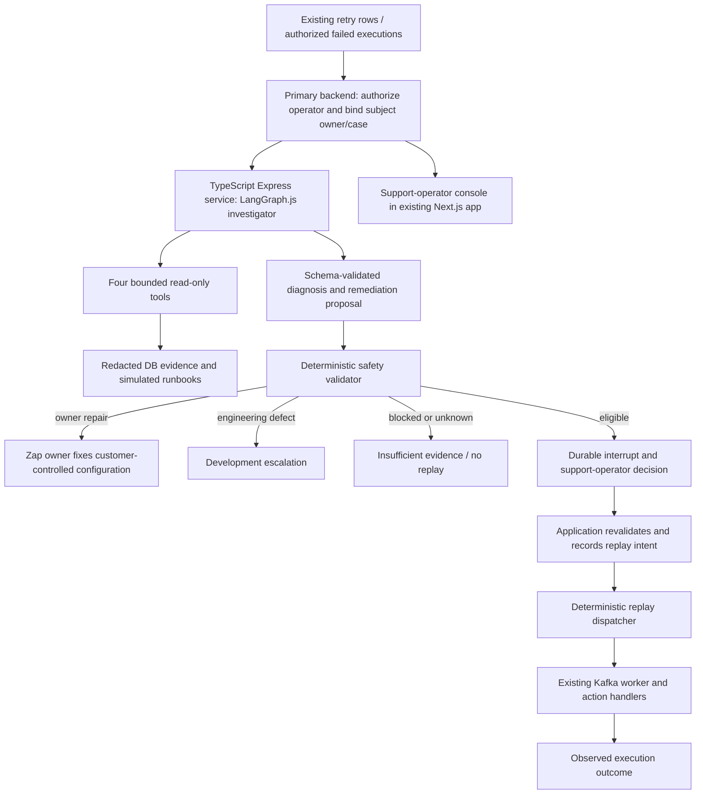

# Autonomous DLQ Triage Agent — master implementation plan

> **Status: Phases 1–6 implemented; Optional R1 completed as a limited baseline/BM25 experiment with no production adoption. The Phase 9A/9B replay path is implemented and Phase 9C local recovery verification is complete with real PostgreSQL/Kafka and stubbed providers; live replay enablement remains blocked. Phase 10B and optional Phase 10C are implemented; 10C adds durable sanitized investigation milestones and authenticated resumable fetch streaming, while polling remains the fallback. Phase 11's offline deterministic evaluation/reporting is implemented; its checked-in no-model fixture control reports quality shortfalls and does not establish real-model results or live eligibility.** Phase 4A-4C verification: 65 focused tests passed, 3 PostgreSQL integration tests passed, and type check/lint/build passed with the existing Next/Yarn/Corepack warnings. Phase 5 verification: 8 focused retrieval tests passed, root type-check and build passed with existing Yarn/Corepack warnings, independent review found no Critical or Important findings, root lint remains blocked by 9 unrelated errors and 22 warnings, and the full AI-agent suite was then blocked by a pre-existing non-JSON comment in evaluation/cases.jsonl (removed in Phase 11). Phase 6 implements bounded integrated diagnosis.

**Next evaluation increment:** Phase 11A is planned, not implemented. It adds real-model observation capture and a repeatable development baseline after the completed Phase 11 evaluator; real-model quality, cost and latency remain unmeasured until that run is recorded.

**Goal:** let an authorized support operator use a bounded AI investigator to diagnose failed workflow stages, review grounded remediation, route owner-controlled repairs or engineering defects correctly, and approve only the replay that deterministic application policy has found eligible.

**Architecture:** one TypeScript LangGraph.js investigator in a separate Express service, behind the existing primary backend’s authenticated endpoints. Tools are read-only. Durable agent state is separate from approval/execution authority; the existing worker remains the executor of external actions.

**Stack:** Bun, TypeScript, Express, Zod and LangGraph.js for the AI service; PostgreSQL for durable agent state when required. Existing Prisma, KafkaJS and Next.js remain in place. Add one model adapter initially; RAG and Langfuse remain in their planned phases. The agent is an ordinary `apps/*` workspace with dependencies in the shared Bun lockfile.

**Requirements and navigation:** this document owns sequencing, release scope and implementation boundaries. [Failure taxonomy](AI/failure-taxonomy.md) owns scenarios/evidence. [ADRs 009–018](decisions.md#adr-009-read-only-single-agent-triage-boundary) own new proposed decisions. Reuse [architecture](architecture.md), [execution flow](execution-flow.md), [worker](worker.md), [Kafka](kafka.md), [actions](actions.md), [idempotency](idempotency.md), [repository structure](repository-structure.md), [current state](current-state.md), and [verification commands](tooling_Verification.md); do not duplicate their service setup instructions.

## 1. Current AI-relevant architecture

The existing path is webhook transaction -> run/outbox -> processor -> Kafka -> ordered worker actions -> durable execution/failure evidence -> separate DLQ publisher. Workflows are linear sequences, not a general branching DAG. The AI investigation graph is a separate control workflow.

| Completed phase                          | Evidence and implementation boundary                                                                                                                                                                                                                                                                                                 |
| ---------------------------------------- | ------------------------------------------------------------------------------------------------------------------------------------------------------------------------------------------------------------------------------------------------------------------------------------------------------------------------------------ |
| 1 — Fixture investigator                 | `apps/ai_agent/src/graph.ts`, contracts, injected fixture model, local preview API/CLI and tests. The fixture path remains available alongside the Phase 4 live read-only path.                                                                                                                                                      |
| 2 — Evaluation foundation                | [Implementation plan](superpowers/plans/2026-09-21-phase-2-evaluation-fixtures.md), `apps/ai_agent/evaluation/cases.jsonl`, evaluation checks and tests. Preserve the existing 26-case development/held-out dataset.                                                                                                                 |
| 3A — Provider outcomes                   | [Design](superpowers/specs/2026-09-22-phase-3a-provider-outcomes-design.md), email/Telegram handlers and tests. Structured acceptance/rejection/not-attempted/unknown evidence; Resend returned errors are handled.                                                                                                                  |
| 3B — Durable failures                    | [Design](superpowers/specs/2026-09-22-phase-3b-durable-failures-design.md), `apps/worker/execution-store.ts`, worker orchestration and additive schema. Single-shot execution, claim fencing, attempt evidence, fingerprints, atomic FAILED/failure-row persistence and ACK gating.                                                  |
| 3C — Publication/reconciliation          | [Completed checklist](superpowers/plans/2026-09-23-phase-3c-dlq-publication.md), publisher, reconciler and separate worker entrypoint. Sanitized publication by failureId, broker-ACK stamping, backoff, expired-execution quarantine and missing-failure repair without provider calls.                                             |
| 4A-4C — Bounded live investigation tools | Authenticated subject-owner-scoped case listing and private service-scope boundary; redacted failure context; bounded execution evidence with provenance and explicit unknowns; deterministic worker-parity input validation with no provider calls. Real PostgreSQL ownership-isolation coverage and shared contract fixtures are included. |
| 5 — Simulated runbooks and minimal retrieval | Six labelled simulated runbooks covering F01–F10; allowlisted bounded Markdown indexing; deterministic keyword and metadata-filter retrieval with stable top-three ordering; versioned citations, SHA-256 content hashes, stale exclusion, and untrusted-guidance markers. |
| 11 — Deterministic evaluation and reporting | Offline split runner, explicit frozen-observation input, machine-readable/readable reports, and 30 contract safety probes. Checked-in no-model fixture control: 26 unchanged records (18 development / 8 held-out); zero safety violations; diagnosis acceptance 3/16 (18.75%) development and 3/5 (60%) held-out against 80%; retrieval Recall@3 15/16 (93.75%) and 4/5 (80%) against 90%. See [report](../apps/ai_agent/evaluation/phase-11-report.md) and [JSON](../apps/ai_agent/evaluation/phase-11-report.json). |

Phase 3B supersedes Phase 3A's interim automatic provider retry behavior: the active execution path makes one provider attempt. Publication retries deliver evidence; they do not resend provider actions. Existing fencing, fingerprints, durable capture, publication and reconciliation are retained.

The Phase 3C checklist records verification as completed. Older phase plans contain historical unchecked steps; source artifacts corroborate implementation, but neither artifact presence nor this revision claims fresh deployment or migration status. Phase 4A-4C verification is recorded in this milestone; check the target environment before deployment rather than replaying old plans.

Remaining constraints: external provider acceptance is not final delivery; an accepted request followed by failed persistence can remain UNKNOWN. Historical evidence/configuration snapshots may be absent. Current action definitions are mutable. FAILED does not become replayable by raw Kafka republish. Phase 4 live tools and Phase 5 retrieval remain read-only and bounded; integrated model diagnosis, durable HITL, frontend integration, and replay remain future work.

Some taxonomy/current-state/ADR prose still describes pre-Phase-3 behavior (including repeated provider retries or missing durable failure records). For present behavior use source and Phase 3 records; preserve legacy/unknown distinctions. Antigravity owns routine reconciliation of those documents. Do not rebuild completed safeguards from stale prose.

## 2. Release scope and workflow

**Finish line — Required:** an authenticated support-operations DLQ application using bounded read-only tools and cited runbooks, explicit uncertainty, saved investigations, a usable support-operator UI in the existing frontend, basic tracing, deterministic evaluations, durable LangGraph interrupt/resume, and support-operator-approved replay of the narrow eligible scenario in Section 5. Complete the required increments and safety gates, not every numbered extension.

Retain TypeScript/Bun, one separate Express/LangGraph.js agent service, one initial model provider, existing PostgreSQL/Kafka/Prisma, and the existing frontend. Prefer a smaller supported capability with explicit limitations. Add complexity only for its correctness, security, or approved scope; never retain a capability while deferring a safeguard on which it depends.

- **Required from the first relevant boundary:** subject-owner isolation, explicit support-operator authorization, service authentication, redaction, runtime contract validation, bounded requests/model/tools/cost, honest evidence and abstention. Approval/replay durability, actor audit, fencing, revalidation and relevant crash/concurrency tests precede live replay.
- **Optional:** expanded retrieval experiment (R2, after Phase 14), semantic judging (12), expanded command-center presentation (13). Phase 10C resumable SSE was explicitly selected and implemented; polling remains supported.
- **Deferred beyond completion:** broader recovery automation and scale testing (14B), supervisors (15), MCP, vector infrastructure, bulk/changed-input replay, high availability, general DAG execution, new brokers and additional services.
- **Preserved:** existing Phase 3 reliability mechanisms. A smaller release is not permission to delete them or to claim exactly-once external delivery.

**Responsibilities:** Astra revises scope/master plan; Codex implements the requested increment, verifies it and gives a concise handoff. Learning happens separately through ChatGPT/GitHub/Notion; there are no mandatory teaching sessions, learner checkpoints, lessons or interview explanations. Antigravity updates routine milestone documentation and Graphify after completion, following the repository's pushed-milestone policy. Codex reports concrete master-plan conflicts instead of silently redesigning.

This revision changes the human actor model and release scope, not the read-only agent, subject-owner isolation, or deterministic safety boundaries in ADRs 009–018. ADRs that currently say owner approval or owner-authorized operator UI require later terminology reconciliation; ADR 017's proposed streaming transport remains optional and authenticated polling is the initial UI transport. Antigravity should align those proposed ADRs during its documentation handoff. No detailed implementation plans for later phases are required now.

## 3. Boundaries, state and initial contracts

```mermaid
flowchart TD
    Source[Existing retry rows / authorized failed executions] --> API[Primary backend: authorize operator and bind subject owner/case]
    API --> Agent[TypeScript Express service: LangGraph.js investigator]
    Agent --> Tools[Four bounded read-only tools]
    Tools --> Evidence[Redacted DB evidence and simulated runbooks]
    Agent --> Proposal[Schema-validated diagnosis and remediation proposal]
    Proposal --> Policy[Deterministic safety validator]
    Policy -->|owner repair| Owner[Zap owner fixes customer-controlled configuration]
    Policy -->|engineering defect| Dev[Development escalation]
    Policy -->|blocked or unknown| Stop[Insufficient evidence / no replay]
    Policy -->|eligible| Approval[Durable interrupt and support-operator decision]
    Approval --> Recheck[Application revalidates and records replay intent]
    Recheck --> Dispatch[Deterministic replay dispatcher]
    Dispatch --> Worker[Existing Kafka worker and action handlers]
    Worker --> Outcome[Observed execution outcome]
    API --> UI[Support-operator console in existing Next.js app]
```

### Initial footprint and trust boundary

The agent lives in `apps/ai_agent/` as a normal Bun workspace with its own `package.json`, `tsconfig.json`, `src/` and `tests/`. Keep graph logic importable independently of Express; expose a local fixture API and CLI using the same graph. Later, primary-backend `route/triage.ts` is the authenticated gateway. Do not add AI action types to the worker registry.

Initial read-only case discovery in the TypeScript backend uses subject-owner-filtered `ZapRunRetry` rows, not a second Kafka consumer. This completed Phase 4 path is a tenant-isolation foundation, not the future support-operator authorization model. It covers only the surviving SQL sink. The Phase 3C reconciler already repairs FAILED executions without rows and quarantines expired executions. Importing Kafka-only failures is deferred; no LLM runs inside the workflow consumer. Unknown ownership is quarantined outside tenant and operator APIs.

Server code binds `subjectOwnerId`, `caseId`, `zapRunId`, `stage` and internal thread ID after a join through the Zap owner. `actorId` identifies the authenticated human making a request; an actor with the explicit support-operator permission may operate an authorized case without becoming its owner. `supportOperatorId` and `approvedBy` record the operator responsible for triage and approval. A model-supplied identity is never authorization. Do not hand the model a Prisma client, provider credential, executable code, free-form URL or Kafka producer. The agent process has separate credentials and no workflow-table write role or workflow-topic producer capability.

Use the smallest explicit permission model: one backend-enforced support-operator permission backed by application identity, not a general RBAC/ABAC platform. The current single operator may be authorized across all subject owners, but every request still resolves one canonical case and subject owner and records the actor. A normal Zap-owner JWT grants neither cross-tenant case discovery nor support-operator approval. Tenant assignments or narrower operator scopes can be added later without changing the agent's case-scoped contract.

### Agent-service contract

- The browser keeps its existing JWT-to-primary-backend flow. Before the operator console is usable, the primary backend must authenticate `actorId`, verify the explicit support-operator permission, resolve the case to `subjectOwnerId`, create the case/investigation binding and call private agent endpoints. The agent service does not become a second user-auth system and never lists cases across tenants.
- Use authenticated service-to-service requests over TLS outside local development. The primary backend issues short-lived signed context scoped to subject owner, case, investigation, allowed evidence operations and audience. Both services validate issuer/audience/expiry; the agent cannot select a different owner and evidence endpoints independently recheck the subject-owner join. Operator identity is retained in the investigation and business audit; it does not broaden the evidence scope. Do not trust caller-provided identity headers or expose internal endpoints merely because they have private-looking URLs.
- Agent tools call bounded primary-backend evidence/validation APIs with that scope; the backend queries existing Prisma models and returns redacted versioned DTOs. Start with HTTP, not new Kafka topics. A trusted runner may renew scope only through a server-side binding check; model arguments cannot request renewal or broaden access.
- Zod validates every service, tool and model boundary. Specify contract version, UUID/string IDs, nonnegative integer stages, UTC timestamps, error codes and size limits. The backend computes canonical workflow fingerprints; the agent carries them unchanged. Use shared JSON contract fixtures including invalid values.
- Distinguish domain outcomes (`insufficient_evidence`, `blocked`) from transport/auth/timeouts. Bound HTTP/model deadlines, propagate correlation/idempotency IDs and retry reads only within budget. Never blindly retry a state-changing request after a timeout without checking its durable idempotency key.
- A proposal is submitted idempotently to the primary backend and stored immutably before an operator decision. Application code owns policy validation, operator authorization, approval and replay authorization. The agent receives the resulting decision reference through an idempotent resume endpoint and verifies it rather than trusting `approved: true` in a request.
- There is no transaction spanning agent checkpoints and application approval tables. Persist the decision first, then deliver the resume notification; reconcile pending notifications by decision ID after crashes or lost responses. A replay command is created and consumed solely by deterministic application code, independently of whether the graph resumed.
- LangGraph checkpoint tables and application tables retain explicit ownership even though both services use TypeScript. Prisma remains owner of workflow/proposal/approval/replay tables. Checkpoint setup runs as a controlled migration, not concurrently in every agent startup. Kafka integrations remain deferred; any later AI DLQ consumer is intake-only with its own group and never replaces the existing worker.

The Express server wrapper owns model-client shutdown, and strict Zod schemas reject unknown or oversized request/evidence/model values. These are service-boundary concerns rather than reasons to add a framework-specific abstraction.

### Four tool contracts

All tools validate arguments, apply server-bound case/subject-owner scope, limit result size, enforce a short timeout, redact before model/checkpoint/trace/UI exposure, and return an evidence ID, observed time, source, version/hash, and completeness flags. Unknowns are explicit. Tools cannot widen scope through model arguments or support-operator authority.

| Tool / proposed file under `apps/ai_agent/src/tools/` | Input                                                         | Output and scope                                                                                                                                                            |
| ----------------------------------------------------- | ------------------------------------------------------------- | --------------------------------------------------------------------------------------------------------------------------------------------------------------------------- |
| `getFailureContext` / `failure-context.ts`            | No model-selected identity; bound case                        | Selected retry fields, source kind, current action type, redacted template structure and payload field summary; distinguish current config from historical evidence         |
| `getExecutionEvidence` / `execution-evidence.ts`      | Bound case; bounded history limit (default 10, maximum 50)    | Current stage/predecessor states, lease, authorized related failure rows, ordering validity, later replay ledger; no global tenant history                                  |
| `validateActionInputs` / `validate-action-inputs.ts`  | Bound case, no arbitrary code/template injection              | Deterministic parser dry run, missing paths/required fields, field type errors, supported action type, redacted fingerprint; no provider network calls or handler `execute` |
| `searchRunbooks` / `search-runbooks.ts`               | Query capped at 500 chars; optional provider/failure category | At most three versioned excerpts with document/section IDs, source labels and retrieval scores; bounded total excerpt bytes                                                 |

Keep authoritative action-input validation next to the worker parser and expose it through a bounded backend evidence endpoint. The agent tool calls this endpoint rather than duplicating parser behavior. Shared JSON fixtures test the contract. Trusted validation can examine secrets but returns only presence/source/version indicators. No provider calls to test credentials or delivery; future receipt adapters require a demonstrated taxonomy need.

### Typed state and output

`apps/ai_agent/src/contracts.ts` uses strict Zod schemas for requests, evidence and output, rejecting unknown fields, oversized values and invalid types. Use an explicit serializable LangGraph.js state schema with intentional reducers; validate external/model values before merging them. Version JSON/OpenAPI contracts and test both services rather than assuming shared language types validate remote data.

- **CaseRef:** server-bound case ID, source (`retry_row` or `reconciled_execution`; `kafka_quarantine` deferred), run/stage, subject owner and source reference. Model-visible projection excludes actor/auth data.
- **Evidence:** ID, type, source reference, observed timestamp, content hash, redacted facts, unavailable fields, and simulation flag. Evidence snapshots are immutable per investigation revision.
- **InvestigationState:** case reference, evidence map, safe progress, bounded tool/step counters, diagnosis, proposal and deterministic policy result. Start with at most 8 tool calls, 12 graph steps, one output-repair attempt and a 60-second active-run deadline; human waiting does not consume that deadline. Enforce the framework recursion bound as an additional cap.
- **Diagnosis:** taxonomy ID or `unknown`, summary, evidence references, alternate explanations, missing evidence, confidence label (`low`, `medium`, `high`). Confidence is descriptive, never replay authorization.
- **RemediationProposal:** immutable proposal ID/version, kind (`wait_then_replay`, `request_manual_fix`, `escalate`, `no_action`), reasons, evidence refs, preconditions and optional not-before time. `request_manual_fix` routes customer-controlled configuration to the Zap owner; `escalate` routes suspected platform defects or evidence gaps to development/support handling. No SQL, script, credentials, arbitrary patch, free-form replay payload or topic.
- **PolicyResult:** `blocked`, `requires_approval`, or `no_action`, with machine-readable reasons and evaluated execution/configuration/evidence fingerprints. Only application code creates it; the model cannot write `approved`/`safe`.
- **ProgressEvent:** investigation ID, monotonic sequence, timestamp, safe event type and bounded summary. Public status is not raw graph state or hidden reasoning.

Planning-level dispositions are `replay_eligible`, `owner_action_required`, `engineering_escalation_required`, `insufficient_evidence`, `outcome_unknown`, `duplicate_or_stale`, and `resolved_without_replay`. Reuse compatible contract values where they already exist; do not add enums until the implementing phase defines transitions and storage. Only `replay_eligible` can enter approval, and policy may still block it after revalidation.

Lifecycle: `queued -> investigating -> proposed -> blocked | owner_action_required | engineering_escalation_required | awaiting_approval -> approved | rejected | expired -> replay_queued -> replaying -> resolved | replay_failed | outcome_unknown`. Duplicate/stale cases and resolution without replay are auditable terminal dispositions. A cancellation/agent-error terminal state never means an action succeeded. Dispatch ACK is only queued; verified stage/whole-run completion determines resolution. Proposal edits require a new version and approval.

### Persistence, API and run ownership (introduced in Phase 8)

The agent service owns investigation jobs, current safe progress and LangGraph PostgreSQL checkpoints in an `ai_agent` schema with a restricted role and service-owned migrations. Primary-backend Prisma owns case-to-subject-owner bindings, operator authorization/audit, immutable submitted proposals, `TriageApproval` and later `ReplayRequest` in the application schema. The same PostgreSQL instance can host both. No table has two migration owners; neither service directly updates the other’s tables. Avoid duplicating unrestricted payloads across stores.

- Investigation stores source identity, `subjectOwnerId`, initiating `actorId`/`supportOperatorId`, run/stage, status, graph/prompt version, redacted evidence snapshot and hash, proposal/version, checkpoint thread ID, active-run lease and expiry. Permit only one active investigation per canonical source identity; repeated start with the same idempotency token returns it.
- Approval stores `subjectOwnerId`, `approvedBy` support-operator identity, proposal/evidence/configuration hashes, decision, timestamp, expiry, and a unique consumable authorization reference. The initial policy requires the explicit support-operator permission; Zap ownership alone cannot approve operational replay. A future high-impact action may separately require owner consent, but that is not part of the narrow F01 replay.
- Business audit records are durable and bounded. Polling reads a current sanitized snapshot; an append-only transport event history is optional in Phase 10C. Approval/replay transitions require durable business audit even if Langfuse is down. Failed trace export is non-blocking; failed approval audit is fail-closed.
- A short-lived DB lease serializes graph execution per investigation across requests/processes. A deterministic runner claims queued rows and resumes after restart; one-process polling is sufficient initially. Waiting for human approval releases the runner lease and all Kafka/provider resources. Browser disconnect does not cancel a persisted investigation.
- Proposed support routes under `/api/v1/triage`: `GET /cases`, `POST /cases/:caseId/investigations`, `GET /investigations/:id`, `POST /investigations/:id/decision`, and optional `GET /investigations/:id/events` only in Phase 10C. Authorize the support actor and resolve the subject-owner/case binding on every request; derive internal graph thread IDs server-side. POST start/decision accept idempotency keys. A decision is a typed action against an immutable proposal/version: approve/reject eligible replay, mark owner action required, escalate to engineering, or resolve without replay. It is never arbitrary LangGraph `Command` state or model instructions. Owner-facing status, consent, or configuration-repair routes are separate and deferred unless explicitly scoped.

Only introduce persistence after fixture contracts work. The Phase 1 request-bound preview has no checkpointer; any later in-memory checkpointer is limited to local teaching exercises, while durable approvals must survive restart. LangGraph supplies checkpoint mechanisms, not the application's auth and approval policy ([LangGraph.js persistence reference](https://docs.langchain.com/oss/javascript/langgraph/persistence)).

## 4. Failure taxonomy and the minimum RAG corpus

The [taxonomy](AI/failure-taxonomy.md) covers F01 rate limits, F02 outages/transport, F03 credentials/permissions, F04 destination/template input, F05 unsupported action, F06 malformed/missing stage/run, F07 uncertain delivery/lease, F08 stale/duplicate cases, F09 incomplete DLQ/progression and F10 hidden email errors. Phase 3 repaired important F05/F07/F09/F10 evidence paths; legacy rows and invalid/unowned envelopes can still lack usable evidence. Inspect source before treating historical taxonomy prose as current behavior.

Phase 5 implements these **six simulated documents**:

| Planned document under `docs/AI/runbooks/` | Scope and required distinctions                                                                                             |
| ------------------------------------------ | --------------------------------------------------------------------------------------------------------------------------- |
| `transient-provider-failure.md`            | F01/F02: provider vs transport, cooldown, pre-send vs ambiguous failure, no unsupported claim of recovery                   |
| `credentials-and-destinations.md`          | F03/F04: missing config vs worker environment unknown, bot membership, owner-controlled repair, no secrets or send-to-test |
| `template-and-registry-validation.md`      | F04/F05/F06: parser missing-path behavior, expected action IDs, stage ordering, unsupported-handler detection gap           |
| `uncertain-delivery.md`                    | F07: leases vs external delivery, Telegram ambiguity, email same-request/key and bounded deduplication window               |
| `replay-and-stale-cases.md`                | F08: terminal FAILED behavior, SUCCESS refusal, fingerprints, expiry, approval and replay-request deduplication             |
| `evidence-gaps.md`                         | F09/F10: split/lost sinks, hidden SDK errors, progression vs action failure, explicit abstention and engineering escalation |

Every document contains ID/version, `simulated: true`, owner/review date, applicable taxonomy/provider/code version, symptoms, evidence needed, read-only investigation procedure, allowed remediation, forbidden actions, replay/approval conditions, verification/rollback or escalation, and links to existing source/docs. Separate fabricated examples from real implementation facts. Do not copy the architecture docs, ingest the entire repo, `.env`, README credentials, user payloads or Graphify graph.

`searchRunbooks` indexes only the six allowlisted Markdown files, bounded by document size, section length/count, query length, filter size, and a maximum result limit of three. It keeps short sections intact with ID, heading, provider/category metadata and SHA-256 content hash. Deterministic keyword overlap plus taxonomy/provider filters use citation order for stable ties. No vector DB, embeddings, reranker, GraphRAG or repository-ingestion service exists. Return no match rather than inventing a citation. Each result includes a versioned citation and is marked as untrusted procedural guidance that cannot change policy; code safety wins if runbook text conflicts. Explicitly stale runbooks are excluded.

Phase 5 retrieval tests cover labelled top-three retrieval against a no-retrieval baseline, no-match behavior, bounds, stable ties, citation and hash integrity, malicious/conflicting text, duplicate citations, and stale documents. Phase 6 retains this retriever. R1 completed its dependency-free baseline comparison without production adoption. Optional R2 may evaluate expanded retrieval after Phase 14; adoption remains deferred unless evaluation justifies dependency and operational cost. Dedicated vector infrastructure remains deferred.

## 5. Deterministic replay design and release gate

**Required initial scenario: F01, captured Telegram send-stage HTTP 429 rejection, same-input and single-stage, with at most one support-operator-approved replay associated with the subject owner per original failure.** Require a complete persisted attempt record proving explicit rejection, a valid bounded retry delay and completion timestamp, unchanged request/action/handler identity, and every gate below. Derive not-before conservatively from the recorded completion time plus retry delay. Missing/contradictory/legacy/reconciled-only evidence blocks eligibility. Only this scenario is allowlisted; all others remain diagnosis/manual escalation. Before live enablement, confirm that the provider's current semantics support treating this exact response as rejection; if not, report a plan conflict and keep replay disabled.

A replay gets its own durable generation/attempt identity; Phase 3's single-attempt and one-failure-row constraints cannot silently be reused to overwrite history. Phase 9A must specify and test an additive history-preserving representation. A second 429 or any replay failure ends this release's replay allowance; unknown outcome is never retried.

**All replay remains same-input, single-stage only.** No LLM mutations, bulk replay, changed recipient/body, historical payload edits, credential repair, reset of SUCCESS, or creation of a new run to evade deduplication. Manual repair recommendations can be useful even when replay remains blocked.

Before replay, code must verify all of: canonical subject-owner binding; current support-operator authorization; approved unexpired proposal; unchanged evidence/action/payload fingerprint and deployed handler version; valid existing run and contiguous unique stage sequence; every predecessor SUCCESS; no incompatible successor state; target FAILED and no live execution; no existing active replay request; provider delivery safety; not-before deadline; bounded replay count. Revalidate after human wait, when creating the request, and immediately before worker execution. Deny unknowns. Email replay is deferred; any future provider-deduplication path must verify the provider's then-current guarantees and expiry rather than assuming permanent safety.

### Smallest reliable extension to the foundation

1. TypeScript backend `services/replay.ts` transactionally validates and consumes one approval, and creates one immutable `ReplayRequest` containing subject owner, run/stage, request ID, approved fingerprint, execution generation, `approvedBy`, deadline and audit linkage. Unique constraints/CAS prevent competing active requests. It does **not** clear FAILED or call Kafka in the approval transaction.
2. Use the immutable request plus its associated `ReplayExecution` row as the durable replay outbox. Pending dispatch, dispatch lease, backoff and broker ACK time belong to `ReplayExecution`; do not mutate `ReplayRequest` or misuse the stage-zero ingestion outbox. A deterministic `replay-dispatcher.ts` publishes `{ zapRunId, stage, replayRequestId }` to existing `zap-events`, then marks publication. A crash after ACK can duplicate the same request ID; correctness must survive it. Keep request pending on publish failure and back off.
3. Extend the worker envelope validation compatibly: ordinary `{ zapRunId, stage }` stays supported; only envelopes with a valid stored replay request may enter the guarded replay path. An arbitrary Kafka replayRequestId is not authority without matching DB state. Deploy the compatible worker before enabling dispatcher publishing.
4. Worker atomically claims the approved request's reserved `ReplayExecution` generation, verifies its expected original FAILED execution and fingerprint/order/safety, and only then transitions the replay generation to RUNNING with a fenced lease. Preserve the original FAILED execution, attempt and failure rows. Ordinary stale events cannot reopen FAILED. Capture exact action inputs selected for this attempt; do not load mutable config again after validation.
5. Preserve `(zapRunId, stage)` and the existing provider key for same-request retry; preserve SUCCESS predecessors. Add generation/claim ownership so stale workers cannot finalize a newer execution. Enforce bounded provider timeouts; DB fencing cannot by itself undo an already accepted external request. Unsupported provider guarantees remain blocked.
6. Record outcome and request generation together. If uncertain after a crash, preserve `outcome_unknown` and require reconciliation; do not automatically retry ambiguous Telegram delivery. Repeated delivery of a completed replay request invokes no provider. Persist the validated next-stage identity at claim time so successful duplicate delivery can recover a lost progression publication without reloading mutable configuration. Successful stage progression continues through the existing worker, with validated ordering and crash-window tests.
7. On replay failure, retain original failure/approval evidence and record the new failure with request/generation linkage. Start a new case revision; never consume old approval again. No infinite autonomous retry loop.

Phase 3 has established evidence prerequisites; Phase 8 establishes durable safety/approval; Phase 9 integrates replay in small reviewed substeps: ledger/dry-run, publisher, worker guarded claim, then crash/concurrency verification. Test real transaction conflicts and duplicate delivery before live side effects. Extending the existing worker at these boundaries preserves the foundation instead of replacing it.

### Phase 9 conflict record — approved resolution (2026-09-30)

During the 9B implementation review, two conflicts were found between Section 5's original protocol and completed 9A: the `ReplayRequest` immutability trigger forbids storing mutable dispatch state on that row, and 9A's additive history model preserves the original FAILED execution rather than resetting it to PENDING. The user approved retaining the 9A representation. Dispatch lease/backoff/ACK state therefore lives on `ReplayExecution`; the worker claims and finalizes that replay generation without altering original history. Worker progression recognizes a successful replay generation, including duplicate delivery after a lost next-stage publication. Failure or unknown outcome remains terminal and cannot consume the original approval again. The protocol above incorporates this resolution. Live replay remains disabled until the 9C recovery and provider-semantics gate passes.

The focused 9B safety review also identified that unchanged configuration hashes cannot prove the same effective Telegram recipient when a username is reassigned, or the same bot identity when an environment credential rotates. The worker therefore denies replay unless the unchanged fingerprinted metadata/payload resolves to a numeric chat ID and a nonempty explicit bot token. Username destinations and environment-only credentials remain manual escalation; replay never repairs credentials or re-resolves an unproven recipient identity. These denials are recorded as `not_attempted` in the additive replay history.

## 6. Phases, dependencies and implementation increments

Phases 1–3 are completed (Section 1); do not rerun their implementation plans. Phase numbering is retained for references. Required execution order:

`4A -> 4B -> 4C -> 5 -> 6 -> 10A(operator authorization -> read-only console) -> 7 -> 8A -> 8B -> 8C -> 9A -> 9B -> 9C -> 10B -> 11 -> 11A -> 14A`

Deterministic checks grow with each phase; Phase 11 formalizes evaluation rather than postponing it. Phase 7 can precede 10A if desired, and Phase 11 diagnosis evaluation can begin after Phase 6. Controls from 14A apply when their capability first becomes live. Optional/deferred work is not a dependency of this sequence.

Each increment below states outcome, files, verification and completion; these are scope contracts, not exhaustive implementation scripts. Paths without a prefix are within `apps/ai_agent/`. No phase completion authorizes the next.

### Phase 4 — Bounded live investigation tools — Completed

**Dependencies:** completed phases 1–3 and Section 3 contracts. No RAG, new model integration, live replay, approval, frontend, schema expansion or Kafka intake. Preserve existing worker semantics and do not call providers.

- **4A — Authenticated failure context.** Completed. Subject-owner-filtered case listing and `getFailureContext` use server-bound identity, HMAC service scopes, redaction, size/time limits, correlation IDs, strict contracts, and PostgreSQL ownership joins. Forged IDs/scopes, expired tokens, orphan rows, nested secrets, response bounds, and read timeouts are covered.
- **4B — Execution evidence.** Completed. `getExecutionEvidence` reports bounded attempts, predecessor states, provenance, ordering, fingerprints, and explicit unknowns for captured, reconciled, and legacy cases.
- **4C — Deterministic input validation.** Completed. `validateActionInputs` uses authoritative worker registry/parser semantics, returns secret-safe status and fingerprints, and performs no handler or provider call.

Phase 4 verification completed with 65 focused tests, 3 PostgreSQL integration tests, and passing type check, lint, and build. The existing Next/Yarn-Corepack warnings remain noted; they do not change the Phase 4 contract.

**Role-model impact audit:** no immediate Phase 4 code correction is required. The implemented `ownerId` contract and PostgreSQL join remain the authoritative subject-owner isolation mechanism and existing tests remain valid. They do not grant support authority. Phase 10A adds an operator-authorized case-discovery/gateway path that resolves one selected case to its subject owner and then reuses these bounded evidence services. That increment must test missing operator permission, ordinary owner cross-tenant attempts, forged subject owner, operator/case mismatch, unauthorized case discovery and actor audit attribution. The model and AI service receive no broad case-listing permission. A versioned future contract may rename `ownerId` to `subjectOwnerId`; do not break the completed v1 contract solely for terminology.

Cross-increment rule: add only files needed for the current contract; no parser duplication, generic SQL/HTTP/shell tool, arbitrary model-selected identity or new dependency without a concrete requirement.

### Phase 5 — Simulated runbooks and minimal retrieval — Completed

- **Dependencies/outcome:** Completed after Phase 4. Six labelled simulated runbooks cover F01–F10. `searchRunbooks` uses allowlisted, bounded Markdown indexing, deterministic keyword overlap and taxonomy/provider metadata filters, returns at most three results with stable citation tie ordering, emits versioned citations and SHA-256 content hashes, excludes stale documents, and labels text as untrusted procedural guidance that cannot change policy.
- **Files:** `docs/AI/runbooks/`, `apps/ai_agent/src/tools/search-runbooks.ts`, and `apps/ai_agent/tests/search-runbooks.test.ts`.
- **Verification:** 8 focused retrieval tests passed, covering labelled retrieval, no-match behavior, bounds, stable ties, citation integrity, malicious/conflicting text, duplicate citations, and stale documents. Root type-check passed. Root build passed with existing Yarn/Corepack warnings. Independent review found no remaining Critical or Important findings. Root lint remains blocked by unrelated existing frontend issues: 9 errors and 22 warnings. The full AI-agent suite has unrelated failures because the pre-existing modified `apps/ai_agent/evaluation/cases.jsonl` contains a non-JSON comment on line 28.
- **Preserved:** Phase 4 read-only, subject-owner-scoped, redacted, bounded, versioned evidence contracts and worker authority are unchanged. Phase 6 integration preserves these contracts. Changing the reviewing human from owner to operator requires no Phase 5 behavioral change; adjust runbook wording only when it incorrectly assigns operational approval or customer-controlled repair.
- **Excluded:** embeddings, vector database, rerankers, repository ingestion, new ingestion services, model diagnosis, graph integration, approval, replay, and frontend integration.

### Phase 6 — Integrated diagnosis and structured remediation — Completed

- **Dependencies/outcome:** Phases 4–5; one model adapter and a bounded graph that gathers evidence, retrieves guidance and returns validated diagnosis/proposal or abstention. Its proposal distinguishes replay candidates, owner-controlled repair, engineering escalation, insufficient evidence, duplicate/stale cases and resolution without replay; deterministic application policy remains authoritative.
- **Files:** `src/graph.ts`, contracts, prompts/model adapter, evaluation checks and graph/API tests.
- **Verify/done:** taxonomy cases, valid evidence IDs, contradictory/insufficient evidence, prompt injection, invalid model output, time/tool/token budgets and limited repair. Unknown delivery cannot become replay eligibility.
- **Excluded:** writes/replay tools, agent-generated fixes, multiple providers and autonomous supervisor. The request-bound diagnosis API remains bounded and explicitly non-durable until 8A.

### Optional R1 — Baseline retrieval experiment — Completed

- **Result:** The dependency-free comparison measured weighted keyword at Recall@3 33.3% and MRR 0.333, and BM25 at Recall@3 50.0% and MRR 0.389 on the held-out split; see [`apps/ai_agent/evaluation/retrieval-experiment-r1.md`](../apps/ai_agent/evaluation/retrieval-experiment-r1.md).
- **Decision:** BM25 is only the better result among the methods R1 tested; it is not the final or best retriever. It did not meet the retrieval target, so weighted keyword remains the application default and R1 causes no production adoption.
- **Scope:** R1 did not add embeddings, pgvector, semantic retrieval, hybrid retrieval, reranking, or any retrieval dependency. R1 is complete and is neither a prerequisite nor a release gate.

### Phase 7 — Basic Langfuse observability — Required

- **Dependencies/outcome:** Phase 6; one useful trace linking investigation, model/tools/retrieval, errors, latency, token usage and version identifiers.
- **Files:** `src/observability.ts`, adapter/graph wiring and exporter tests.
- **Verify/done:** inspect one configured trace; fake exporter tests prove redaction and non-blocking outage behavior. Report inability to validate real export rather than claiming it.
- **Excluded:** self-hosted telemetry infrastructure, duplicate tracing stacks, elaborate dashboards and trace-driven automatic dataset creation. Business audit remains independent.

### Phase 8 — Durable investigations, policy and HITL — Required

**Dependencies:** Phase 6 and Section 3 ownership contracts; Phase 7 export is never an availability dependency. One deployment/runner is sufficient, but duplicate requests and restarts still require idempotency. No Kafka dispatch or provider execution.

- **8A — Saved investigations.** Persist jobs, immutable redacted snapshots/results and PostgreSQL graph checkpoints with restricted ownership. Files: `src/checkpoint.ts`, `runner.ts`, service-owned migrations, backend binding/API changes and recovery tests. Verify duplicate start, bounded concurrency, restart recovery, authorized operator reads, subject-owner isolation and browser disconnect. Done: saved results survive restart; abandoned read-only work can resume or end explicitly without losing actor or tenant boundaries.
- **8B — Deterministic policy and proposals.** Store immutable versioned proposals, typed disposition and backend-computed policy for the Section 5 allowlist. Files: backend `services/replay-policy.ts`, proposal schema/migration, routes and tests. Verify missing evidence, cooldown, changed fingerprints, order, active lease, unknown outcomes, stale state, owner-action routing and engineering escalation. Done: eligible proposals require operator approval; hard blocks cannot be overridden by any actor.
- **8C — Durable approval and interrupt/resume.** Persist `subjectOwnerId`, authorized `supportOperatorId`/`approvedBy`, decision, expiry and audit before notifying LangGraph; use idempotent decision IDs and recover missed resume notifications. Files: approval schema/migration, backend decision route, graph/runner and HITL tests. Verify restart at interrupt, concurrent/duplicate decisions, missing or revoked operator permission, subject-owner/case mismatch, expiry, rejection, non-replay dispositions, failed audit writes and commit-before-notification crash. Done: graph reflects the authoritative decision exactly once logically, without dispatching actions.

### Phase 9 — Narrow deterministic replay — Required

**Dependencies:** Phase 8 and completed Phase 3 safeguards; Section 5 gates are mandatory. Feature disabled until 9C passes. Only the allowlisted F01 case is supported; no changed inputs, automatic/bulk replay, credential repair or second replay.

- **9A — Durable request and dry run.** Specify additive replay generation/attempt/failure history compatible with existing uniqueness constraints; transactionally consume one support-operator approval and record immutable ReplayRequest with subject owner, `approvedBy` and audit. Files: backend `services/replay.ts`, Prisma migration/schema and policy/transaction tests. Verify real DB competing requests, duplicate approval, revoked operator permission, subject-owner mismatch, stale versions, preserved original history and all block reasons. Done: one durable intent, no publishing or provider effects.
- **9B — Dispatch and guarded worker claim.** Implement Section 5 outbox/worker protocol with request identity, fencing, bounded provider timeout, immutable selected inputs and outcome recording. Files: backend dispatcher, worker execution/envelope boundaries, schema as needed and focused tests. Verify duplicates, forged request IDs, legacy event compatibility, stale completion, no SUCCESS reset and failed replay history. Done: stubbed eligible request executes through the existing worker; unknown outcomes remain terminal.
- **9C — Recovery verification completed; live enablement blocked.** Run `bun run test:replay-recovery` from the repository root with explicit local `DATABASE_URL` and `KAFKA_TEST_BROKERS` values. The command regenerates the local Prisma client before running the Node recovery suite; the tested runtime is Node v24.20.0. Keep regenerated client artifacts outside the phase bundle. The suite uses real PostgreSQL and Kafka fixtures with stubbed external-provider handlers. It verifies publication/ACK recovery separately from provider execution, single consumption of replay authority, immutable approval and original failure history, predecessor/successor ordering, terminal `UNKNOWN` with no resend, kill-switch behavior, and lossless offset handling. `REPLAY_RELEASE_READY` remains false: `REPLAY_ENABLED=true` alone does not enable dispatch or execution. These fault-injection tests do not prove live provider semantics and do not verify broker restart, production migration, or production rollout behavior. Do not describe a real provider send or those operational checks as completed.

### Phase 10 — Support-operator interface and optional streaming

- **10A — Required; moved immediately after Phase 6.** First add and test the explicit support-operator permission, durable bounded access audit, bounded cross-owner case discovery and case-to-subject-owner resolution in the primary backend; only then expose the read-only operator console. The console provides a case list, explicit investigation action, diagnosis/evidence/citations and blocked/unknown states in the existing frontend. Files: backend auth middleware/permission, access-audit persistence, `route/triage.ts`, evidence/case projection service and tests, then existing AppShell, `apps/frontend/src/app/triage/`, `src/hooks/useTriage.ts` and types. Verify ordinary-owner denial, missing/revoked operator permission, subject-owner isolation, case mismatch, actor/subject/action audit attribution, failed audit writes, loading/error/empty states and request cancellation. Fail closed when a required operator audit cannot be persisted. Done: a useful read-only support console using ordinary requests; pre-8A investigation results are explicitly transient, while operator access audit is durable. Do not poll by repeatedly starting investigations. No broad case-listing authority is given to the agent.
- **10B — Implemented; fresh PostgreSQL verification blocked.** The operator console reads and polls saved investigations, restores case/investigation selection from the URL, and submits typed approve, reject, owner-action-required, engineering-escalation, and resolve-without-replay decisions. Proposal versions are checked; committed decisions retain immutable proposal/approval authority and actor audit, with explicit expiry, stale/conflict, policy, and authorization reasons. The UI distinguishes queued/published replay-request publication from PENDING/RUNNING/SUCCESS/FAILED/UNKNOWN stage execution. `UNKNOWN` is terminal and is shown with no resend. Approval records authority only: it does not create a `ReplayRequest` or initiate replay. Fresh PostgreSQL verification is blocked because `DATABASE_URL` is unavailable in the current environment; targeted tests use HTTP/SQL fixtures and do not replace that integration verification. Live replay remains disabled, and provider non-delivery semantics are unproven. Do not mark Phase 10B fully verified or live enablement complete. A future Zap-owner status/consent surface is separate and deferred.
- **10C — Optional; explicitly selected and implemented after 8A and 10B.** The agent persists immutable sanitized status milestones with per-investigation sequences and a seven-day resume window; authenticated fetch SSE is proxied through the existing backend and consumed by the frontend with `Last-Event-ID`, reconnect, snapshot fallback for aged/future cursors, disconnect cleanup and bounded backpressure. The private stream is scope/case/owner/investigation bound, deadline-limited and contains no raw graph state, hidden reasoning or URL tokens. Heartbeats refresh durable decision/replay outcomes; terminal `SUCCESS`, `FAILED` and `UNKNOWN` outcomes stop monitoring. Polling remains the fallback. Focused streaming regression tests passed, the PostgreSQL event-history integration test passed with a disposable schema under Node, explicit backend/frontend type checks passed, `bun run check-types` and `bun run build` passed, targeted frontend lint passed, and root lint still has 9 pre-existing errors and 22 warnings. The live agent schema still needs its normal controlled migration; production reverse-proxy delivery was not available for verification.

### Phase 11 — Deterministic evaluation and reporting — Required

- **Dependencies/outcome:** Phase 6 for diagnosis, Phase 9 for final replay assertions. Reuse Phase 2's versioned 26 cases (18 development / 8 held-out); add variants only for supported changes.
- **Files:** `evaluation/cases.jsonl`, `src/evaluation/checks.ts`, experiment runner and tests.
- **Verify/done:** reproducible report with schema/citation validity, grounding, abstention, subject-owner isolation, support-operator authorization/audit, disposition routing, replay policy, cost and latency. Ordinary-owner cross-tenant access, unauthorized operator, operator/case mismatch, fabricated citation, stale proposal and unsafe replay mutations must fail; zero safety violations is required. Track diagnosis acceptance (initial target 80%) and retrieval top-three recall (90%) with denominators and small-sample caveats; report shortfalls honestly. No held-out leakage or real provider effects.

- **Status: Implemented; offline deterministic evaluation/reporting only.** The runner defaults to development and requires `--include-held-out` to include held-out records. The original 26 version-1 cases remain unchanged (18 development / 8 held-out); the invalid trailing JSONL comment/blank line was removed. The checked-in report is a conservative `no-model-fixture-v1` control, not provider/model acceptance evidence: diagnosis acceptance is 3/16 (18.75%) development and 3/5 (60%) held-out versus the 80% target; retrieval Recall@3 is 15/16 (93.75%) development versus 90% and 4/5 (80%) held-out versus 90%. Small samples; no statistical release claim. Five deterministic rejection controls are excluded from quality denominators.
- **Safety and scope:** the report records 30/30 contract probes passed and zero evaluated safety violations. It covers schema/citation structure, evidence-reference/disclosure grounding, abstention, routing, conservative replay policy, and authorization/audit/mutation controls. Grounding does not establish arbitrary free-text truth; empty citation lists are structurally valid. Retrieval uses the production weighted-keyword ranker on observed fixture-text queries and counts any labelled runbook family in the top three sections. Frozen observations must be explicitly supplied; there is no automatic trace ingestion or provider invocation. Cost is zero local provider spend for this no-model control; real provider/model acceptance, cost and latency remain unmeasured. Live eligibility is unmeasured; live replay restrictions remain in force and approval records authority only.
- **Reproduction and artifacts:** from repository root run `bun run apps/ai_agent/src/evaluation/experiment.ts --include-held-out --output apps/ai_agent/evaluation/phase-11-report`. Omit `--include-held-out` for the development-only default. For an explicitly frozen observation set, add `--observations <json-file> --model <identifier>`; strict input shape and caveats are in the [readable report](../apps/ai_agent/evaluation/phase-11-report.md), with details in the [JSON report](../apps/ai_agent/evaluation/phase-11-report.json).
- **Verification record:** focused final run: 89 passed, 1 PostgreSQL test skipped, 0 failed across 12 files; root `bun run check-types` and `bun run build` passed. Root lint did not pass: it reported the unchanged frontend baseline of 9 errors and 22 warnings, and no frontend files changed. A broader earlier run had 143 passes, 5 skips, and 1 existing failure in `apps/ai_agent/tests/events-db.integration.test.ts` because Bun executes its `node:test` case without `DATABASE_URL`. Do not describe the full suite or real PostgreSQL transactional behavior as passing. These results do not verify provider non-delivery semantics or live eligibility.
- **Excluded:** automatic trace ingestion, semantic judge as a safety authority, real provider effects, replay execution, and any change to live replay restrictions.

### Phase 11A — Real-model observation capture and baseline evaluation — Required

- **Status/dependencies:** Planned; depends on completed Phases 5, 6 and 11. Phase 11 remains complete within its offline scope. This increment supplies real-model measurements before Phase 14A's readiness assessment; it does not grant live replay eligibility.
- **Outcome:** a developer-run CLI selects cases, runs the current diagnosis graph/prompt/retrieval with the existing Gemini adapter against controlled fixture evidence, freezes observations, and invokes the Phase 11 evaluator. A developer reviews failures, makes a deliberate change, and runs a new experiment. Do not create a second evaluator or an automatic improvement loop.
- **Files:** create `src/evaluation/model-experiment.ts`, `src/evaluation/fixture-tools.ts` and `tests/model-experiment.test.ts`; extend `src/evaluation/experiment.ts`, `src/evaluation/checks.ts` and their tests only where needed to evaluate captured evidence/retrieval consistently. Reuse `src/graph.ts`, `src/prompts.ts`, `src/gemini-model.ts`, `src/contracts.ts` and `src/tools/search-runbooks.ts`; narrowly scoped instrumentation is allowed if existing hooks cannot capture measurements. Keep `evaluation/cases.jsonl` and the Phase 11 control report unchanged. Add a concise reproduction guide and sanitized baseline artifacts under `evaluation/`; keep raw experiment output ignored locally.
- **Dataset and isolation:** default to the existing 18 development cases, including the two rejection controls where model invocation must remain zero. Keep expected diagnoses, expected policy and relevance labels outside model prompts and retrieval queries; expected policy is an assertion, not the implementation of a rejection gate. An explicit held-out mode may select the existing eight held-out cases for a separately recorded assessment; never use those results to tune prompts, retrieval, labels or case selection. Preserve dataset versions and report denominators, including excluded controls.
- **Evidence adapter:** map only observed fixture facts into the existing read-only tool contracts; preserve redaction, missing evidence, provenance and deterministic rejection behavior. Do not invent live fingerprints, authorization, delivery receipts or replay facts to satisfy a contract. No live backend, database, Kafka or action-provider access is required. If a case cannot be represented faithfully, expose that limitation and stop for a scope decision rather than silently skipping it, supplying its expected answer, or claiming full coverage.
- **Measurement alignment:** capture the actual bounded evidence IDs, retrieval query, returned citations and content hashes used for each diagnosis. Score citations against that supplied context and retrieval against the captured results. Phase 11's current fixture-text query and `evaluation:<case-id>` references must not be silently substituted for the graph's actual inputs. If a context extension is necessary, make it explicit, versioned and strictly validated while retaining the existing frozen-observation interface and fixture-control behavior. Label controlled-fixture graph measurements separately from Phase 11 fixture-query recall; neither establishes live-system retrieval quality or arbitrary free-text truth.
- **Frozen artifacts and comparison:** record a unique experiment ID, timestamp, exact model identifier/settings, code revision plus dirty-state/source hashes, graph/prompt versions and hashes, dataset/runbook hashes, selected split/cases, per-case output or failure, actual invocation counts including repairs, token usage, elapsed latency and cost. Unknown measurements remain null; any calculated cost records its rate source/date. Save strict Phase 11-compatible observations alongside a versioned manifest and captured context. Preserve failures and incomplete runs without substituting fixture answers or overwriting prior experiments. Provide a simple previous-run comparison with changed settings, per-case regressions and aggregate metrics; disclose incomparable dataset/corpus changes. Re-evaluating frozen artifacts must reproduce the report without network access; fresh model runs need not produce identical outputs.
- **Bounds and effects:** real calls are limited to the explicitly selected diagnosis-model API, using synthetic/sanitized case evidence. Require explicit live-model execution and configured credentials/model; ordinary tests and dry runs make no paid calls. Use bounded concurrency, per-call/run deadlines, invocation/token limits and bounded repairs; no unlimited retry or silent provider/model fallback. Persist sanitized failures on outages, cancellation or exhausted budgets. Never store credentials, hidden reasoning or raw sensitive provider responses. No workflow action sends, replay execution, approval mutation or production trace ingestion.
- **Verification:** stubbed tests cover split selection, no label leakage, zero calls for rejection controls, faithful evidence mapping, actual citation/retrieval alignment, measured usage/repairs, null unknowns, malformed output, provider errors, cancellation/timeouts, budget exhaustion, artifact validation/completeness, offline re-evaluation and comparison. Re-run affected Phase 11 regressions and required repository checks from `docs/tooling_Verification.md`; distinguish unchanged baselines from passing checks. Separately run one bounded real-model development baseline when credentials and model are available; automated tests must not depend on that service.
- **Done:** tested runner, reproduction commands, frozen observations/context/manifest, readable and machine-readable baseline reports, and repeat/compare instructions are available. All 18 development cases are accounted for, controls make no forbidden calls, evaluated safety violations are zero, and quality shortfalls versus the existing 80% diagnosis/90% retrieval targets remain explicit. Missing credentials, incomplete capture or safety violations leave the baseline gate incomplete even if runner implementation passes. Review diagnosis explanations manually because deterministic acceptance is not semantic adjudication. No claim of statistical release confidence follows from this small dataset.
- **Excluded:** automatic prompt/code/retrieval edits, fine-tuning, semantic-judge implementation, dashboards, new retrieval algorithms/dependencies, live trace ingestion, held-out optimization and changes to replay restrictions. Optional Phase 12 and R2 remain separate. Use Sol at medium reasoning for implementation; stop and report a concrete master-plan conflict instead of redesigning silently.

### Phase 12 — Semantic judge — Optional

After Phase 11, add a calibrated offline rubric only if needed. Files: judge/rubric/runner and tests. Verify grounded abstention, verbosity bias, malformed output and outage; done when human comparison shows useful signal. Never gates authorization; not required for release.

### Phase 13 — Expanded command center — Optional

After 10B, extend timeline/filtering/trace links and evaluation presentation within the existing UI. Files: triage pages/hooks and support-authorized, subject-owner-scoped projections; verify accessibility, stale state and partial failures. Done when the selected operator feature works; no separate app or mandatory advanced dashboard.

### Phase 14 — Operational readiness

- **14A — Required final gate, controls introduced with their features.** Investigation/replay feature switches, configured origins and service/DB privileges, bounded input/model/tool/provider deadlines, per-subject-owner and per-operator request/concurrency/spend budgets, operator access/revocation, redaction, retention/access rules, durable actor audit, basic failure/stuck-work visibility and recoverable shutdown/restart. Files: service/backend config, runner, necessary deployment settings and operational tests. Verify unauthorized and revoked operators, cross-tenant case selection, operator mistakes, model/DB/Kafka outages at supported boundaries, restart, kill switch, secret isolation and backup/restore of approval/replay authority before external rollout. Done: documented supported limits, read-only operation first, narrow approved replay only after 9C; rollback stops new work without claiming to unsend accepted actions.
- **14B — Deferred.** Kafka-only intake, generalized recovery automation, high-volume load/SLO programs, high availability and broader replay coverage. No new files/work until separately scoped; existing Phase 3 reconciliation remains active.

### Optional R2 — Expanded Retrieval Experiment — After Phase 14

- **Status/sequence:** Deferred. R2 follows the required core implementation through Phase 14; it is not a prerequisite or release gate.
- **Variants:** Compare weighted keyword, BM25, semantic retrieval, hybrid BM25 plus semantic retrieval using reciprocal rank fusion, and that hybrid with cross-encoder reranking.
- **Corpus and queries:** Expand from six to roughly 10–20 genuinely useful runbooks without filler. Build roughly 30–50 labelled queries with development and held-out splits, covering exact provider/error terms, paraphrased symptoms, ambiguous cases, and no-match queries. Label relevance at the section level.
- **Evaluation:** Measure Recall@3, MRR, no-match behavior, latency/cost, and downstream grounded diagnosis and abstention. Hold corpus, queries, prompts, evidence, and diagnosis model constant across variants. For reranking, retrieve a larger bounded candidate set before reranking to the top three.
- **Bounds and safety:** Preserve metadata filters, stale exclusion, versioned citations/hashes, redaction, subject-owner isolation, untrusted-guidance markers, and at-most-three returned excerpts. Similarity scores do not establish confidence or replay authority; use stubbed external action providers.
- **Scope:** Do not implement R2 now and do not add embeddings, pgvector, semantic search, hybrid retrieval, reranking, or other retrieval dependencies until R2 is separately authorized.

### Phase 15 — Supervisors — Deferred

Outside completion criteria. Reconsider only with measured failure of the bounded single-agent approach and a separately approved scope. No implementation files or verification work now.

### Optional — MCP adapter — Deferred beyond this release

Existing numbering/title retained for references. No implementation now; reconsider only for an actual second consumer without expanding tool authority.

## 7. Verification and handoff

For implementation, read [tooling_Verification.md](tooling_Verification.md), run focused checks for affected behavior and the required root type/lint/build checks. Root Turbo success only covers declared package scripts; use direct backend/worker checks where needed. Do not claim tests passed without current output, or infer migrations are deployed from their presence.

Use existing agent tests/type checks and worker provider/execution/publisher/reconciler suites when affected. Phase 4 requires real DB ownership-join coverage; Phase 9 requires production-path DB/Kafka crash/concurrency tests. Automated provider calls are stubbed; real external sends are never an incidental verification step.

Codex handoff: changed files, behavior delivered, checks/results, limitations or blockers, and a short Antigravity documentation handoff where relevant. No teaching session, generated lesson, routine Graphify update, unsolicited next-phase implementation or automatic commit/push. Antigravity handles routine documentation and milestone Graphify work. Feature artifacts explicitly in scope, such as runbooks and evaluation rubrics, remain implementation work.

This scope revision records the completed Phase 4A-4C, Phase 5, and Phase 6 implementation from the current working tree. Phase 6 provides bounded integrated diagnosis while preserving the Phase 5 retrieval contract. Graphify remains governed by the pushed-milestone policy in `docs/graphify.md`.

### Support-operator revision impact

- **Completed phases:** Phases 4A-4C, 5, and 6 remain complete. No immediate application-code, schema, migration, UI or test change is required by this plan revision. Existing `ownerId` service scopes and ownership joins continue to mean subject-owner isolation, not support authority.
- **Concrete implementation seam:** current authenticated triage routes derive `ownerId` from the caller's JWT and therefore cannot serve a cross-owner support console. This is not a broken security invariant; it is a deliberately narrow completed boundary. Phase 10A must add an explicit operator permission and case-resolution path in the primary backend before exposing operator UI, while preserving the existing evidence join and keeping broad discovery out of the AI service.
- **New future work:** operator permission and revocation, actor-versus-subject identity, bounded case discovery, durable audit attribution, typed non-replay dispositions, operator-approved replay records and authorization mutation tests.
- **Sequence:** R1 is complete. Phase 10A implements backend operator authorization before the read-only support console; R2 is deferred until after Phase 14. Durable proposal/decision/replay authority remains in Phases 8–9, followed by the interactive decision/outcome UI in 10B.

### First Codex implementation handoff

When Phase 10A is authorized, implement only the backend operator-authorization slice before frontend work. Likely files are `packages/db/prisma/schema.prisma` plus one additive migration for a minimal triage permission and bounded operator-access audit, `apps/primary_backend/middleware.ts`, `apps/primary_backend/route/triage.ts`, `apps/primary_backend/services/triage-evidence.ts`, and focused `apps/primary_backend/tests/triage-*.test.ts`/PostgreSQL integration tests. Touch `packages/triage-contracts/index.ts` only if a versioned contract change is proven necessary; the completed v1 `ownerId` scope can continue to carry the subject owner. Do not modify the agent to list tenants or cases.

### Antigravity documentation handoff

After this plan revision is accepted, reconcile operator-versus-subject-owner terminology in `docs/architecture.md`, `docs/current-state.md`, `docs/decisions.md` (especially ADRs 009, 010, 012, 013, 017 and 018) and `docs/documentation.md` without claiming operator authorization is implemented. The Phase 5 behavior stays unchanged, but `docs/AI/runbooks/transient-provider-failure.md`, `credentials-and-destinations.md`, `template-and-registry-validation.md` and `uncertain-delivery.md` contain owner-approval or ambiguous operator-repair wording that should be aligned in an explicitly scoped documentation pass; preserve runbook safety rules and update citation hashes/tests when their content changes. Suggested documentation staging set: `docs/ai-dlq-master-plan.md`, `docs/architecture.md`, `docs/current-state.md`, `docs/decisions.md`, `docs/documentation.md`, plus only runbooks actually changed. Suggested commit subject: `docs(ai-dlq): make support operator the triage actor`. Update Graphify only after the corresponding implementation milestone is complete and pushed, following `docs/graphify.md`; do not run a milestone update for this plan-only edit.

## 8. Risks and deliberately deferred complexity

- **External uncertainty:** database state and model confidence cannot prove provider non-delivery; unsupported/ambiguous cases remain blocked even after human approval.
- **Historical gaps:** no invented snapshots, receipts or missing attempts. Current definitions are not historical evidence.
- **Untrusted content:** retrieved prose, payloads and errors cannot change tool scope/policy; redact before any model, checkpoint, trace or UI exposure.
- **Operator access:** cross-owner support visibility is privileged. Missing, revoked or mismatched operator permission fails closed; every access and disposition records actor and subject owner, and the agent never receives broad tenant discovery.
- **Operator mistakes:** an operator can choose among authorized dispositions but cannot override deterministic policy, stale evidence, unknown delivery or replay gates. Sensitive future actions may add separate owner consent without converting every owner into a DLQ operator.
- **Approval races:** immutable versions, subject-owner binding, operator authorization, fingerprints and revalidation survive human delays; checkpoints never grant authority.
- **Recovery:** preserve Phase 3 fencing and reconciliation. Persist approval/replay before effects; never hold a provider/Kafka lease while awaiting a human.
- **Scope:** no auth/ingestion rebuild, general DAG, extra platform, automatic provider retry, broad replay, vector infrastructure, supervisor or MCP requirement.
- **Dependency drift:** verify the selected library/provider interfaces during their implementation phase. No speculative upgrade or architecture review is required.

The release is complete when its required capabilities and safety gates work within the stated limits. Unsupported cases may finish with diagnosis and manual escalation; optional extensions do not block completion.
