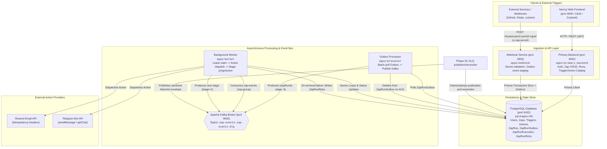

# System Architecture

This document outlines the high-level architecture of the Zapier automation platform.

---

## 🏗️ High-Level Topology

The system is an event-driven workflow automation platform structured as a monorepo. It decouples synchronous ingestion, asynchronous polling, broker-based queuing, and background step execution using PostgreSQL and Kafka.

---

## 📦 Major Applications & Packages

| Service / Package                                        | Path                                              | Runtime & Role                                                                                                                                                                                                                                                             |
| :------------------------------------------------------- | :------------------------------------------------ | :------------------------------------------------------------------------------------------------------------------------------------------------------------------------------------------------------------------------------------------------------------------------- |
| **`primary_backend`**                                    | [`apps/primary_backend`](../apps/primary_backend) | Bun / Express REST API serving user authentication (JWT + Clerk exchange), Zap configuration management, run history queries, and trigger/action catalog metadata.                                                                                                         |
| **`webhook`**                                            | [`apps/webhook`](../apps/webhook)                 | Bun / Express HTTP service dedicated to ingesting incoming webhooks with secret token validation (`x-zap-secret`) and writing atomic transactional outbox events. Also provides live trigger test buffering.                                                               |
| **`processor`**                                          | [`apps/processor`](../apps/processor)             | Bun background daemon implementing the Transactional Outbox pattern. Continuously polls pending `ZapRunOutbox` rows, dispatches initial execution events (`stage: 0`) to Kafka, and deletes outbox records upon broker ACK.                                                |
| **`worker`**                                             | [`apps/worker`](../apps/worker)                   | Bun background consumer group (`zap-group`). Claims action execution stages using distributed PostgreSQL leases (`ZapRunExecution`), runs idempotent action handlers with retries, produces subsequent workflow stages back to Kafka, and dead-letters exhausted failures. |
| **`ai_agent`**                                           | [`apps/ai_agent`](../apps/ai_agent)               | Bun / Express service (port `3004`) running a read-only LangGraph.js DLQ triage investigator with strict Zod contracts, bounded private evidence tools, and grounding guardrails.                                                                                          |
| **`frontend`**                                           | [`apps/frontend`](../apps/frontend)               | Next.js 16 (App Router) web dashboard with Zustand state management, Clerk authentication, workflow DAG builder, Zap inspect view, and trigger test payload viewer.                                                                                                        |
| **`@repo/db`**                                           | [`packages/db`](../packages/db)                   | Prisma ORM 6 client and schema definitions for PostgreSQL.                                                                                                                                                                                                                 |
| **`@repo/ui`**                                           | [`packages/ui`](../packages/ui)                   | Shared React UI component library.                                                                                                                                                                                                                                         |
| **`@repo/typescript-config`**, **`@repo/eslint-config`** | [`packages/*`](../packages)                       | Shared monorepo configurations across workspace packages.                                                                                                                                                                                                                  |

---

## 🔄 Component Communication Mechanisms

1. **Synchronous HTTP (REST)**:
   - Frontend communicates with `primary_backend` on port `3002` using Bearer JWT authentication tokens.
   - External trigger sources post JSON payloads to `webhook` on port `3003` with header `x-zap-secret`.
2. **Transactional Outbox via PostgreSQL**:
   - `webhook` does **not** produce directly to Kafka during HTTP request processing. Instead, it writes a `ZapRun` and a `ZapRunOutbox` record inside a single database transaction. This eliminates dual-write anomalies and guarantees that accepted webhooks are never lost if Kafka is temporarily unreachable.
3. **Kafka Event Streaming**:
   - `processor` dispatches `{ zapRunId, stage: 0 }` to Kafka topic `zap-events`.
   - `worker` consumes `zap-events`, executes the current action stage, and produces `{ zapRunId, stage: stage + 1 }` back to `zap-events` until all stages are complete.
4. **Third-Party Integrations**:
   - Resend API over HTTPS with client-side idempotency tokens (`X-Entity-Ref-ID`, `Idempotency-Key`).
   - Telegram Bot API over HTTPS for channel and chat messaging.

## AI Triage Boundary (Phase 4A-4C)

The primary backend owns the authenticated browser boundary and exposes the owner-scoped triage case list and evidence routes under `/api/v1/triage`. Case discovery and every evidence query join `ZapRunRetry` through `ZapRun` and `Zap` to the authenticated owner's `userId`; foreign and orphan retry rows are not visible. The agent receives only the selected case and allowed operation, never model-selected owner or case identity.

For private backend calls, the primary backend signs a short-lived HMAC service scope. The scope binds issuer (`primary-backend`), audience (`ai-agent`), owner, case, investigation, correlation ID, and one or more of the three implemented operations: `failure_context`, `execution_evidence`, and `validate_action_inputs`. The token is valid for at most 300 seconds and defaults to 60 seconds. Both services verify the signature, exact claims, expiry, operation, route case ID, and `x-correlation-id`. The shared secret must be at least 32 characters.

Set `TRIAGE_SERVICE_SECRET` to the same secret in both services. Set `AI_AGENT_URL` on the primary backend and `PRIMARY_BACKEND_URL` on the agent for deployed or non-local addresses; both have loopback defaults for local development. Private routes are enabled only when the agent has `TRIAGE_SERVICE_SECRET`.

The three tools return versioned, redacted, hashed evidence with bounded structures and explicit `unavailable`, provenance, completeness, and ordering fields. Failure context returns payload/action structure rather than values. Execution evidence distinguishes execution status, provider outcome, attempt history, predecessor state, and captured/reconciled/legacy provenance. Action-input validation reuses the worker parser and registry semantics, reports missing fields, types, template paths, and credential presence without returning credentials, and never invokes an action handler or external provider. Backend reads are bounded to 2 seconds, agent reads to 3 seconds, and responses to 32 KiB; unknown or incomplete facts remain unknown rather than being inferred.

---

## 🔌 External Dependencies

- **PostgreSQL 16**: Relational storage for user accounts, zap graphs, run history, outbox records, execution locks, and retry metrics.
- **Apache Kafka (Bitnami KRaft mode)**: Distributed messaging broker for stage queuing and dead-letter storage.
- **Clerk**: Social / OAuth authentication provider (Google OAuth).
- **Resend**: Transactional email delivery service.
- **Telegram Bot API**: Telegram messaging service.
