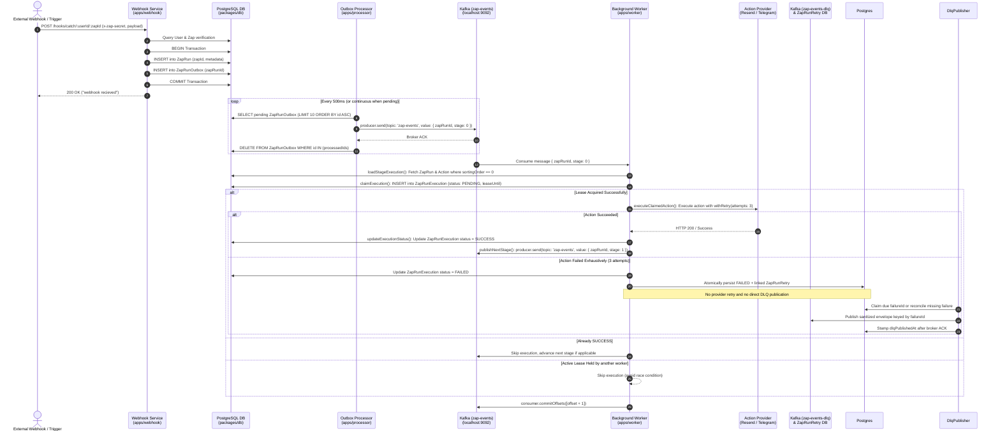

# Workflow Execution Flow

This document details the complete end-to-end execution lifecycle of a Zap workflow, tracing an event from its external trigger to final action execution.

---

## 🔁 End-to-End Sequence Diagram



---

## 🪜 Step-by-Step Lifecycle Breakdown

### Phase 1: Webhook Ingestion & Transactional Outbox

1. **Request Reception**: An external client or test sender sends an HTTP `POST` request to `/hooks/catch/:userId/:zapId` in [`apps/webhook/index.ts`](../apps/webhook/index.ts).
2. **Secret Header Check**: The service checks `req.headers["x-zap-secret"]` against `process.env.ZAP_SECRET`. If unauthorized, it returns `401`.
3. **Entity Verification**: The service queries `prisma.user` and `prisma.zap` to ensure both records exist.
4. **Atomic Outbox Transaction**:
   ```typescript
   await prisma.$transaction(async (tx) => {
     const run = await tx.zapRun.create({
       data: { zapId, metadata: body },
     });
     await tx.zapRunOutbox.create({
       data: { zapRunId: run.id },
     });
   });
   ```
   _Result_: The webhook payload is durably saved in PostgreSQL before acknowledging the client with `200 OK`.

---

### Phase 2: Outbox Processing & Kafka Production

1. **Polling Loop**: In [`apps/processor/index.ts`](../apps/processor/index.ts), `processor` queries `prisma.zapRunOutbox.findMany` with `take: 10` and `orderBy: { id: 'asc' }`.
2. **Backoff on Idle**: If no rows are pending, the processor sleeps for `500ms`.
3. **Publishing to Kafka**: The processor sends messages to topic `zap-events`:
   ```json
   { "zapRunId": "<run-uuid>", "stage": 0 }
   ```
4. **Outbox Deletion**: Only after the Kafka broker returns a successful produce response, the processor calls `prisma.zapRunOutbox.deleteMany` for the sent row IDs.

---

### Phase 3: Worker Consumption & Distributed Lease Claim

1. **Message Intake**: [`apps/worker/index.ts`](../apps/worker/index.ts) listens to `zap-events` under consumer group `zap-group` with `autoCommit: false`.
2. **Stage Lookup**: `loadStageExecution()` loads the `ZapRun` and finds the action matching `action.sortingOrder === event.stage`.
3. **Atomic 2-Phase Lease Claim (`claimExecution`)**:
   - The worker attempts an `INSERT` into `ZapRunExecution` with `status: "PENDING"` and `leaseUntil = now + 2 minutes`.
   - **Unique Constraint (`zapRunId_stage`)**:
     - If the record does not exist, the lease is acquired (`executionClaimed = true`).
     - If `status === "SUCCESS"`, the worker skips execution and considers the stage resolved (`alreadySucceeded = true`).
     - If `status === "FAILED"`, the worker treats it as a terminal failure and skips execution.
     - If `status === "PENDING"` with an active lease (`leaseUntil > now`), another worker is running; this message is skipped.
     - If `status === "PENDING"` with an expired lease (`leaseUntil <= now`), the worker reclaims the lease via `updateMany` to recover from a crashed worker.

---

### Phase 4: Action Execution & In-Process Retry

1. **Context Preparation**: The worker constructs `ActionContext`:
   ```typescript
   const ctx: ActionContext = {
     zapRunId,
     stage,
     idempotencyKey: `zaprun_${zapRunId}_stage_${stage}`,
     zapRunMetadata: execution.zapDetails.metadata,
   };
   ```
2. **Action Resolution**: `getActionHandler(actionType)` retrieves the handler from the action registry ([`apps/worker/actions/index.ts`](../apps/worker/actions/index.ts)).
3. **Execution with Exponential Backoff**:
   - [`apps/worker/retry.ts`](../apps/worker/retry.ts) runs `withRetry(handler.execute, 3)`.
   - Backoff delay: `1000ms * 2^(attempt - 1)` (1s, 2s).
4. **Template Parsing**: Handlers call `parse(templateString, ctx.zapRunMetadata)` in [`apps/worker/parse.ts`](../apps/worker/parse.ts) to resolve dynamic tokens such as `{{body.amount}}` or `{{comment.author}}`.

---

### Phase 5: Stage Advancement & Dead-Letter Routing

1. **On Success**:
   - `updateExecutionStatus(zapRunId, stage, "SUCCESS")` marks the stage finished in `ZapRunExecution`.
   - If more actions exist in the Zap (`stage < totalActions - 1`), the worker produces `{ zapRunId, stage: stage + 1 }` to `zap-events`.
2. **On Failure (Exhausted Retries)**:
   - `updateExecutionStatus(zapRunId, stage, "FAILED")` sets `status: "FAILED"`.
  - The action worker persists a sanitized, linked `ZapRunRetry` failure record in one transaction.
  - The separate Phase 3C runtime publishes that row to `zap-events-dlq` by `failureId`, stamps `dlqPublishedAt` only after broker acknowledgement, and reconciles expired or unlinked execution rows without invoking providers.
3. **Offset Commit**:
   - After processing, skipping, or dead-lettering, the worker commits the Kafka offset:
     ```typescript
     await consumer.commitOffsets([
       { topic, partition, offset: (parseInt(message.offset) + 1).toString() },
     ]);
     ```

---

## 🧪 Test Trigger Buffer Execution Path

For testing triggers live during workflow construction in the UI:

1. Webhook is posted to `POST /hooks/catch/test/:userId/:tempZapId` in [`apps/webhook/index.ts`](../apps/webhook/index.ts).
2. The payload is upserted into the `TestTriggerBuffer` table keyed by `tempZapId`.
3. The frontend polls or queries `GET /api/v1/trigger/test/result/:tempZapId` via `primary_backend` ([`apps/primary_backend/route/trigger.ts`](../apps/primary_backend/route/trigger.ts)) to display live payload schema keys for variable mapping.
