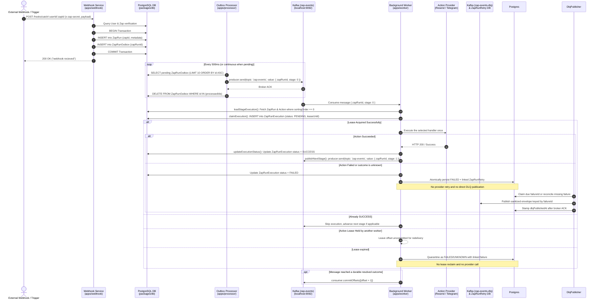

# Workflow Execution Flow

This document details the complete end-to-end execution lifecycle of a Zap workflow, tracing an event from its external trigger to final action execution.

---

## 🔁 End-to-End Sequence Diagram


```mermaid
sequenceDiagram
    autonumber
    actor External as External Webhook / Trigger
    participant Webhook as Webhook Service<br/>(apps/webhook)
    participant DB as PostgreSQL DB<br/>(packages/db)
    participant Processor as Outbox Processor<br/>(apps/processor)
    participant Kafka as Kafka (zap-events)<br/>(localhost:9092)
    participant Worker as Background Worker<br/>(apps/worker)
    participant ExternalAPI as Action Provider<br/>(Resend / Telegram)
    participant DLQ as Kafka (zap-events-dlq)<br/>& ZapRunRetry DB

    %% 1. Ingestion Phase
    External->>Webhook: POST /hooks/catch/:userId/:zapId (x-zap-secret, payload)
    Webhook->>DB: Query User & Zap verification
    Webhook->>DB: BEGIN Transaction
    Webhook->>DB: INSERT into ZapRun (zapId, metadata)
    Webhook->>DB: INSERT into ZapRunOutbox (zapRunId)
    Webhook->>DB: COMMIT Transaction
    Webhook-->>External: 200 OK ("webhook recieved")

    %% 2. Outbox Polling & Event Staging
    loop Every 500ms (or continuous when pending)
        Processor->>DB: SELECT pending ZapRunOutbox (LIMIT 10 ORDER BY id ASC)
        Processor->>Kafka: producer.send(topic: 'zap-events', value: { zapRunId, stage: 0 })
        Kafka-->>Processor: Broker ACK
        Processor->>DB: DELETE FROM ZapRunOutbox WHERE id IN (processedIds)
    end

    %% 3. Ordinary Worker Consumption & Stage 0 Execution
    Kafka->>Worker: Consume message { zapRunId, stage: 0 }
    Worker->>DB: loadStageExecution(): Fetch ZapRun & Action where sortingOrder == 0
    Worker->>DB: claimExecution(): INSERT into ZapRunExecution (status: PENDING, leaseUntil)

    alt Lease Acquired Successfully
        Worker->>ExternalAPI: Execute the selected handler once
        alt Action Succeeded
            ExternalAPI-->>Worker: HTTP 200 / Success
            Worker->>DB: updateExecutionStatus(): Update ZapRunExecution status = SUCCESS
            Worker->>Kafka: publishNextStage(): producer.send(topic: 'zap-events', value: { zapRunId, stage: 1 })
        else Action Failed or outcome is unknown
            Worker->>DB: Update ZapRunExecution status = FAILED
            Worker->>Postgres: Atomically persist FAILED + linked ZapRunRetry
            Note over Worker,Postgres: No provider retry and no direct DLQ publication
            DlqPublisher->>Postgres: Claim due failureId or reconcile missing failure
            DlqPublisher->>DLQ: Publish sanitized envelope keyed by failureId
            DlqPublisher->>Postgres: Stamp dlqPublishedAt after broker ACK
        end
    else Already SUCCESS
        Worker->>Kafka: Skip execution, advance next stage if applicable
    else Active Lease Held by another worker
        Worker-->>Worker: Leave offset uncommitted for redelivery
    else Lease expired
        Worker->>Postgres: Quarantine as FAILED/UNKNOWN with linked failure
        Note over Worker,Postgres: No lease reclaim and no provider call
    end

    opt Message reached a durable resolved outcome
        Worker->>Kafka: consumer.commitOffsets([offset + 1])
    end
```

The sequence above shows ordinary execution. The separately gated replay path is described in Phase 6 below.

---

## 🪜 Step-by-Step Lifecycle Breakdown

### Phase 1: Webhook Ingestion & Transactional Outbox

1. **Request Reception**: An external client or test sender sends an HTTP `POST` request to `/hooks/catch/:userId/:zapId` in [`apps/webhook/index.ts`](../apps/webhook/index.ts).
2. **Secret Header Check**: The service checks `req.headers["x-zap-secret"]` against `process.env.ZAP_SECRET`. If unauthorized, it returns `401`.
3. **Entity Verification**: The service queries `prisma.user` and `prisma.zap` to ensure both records exist.
4. **Atomic Outbox Transaction**:
   ```typescript
   await prisma.$transaction(async (tx) => {
     const run = await tx.zapRun.create({
       data: { zapId, metadata: body },
     });
     await tx.zapRunOutbox.create({
       data: { zapRunId: run.id },
     });
   });
   ```
   _Result_: The webhook payload is durably saved in PostgreSQL before acknowledging the client with `200 OK`.

---

### Phase 2: Outbox Processing & Kafka Production

1. **Polling Loop**: In [`apps/processor/index.ts`](../apps/processor/index.ts), `processor` queries `prisma.zapRunOutbox.findMany` with `take: 10` and `orderBy: { id: 'asc' }`.
2. **Backoff on Idle**: If no rows are pending, the processor sleeps for `500ms`.
3. **Publishing to Kafka**: The processor sends messages to topic `zap-events`:
   ```json
   { "zapRunId": "<run-uuid>", "stage": 0 }
   ```
4. **Outbox Deletion**: Only after the Kafka broker returns a successful produce response, the processor calls `prisma.zapRunOutbox.deleteMany` for the sent row IDs.

---

### Phase 3: Worker Consumption & Distributed Lease Claim

1. **Message Intake**: [`apps/worker/index.ts`](../apps/worker/index.ts) listens to `zap-events` under consumer group `zap-group` with `autoCommit: false`.
2. **Stage Lookup**: `loadStageExecution()` loads the `ZapRun` and finds the action matching `action.sortingOrder === event.stage`.
3. **Atomic 2-Phase Lease Claim (`claimExecution`)**:
   - The worker attempts an `INSERT` into `ZapRunExecution` with `status: "PENDING"` and `leaseUntil = now + 2 minutes`.
   - **Unique Constraint (`zapRunId_stage`)**:
     - If the record does not exist, the lease is acquired (`executionClaimed = true`).
     - If `status === "SUCCESS"`, the worker skips execution and considers the stage resolved (`alreadySucceeded = true`).
     - If `status === "FAILED"`, the worker treats it as a terminal failure and skips execution.
      - If `status === "PENDING"` with an active lease (`leaseUntil > now`), another worker is running; leave the Kafka offset uncommitted for redelivery.
      - If `status === "PENDING"` with an expired or null lease, atomically fence and quarantine it as `FAILED` with provider outcome `unknown`, finalize any started attempt as `UNKNOWN`, and create one linked `ZapRunRetry`. Do not reclaim the lease or call the provider again.

---

### Phase 4: Single-Shot Action Execution

1. **Context Preparation**: The worker constructs `ActionContext`:
   ```typescript
   const ctx: ActionContext = {
     zapRunId,
     stage,
     idempotencyKey: `zaprun_${zapRunId}_stage_${stage}`,
     zapRunMetadata: execution.zapDetails.metadata,
   };
   ```
2. **Action Resolution**: `getActionHandler(actionType)` retrieves the handler from the action registry ([`apps/worker/actions/index.ts`](../apps/worker/actions/index.ts)).
3. **Single provider attempt**:
  - The worker records one `STARTED` attempt and invokes the selected handler once. It does not retry provider actions in-process.
  - A provider rejection, transport uncertainty, or failure persisting a provider result is durably recorded as failure evidence; ambiguous delivery is `UNKNOWN` and is never resent automatically.
4. **Template Parsing**: Handlers call `parse(templateString, ctx.zapRunMetadata)` in [`apps/worker/parse.ts`](../apps/worker/parse.ts) to resolve dynamic tokens such as `{{body.amount}}` or `{{comment.author}}`.

---

### Phase 5: Stage Advancement & Dead-Letter Routing

1. **On Success**:
   - `updateExecutionStatus(zapRunId, stage, "SUCCESS")` marks the stage finished in `ZapRunExecution`.
   - If more actions exist in the Zap (`stage < totalActions - 1`), the worker produces `{ zapRunId, stage: stage + 1 }` to `zap-events`.
    - This computed successor applies to ordinary execution. Successful replay progression uses the validated `nextStage` stored on its separate `ReplayExecution` row.
  2. **On Terminal Failure**:
    - `ZapRunExecution` is atomically finalized as `FAILED` with one sanitized, linked `ZapRunRetry` failure record.
    - Provider actions are not retried automatically; an ambiguous provider result is recorded as `UNKNOWN` and requires human review.
  - The separate Phase 3C runtime publishes that row to `zap-events-dlq` by `failureId`, stamps `dlqPublishedAt` only after broker acknowledgement, and reconciles expired or unlinked execution rows without invoking providers.
3. **Offset Commit**:
    - After a durable success, a linked terminal failure, or a safely resolved duplicate, the worker commits the Kafka offset:
     ```typescript
     await consumer.commitOffsets([
       { topic, partition, offset: (parseInt(message.offset) + 1).toString() },
     ]);
     ```

### Phase 6: Additive Replay Generation (Phase 9A/9B; gated)

1. **Separate history**: A replay uses an immutable `ReplayRequest` plus its own `ReplayExecution`, attempt, and failure rows. It never resets or overwrites the original `FAILED` `ZapRunExecution`, attempts, or `ZapRunRetry` evidence.
2. **Guarded claim and selected inputs**: In a serializable transaction, the worker revalidates the stored approval and request against ownership, current policy, fingerprints, handler version, and stage ordering. It resolves the eligible Telegram destination, message, and explicit bot token once at claim time and passes those exact selected inputs to the handler; the handler does not reload mutable configuration or interpolate them again.
3. **Stored successor**: The validated `nextStage` is written to `ReplayExecution` when the generation is claimed. On success, the worker publishes that successor. A duplicate successful replay can use the stored value to recover a lost progression publication without recomputing it from mutable workflow configuration.
4. **Terminal outcomes**: A provider rejection/failure ends this release's replay allowance. An expired replay lease or ambiguous provider/persistence result is recorded as terminal `UNKNOWN`; the worker does not resend, reclaim the generation, advance, or reuse the approval.
5. **Disabled release gate**: `REPLAY_RELEASE_READY` is false pending Phase 9C PostgreSQL/Kafka crash-window recovery and provider-semantics verification. The dispatcher therefore does not publish replay requests, and a replay event presented to the worker is left unacknowledged while the gate is closed. Setting `REPLAY_ENABLED=true` alone has no effect.

---

## 🧪 Test Trigger Buffer Execution Path

For testing triggers live during workflow construction in the UI:

1. Webhook is posted to `POST /hooks/catch/test/:userId/:tempZapId` in [`apps/webhook/index.ts`](../apps/webhook/index.ts).
2. The payload is upserted into the `TestTriggerBuffer` table keyed by `tempZapId`.
3. The frontend polls or queries `GET /api/v1/trigger/test/result/:tempZapId` via `primary_backend` ([`apps/primary_backend/route/trigger.ts`](../apps/primary_backend/route/trigger.ts)) to display live payload schema keys for variable mapping.
