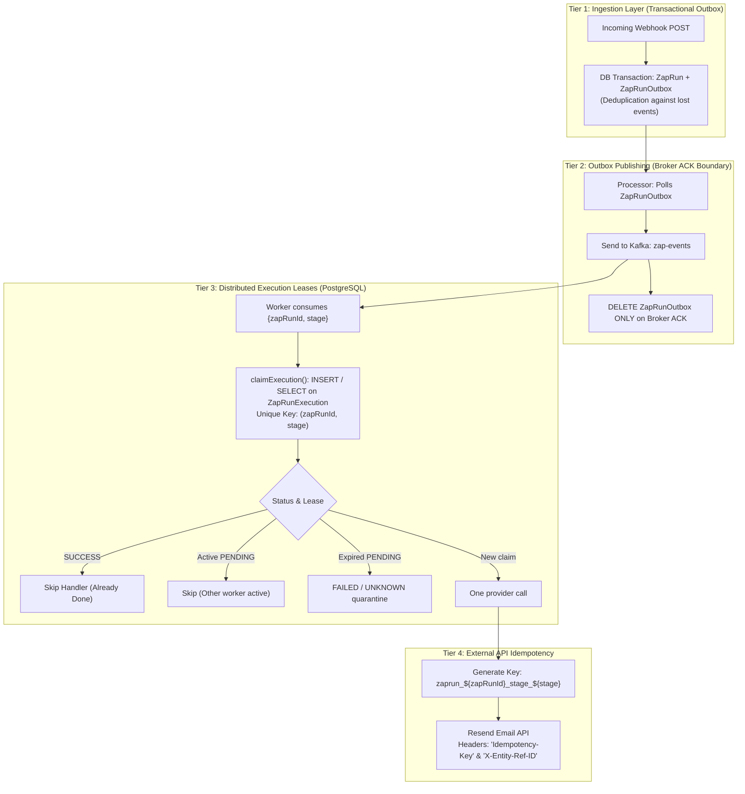

# Idempotency & Deduplication

In an event-driven workflow system with **at-least-once** Kafka delivery, duplicate message deliveries, worker crashes, network timeouts, and consumer group rebalances are inevitable. This document outlines how idempotency is designed, enforced, and propagated across every layer of the platform.

---

## 🛡️ Multi-Layered Idempotency Architecture

The platform provides a defense-in-depth idempotency strategy spanning four distinct architectural tiers:



---

## 🔑 Idempotency Key Specification

### Key Formulation

In [`apps/worker/index.ts`](../apps/worker/index.ts#L209), the worker generates a deterministic, unique idempotency token for every action stage:

$$\text{idempotencyKey} = \texttt{"zaprun\_" + zapRunId + "\_stage\_" + stage}$$

- `zapRunId`: The unique UUID representing the trigger event execution instance.
- `stage`: The 0-indexed integer corresponding to the position of the action in the workflow DAG sequence (`sortingOrder`).

---

## 🧱 Tier-by-Tier Enforcement

### 1. Ingestion: Transactional Outbox ([`apps/webhook/index.ts`](../apps/webhook/index.ts))

- Webhook payloads are inserted into `ZapRun` and `ZapRunOutbox` inside a single ACID database transaction.
- Prevents split-brain state where a webhook is acknowledged to the sender but lost before reaching the message bus.

### 2. Event Dispatch: ACK-Before-Delete ([`apps/processor/index.ts`](../apps/processor/index.ts))

- The outbox processor awaits Kafka confirmation (`await producer.send(...)`) before issuing `prisma.zapRunOutbox.deleteMany(...)`.
- If the processor crashes or Kafka is unreachable, outbox rows remain intact and will be re-polled and re-sent.

### 3. Worker Execution: Fenced Single-Shot Claim ([`apps/worker/orchestration.ts`](../apps/worker/orchestration.ts))

- Enforced by PostgreSQL table `ZapRunExecution` with unique constraint `@@unique([zapRunId, stage])`.
- **Duplicate Kafka Deliveries**: If Kafka redelivers `{ zapRunId, stage: 0 }` after a stage has already finished, `claimExecution()` detects `status === "SUCCESS"` and skips action dispatch completely.
- **Claim fencing**: Each new claim receives a local `claimToken`. Attempt and terminal writes require the execution ID, `PENDING` status, and current token.
- **Worker crash/lease expiry**: An expired or null lease is quarantined as `FAILED` with `providerOutcome = "unknown"` and `requiresHuman = true`; it is never reclaimed for another provider call.
- **Attempt evidence**: One `STARTED` row is finalized with bounded provider evidence and fingerprints. A linked `ZapRunRetry.id` is the durable `failureId`.

### 4. External Provider Side Effects

- **Resend Email API** ([`apps/worker/actions/email.ts`](../apps/worker/actions/email.ts)):
  The handler attaches the idempotency token to both HTTP headers:
  ```typescript
  headers: {
    "Idempotency-Key": ctx.idempotencyKey,
    "X-Entity-Ref-ID": ctx.idempotencyKey,
  }
  ```
  The key remains available to the provider, but the worker makes one call only. A timeout or persistence failure is recorded as `UNKNOWN` when possible and requires human review; internal retries do not resend the provider request.
- **Telegram Bot API** ([`apps/worker/actions/telegram.ts`](../apps/worker/actions/telegram.ts)):
  _Current Limitation_: Telegram does not natively support client-supplied idempotency tokens. Unknown delivery therefore remains a human-review case; the worker never retries the call automatically.

---

## 🧪 Verification & Test Coverage

The idempotency model is covered by automated unit tests in [`apps/worker/idempotency.test.ts`](../apps/worker/idempotency.test.ts):

- **Scenario A**: Normal single-run lease acquisition, execution, and transition to `SUCCESS`.
- **Scenario B**: Immediate Kafka redelivery after `SUCCESS` (skips side-effect execution).
- **Scenario C**: Active `PENDING` is not executed or acknowledged; expired `PENDING` is quarantined without a provider call.
- **Scenario D**: Claim-token fencing blocks stale workers from changing attempts or terminal state.
- **Scenario E**: Terminal failure atomically links one `ZapRunRetry` record; the separate publisher may publish that record more than once only with the same `failureId`, and consumers deduplicate it.
