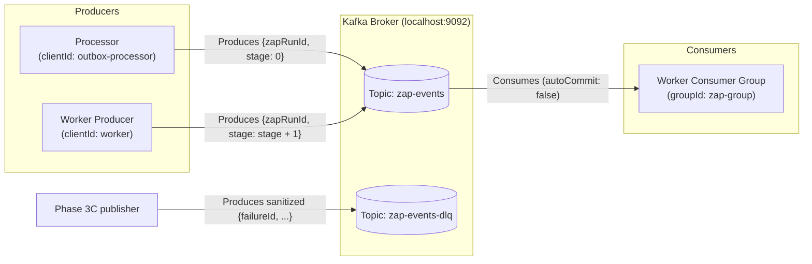

# Kafka Messaging Architecture

This document specifies the Kafka message topics, schemas, producer/consumer topologies, and offset commit behaviors implemented in the codebase.

---

## 📡 Kafka Topics Overview

| Topic Name           | Purpose                                                                  | Producers                       | Consumers                                                          | Retention / Configuration                                  |
| :------------------- | :----------------------------------------------------------------------- | :------------------------------ | :----------------------------------------------------------------- | :--------------------------------------------------------- |
| **`zap-events`**     | Primary workflow execution queue carrying stage transition events.       | `apps/processor`, `apps/worker` | `apps/worker` (`zap-group`)                                        | Auto-created in local KRaft container; standard retention. |
| **`zap-events-dlq`** | Sanitized publication of durable failures. | Separate Phase 3C publisher | Future triage/reconciliation consumers | Publication is keyed by durable `failureId`; it is evidence delivery, not provider replay. |

---

## 📨 Message Schemas

### 1. `zap-events` Message Schema

Messages on `zap-events` represent a single action stage execution request for a specific workflow run.

```typescript
type ZapEvent = {
  zapRunId: string; // UUID of the ZapRun record in PostgreSQL
  stage: number; // 0-indexed sortingOrder stage in the Zap action sequence
};
```

**Example Payload**:

```json
{
  "zapRunId": "9b1deb4d-3b7d-4bad-9bdd-2b0d7b3dcb6d",
  "stage: 0
}
```

---

### 2. `zap-events-dlq` Message Schema

Messages published to `zap-events-dlq` contain failure context for offline inspection and replay.

```typescript
type DurableFailureEvent = {
  failureId: string; // ZapRunRetry.id
  zapRunId: string; // UUID of the failed ZapRun
  stage: number; // The action stage that failed
  attempt: number; // Provider attempt number, or 0 for not-attempted cases
  providerOutcome: "rejected" | "not_attempted" | "unknown";
  safeCode: string;
  requiresHuman: true;
  failedAt: string; // ISO 8601 timestamp of failure
};
```

**Example Payload**:

```json
{
  "zapRunId": "9b1deb4d-3b7d-4bad-9bdd-2b0d7b3dcb6d",
  "stage": 1,
  "failureId": "2d8a3a0c-9f4a-4ee6-8b5a-3a4f0f4f4c2a",
  "attempt": 1,
  "providerOutcome": "rejected",
  "safeCode": "provider_rejected",
  "requiresHuman": true,
  "failedAt": "2026-09-16T08:00:00.000Z"
}
```

---

## ⚙️ Producer & Consumer Topology



### Producers

1. **Outbox Processor** ([`apps/processor/index.ts`](../apps/processor/index.ts)):
   - `clientId`: `"outbox-processor"`
   - Produces initial stage events (`stage: 0`) to `zap-events`.
2. **Worker Producer** ([`apps/worker/index.ts`](../apps/worker/index.ts)):
   - `clientId`: `"worker"`
   - Produces subsequent stage events (`stage: stage + 1`) to `zap-events`.
  - Does not produce to `zap-events-dlq`. The separate Phase 3C publisher claims due `ZapRunRetry` rows and stamps `dlqPublishedAt` only after broker acknowledgement.

3. **DLQ publisher/reconciler** ([`apps/worker/dlq-publisher-index.ts`](../apps/worker/dlq-publisher-index.ts)):
   - Runs separately from action execution.
   - Publishes bounded, sanitized envelopes keyed by `failureId`.
   - Retries Kafka evidence delivery with bounded backoff, never provider execution.
   - Reconciles expired `PENDING` and unlinked `FAILED` executions without invoking providers.

### Consumers

1. **Worker Consumer** ([`apps/worker/index.ts`](../apps/worker/index.ts)):
   - `clientId`: `"worker"`
   - `groupId`: `"zap-group"`
   - `fromBeginning`: `true`
   - `autoCommit`: `false`

---

## 🔒 Offset Commit & Delivery Semantics

1. **At-Least-Once Delivery**:
   - The system is architected for **at-least-once delivery**. A message may be delivered more than once if a worker crashes before committing offsets or if Kafka rebalances.
2. **Manual Offset Commits**:
   - `autoCommit` is set to `false`.
   - The worker explicitly commits offsets only after an event has been:
       - Successfully executed and status recorded as `SUCCESS`.
       - Skipped due to existing `SUCCESS` or linked `FAILED` status.
       - Expired/failed and recorded as `FAILED` with one linked `ZapRunRetry`.
     - Active `PENDING`, unlinked `FAILED`, stale ownership, invalid input, or persistence failure are not committed.
3. **Commit Syntax**:
   ```typescript
   await consumer.commitOffsets([
     {
       topic,
       partition,
       offset: (parseInt(message.offset) + 1).toString(),
     },
   ]);
   ```
4. **Crash Safety Invariant**:
   - If a worker crashes mid-execution (before offset commit), the Kafka consumer will re-read the message upon restart. The PostgreSQL lease in `ZapRunExecution` prevents duplicate execution.
