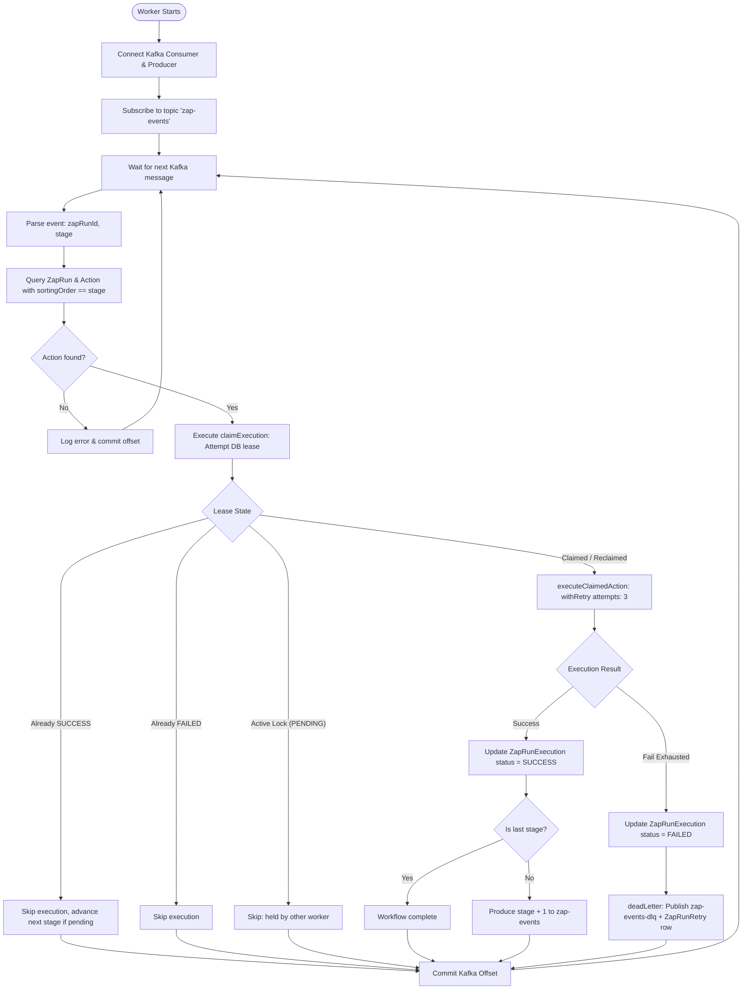

# Background Worker

This document specifies the internal lifecycle, distributed lease management, action execution mechanics, and error recovery policies of the background worker service (`apps/worker`).

---

## 🔄 Worker Lifecycle & Architecture

The worker service ([`apps/worker/index.ts`](../apps/worker/index.ts)) consumes workflow stage execution events from Kafka, guarantees idempotent execution using PostgreSQL leases, coordinates in-process retries, advances workflow stages, and handles terminal failures.



---

## 🔒 Distributed Lease Management (`ZapRunExecution`)

To ensure **strict once-and-only-once execution** of external side effects under Kafka at-least-once redelivery and concurrent worker environments, the worker implements a two-phase database lease claim in [`apps/worker/index.ts`](../apps/worker/index.ts) using the `ZapRunExecution` model:

### Database Model

```prisma
model ZapRunExecution {
  id          String    @id @default(uuid())
  zapRunId    String
  stage       Int
  status      String    @default("PENDING") // PENDING | SUCCESS | FAILED
  leaseUntil  DateTime?
  createdAt   DateTime  @default(now())
  completedAt DateTime?

  @@unique([zapRunId, stage])
  @@index([zapRunId])
}
```

### Lease Rules & State Transitions

1. **Initial Acquisition**:
   - Worker attempts `prisma.zapRunExecution.create({ data: { zapRunId, stage, status: "PENDING", leaseUntil: now + 2min } })`.
   - If insertion succeeds, the worker holds the execution lock (`executionClaimed = true`).
2. **Duplicate Detection & Re-entry**:
   - If insertion throws a unique constraint collision (`code: "P2002"`), the existing record is inspected:
     - `status === "SUCCESS"`: Action was previously completed. Skip side-effects (`alreadySucceeded = true`).
     - `status === "FAILED"`: Action previously exhausted all retries. Skip permanently.
     - `status === "PENDING"` and `leaseUntil > now`: Another active worker is processing this stage. Skip execution to prevent duplicate concurrent work.
3. **Crashed Worker Recovery (Expired Lease Reclamation)**:
   - If `status === "PENDING"` and `leaseUntil <= now`, the holding worker crashed or timed out.
   - The current worker attempts an atomic `updateMany`:
     ```typescript
     const reclaim = await prisma.zapRunExecution.updateMany({
       where: {
         zapRunId,
         stage,
         status: "PENDING",
         OR: [{ leaseUntil: { lte: now } }, { leaseUntil: null }],
       },
       data: { leaseUntil: new Date(now.getTime() + LEASE_DURATION_MS) },
     });
     if (reclaim.count > 0) executionClaimed = true;
     ```

---

## 🛠️ Action Dispatch & Execution

Once a lease is secured, `executeClaimedAction` runs:

1. **Handler Resolution**: Looks up `getActionHandler(actionTypeId)` from [`apps/worker/actions/index.ts`](../apps/worker/actions/index.ts).
2. **Context Creation**:
   ```typescript
   const ctx: ActionContext = {
     zapRunId,
     stage,
     idempotencyKey: `zaprun_${zapRunId}_stage_${stage}`,
     zapRunMetadata: execution.zapDetails.metadata,
   };
   ```
3. **In-Process Exponential Backoff with Full Jitter**:
   - Wrapped by `withRetry(..., 3)` in [`apps/worker/retry.ts`](../apps/worker/retry.ts).
   - Attempt 1: Immediate execution.
   - Attempt 2: Sleeps a randomized duration in $[0, 1000\text{ms}]$.
   - Attempt 3: Sleeps a randomized duration in $[0, 2000\text{ms}]$.
   - **Full Jitter** decorrelates retry spikes across concurrent workers to mitigate the "Thundering Herd" problem against rate-limited downstream APIs.
4. **State Finalization**:
   - On success: `status = "SUCCESS"`, `leaseUntil = null`, `completedAt = now()`.
   - On terminal failure: `status = "FAILED"`, `leaseUntil = null`, `completedAt = now()`.

---

## 🪦 Dead-Letter Queue (DLQ) & Failure Recording

When an action exhausts all retry attempts:

1. The worker calls `deadLetter()` in [`apps/worker/deadletter.ts`](../apps/worker/deadletter.ts).
2. **Dual-Sink Strategy**:
   - **Kafka Sink**: Produces a structured failure event to topic `zap-events-dlq`.
   - **PostgreSQL Sink**: Inserts a diagnostic record into `ZapRunRetry`:
     ```typescript
     await prisma.zapRunRetry.create({
       data: { zapRunId, stage, attempt, lastError },
     });
     ```
3. **Non-Throwing Guarantee**: Sinks are executed independently in separate `try/catch` blocks so that sink failures do not crash the consumer loop or prevent offset commits.

---

## 📐 Invariants Summary

- **Offset Commit Isolation**: Kafka offsets are never committed before status resolution (`SUCCESS`, `FAILED`, skipped, or dead-lettered).
- **Lease Boundary**: The default lease duration is `2 minutes` (`LEASE_DURATION_MS = 120_000`).
- **Linear Progression**: Stage $N+1$ is only queued if stage $N$ completes with status `SUCCESS`.
