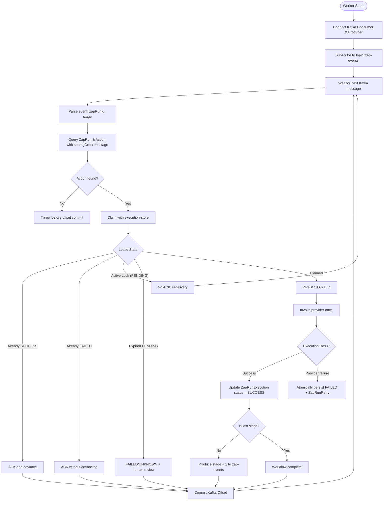

# Background Worker

This document specifies the internal lifecycle, fenced action execution, durable failure evidence, and Kafka acknowledgement policy of the background worker service (`apps/worker`).

---

## 🔄 Worker Lifecycle & Architecture

The worker service ([`apps/worker/index.ts`](../apps/worker/index.ts)) consumes workflow stage execution events from Kafka, uses PostgreSQL claim fencing for at-least-once delivery, invokes each provider at most once per claimed stage, advances only successful stages, and durably parks failures for human review.



---

## 🔒 Distributed Lease Management (`ZapRunExecution`)

To prevent stale workers from overwriting newer decisions under Kafka at-least-once redelivery, the worker uses a per-claim `claimToken` in [`apps/worker/execution-store.ts`](../apps/worker/execution-store.ts). This fences database writes; it cannot prove exactly-once delivery to an external provider.

### Database Model

```prisma
model ZapRunExecution {
  id          String    @id @default(uuid())
  zapRunId    String
  stage       Int
  status      String    @default("PENDING") // PENDING | SUCCESS | FAILED
  leaseUntil  DateTime?
  claimToken  String?
  providerOutcome String?
  actionFingerprint String?
  requestFingerprint String?
  requiresHuman Boolean @default(false)
  createdAt   DateTime  @default(now())
  completedAt DateTime?

  @@unique([zapRunId, stage])
  @@index([zapRunId])
}
```

### Lease Rules & State Transitions

1. **Initial Acquisition**:
   - Worker attempts `prisma.zapRunExecution.create({ data: { zapRunId, stage, status: "PENDING", leaseUntil: now + 2min } })`.
   - If insertion succeeds, the worker holds the execution lock (`executionClaimed = true`).
2. **Duplicate Detection & Re-entry**:
   - If insertion throws a unique constraint collision (`code: "P2002"`), the existing record is inspected:
     - `status === "SUCCESS"`: Action was previously completed. Skip side-effects (`alreadySucceeded = true`).
     - `status === "FAILED"`: Action previously exhausted all retries. Skip permanently.
     - `status === "PENDING"` and `leaseUntil > now`: Another active worker is processing this stage. Skip execution to prevent duplicate concurrent work.
3. **Expired lease quarantine**:
   - An expired or null lease is atomically fenced, marked `FAILED` with `providerOutcome = "unknown"`, and linked to exactly one `ZapRunRetry` row with `requiresHuman = true`.
   - The provider is never invoked to resolve lease uncertainty. A stale worker cannot update the terminal row because every attempt and terminal write checks the current token.

---

## 🛠️ Action Dispatch & Execution

Once a claim is secured, [`apps/worker/orchestration.ts`](../apps/worker/orchestration.ts) runs:

1. **Handler Resolution**: Looks up `getActionHandler(actionTypeId)` from [`apps/worker/actions/index.ts`](../apps/worker/actions/index.ts).
2. **Context Creation**:
   ```typescript
   const ctx: ActionContext = {
     zapRunId,
     stage,
     idempotencyKey: `zaprun_${zapRunId}_stage_${stage}`,
     zapRunMetadata: execution.zapDetails.metadata,
   };
   ```
3. **Single provider attempt**:
  - The worker persists one `STARTED` attempt, invokes the selected handler exactly once, and finalizes that attempt as `ACCEPTED`, `REJECTED`, or `UNKNOWN`.
  - A provider response followed by database failure is not retried automatically. The outcome remains unresolved until persistence succeeds or reconciliation records `UNKNOWN`.
4. **State Finalization**:
   - On success: `status = "SUCCESS"`, `leaseUntil = null`, `completedAt = now()`.
   - On terminal failure: `status = "FAILED"`, `leaseUntil = null`, `completedAt = now()`.

---

## 🪦 Durable Failure Recording

When a provider rejects an action, persistence fails after a provider call, or a lease expires:

1. `execution-store.ts` sanitizes allowlisted evidence and computes SHA-256 action/request fingerprints.
2. One PostgreSQL transaction fences the execution, finalizes the attempt, and creates exactly one linked `ZapRunRetry`. Its UUID is the future shared `failureId`.
3. The worker does not publish Kafka DLQ messages. Phase 3C will publish durable failure rows by `failureId` and stamp `dlqPublishedAt` only after broker acknowledgement.

---

## 📐 Invariants Summary

- **Offset Commit Isolation**: Offsets are committed only after durable `SUCCESS` or linked durable `FAILED`. Active leases, unlinked failures, stale ownership, invalid input, and persistence errors remain uncommitted.
- **Lease Boundary**: The default lease duration is `2 minutes`; expiration quarantines the action as unknown rather than reclaiming it for another provider call.
- **Linear Progression**: Stage $N+1$ is only queued if stage $N$ completes with status `SUCCESS`.
